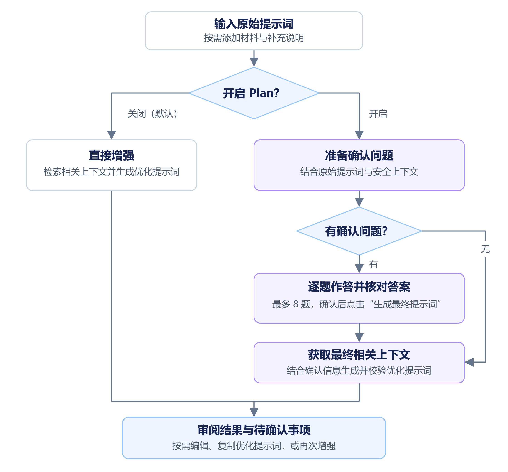

# Prompt Optimizer Platform

面向开发者、学生、文案创作者、办公人员和科研工作者的提示词优化平台，帮助你把一个想法、一句需求和相关材料，整理成可以交给大模型使用的结构化提示词。

**先说清想做什么，再让 AI 按明确的目标、材料和边界工作。** 需求明确时可以直接增强；需要补充关键决定时，可以开启 Plan 确认，在生成前逐题核对。

> 当前阶段：MVP 本地联调与内部试用。工作台、直接增强、可选 Plan Mode、项目上下文分析、Mock/OpenAI 兼容模型接入、优化历史、邮箱注册登录和平台模型目录已有实现。正式上线仍需完成拟开放模型的真实业务验收、双人评审及部署验收；团队管理、额度计费和浏览器插件等仍属后续范围。

## 项目简介

在使用 ChatGPT、DeepSeek、Claude 等大模型进行开发时，很多人都经历过这样的场景：**一句需求、一个想法丢给 AI 就开始执行，但最终做出来的效果往往并不是自己想要的，只能反复推倒重来，白白浪费时间和 Token。**问题通常不在 AI 本身，而在于需求没有被充分表达，模型只能根据有限的信息猜测背景、目标和边界。

Prompt Optimizer Platform 把需求整理这一步放在执行之前：结合**原始提示词、用户主动提供的项目上下文、本次 Plan 确认答案和平台安全规则**，组织目标、输出要求、约束与待确认信息。你不必先掌握一套复杂的提示词写法，也可以从一句自然语言开始。

使用路径是：**写下想法 → 按需添加材料 → 直接增强或 Plan 确认 → 审阅、编辑并复制优化提示词**。

平台交付的是优化提示词。后续的写文章、分析数据或修改代码，由你选择的模型或工具执行；本平台不会自动执行命令、提交代码、发送邮件或部署系统。

## 适合哪些使用场景

下列任务可以通过现有的通用、研究分析和软件任务策略组织提示词。表格说明的是可以帮助明确的内容，具体效果仍需结合材料和所选模型核对。

| 用户与场景 | 可以从这样的需求开始 | 提示词需要明确的重点 |
| --- | --- | --- |
| 开发者：功能、排错、重构与测试 | “给现有工单增加升级处理功能” | 现有实现、修改范围、状态与权限规则、异常分支及验证方式 |
| 学生与教师：学习和资料整理 | “根据这些课程资料制定复习计划” | 当前水平、知识范围、可用时间、练习方式和引用来源 |
| 文案创作者：文章、邮件与演讲稿 | “把这份活动资料改成公众号预告” | 目标受众、发布渠道、语气、篇幅及必须保留的事实 |
| 办公与运营人员：纪要、报告和方案 | “把会议记录整理成行动清单” | 议题、已确认决议、负责人、期限和仍待核实的信息 |
| 科研与分析人员：研究方案和分析需求 | “根据数据字典整理统计分析要求” | 研究对象、数据来源、指标口径、方法条件和交付形式 |

这些场景共享当前工作台，尚未分别提供专用编辑器或完成所有专业领域的质量验收。输入研究方案不代表已经取得研究结果，上传数据字典也不代表已经提供实际数据；生成的提示词仍需保留这些区别。

## 核心能力

### 1. 一键增强提示词

输入原始提示词，按需添加文件或背景说明，点击增强即可开始。工作台默认直接生成结果；开启“Plan 确认”后，先补充会影响结果的决定，再生成优化提示词。

工作台保留原始提示词，结果支持编辑、复制和再次增强。“再次增强”使用当前结果作为新的输入，并遵循当前 Plan 开关；“复制并打开”目标平台后，仍由用户自行粘贴和发送。

### 2. 需求明确化

将“帮我处理一下”进一步组织为“处理哪些材料、要交付什么、哪些规则必须遵守”。系统结合本次需求和可用上下文识别未决信息；开启 Plan 时用自然语言提问，直接增强时则允许在结果中保留待确认事项。

例如，演讲稿任务需要说明受众、场合和时长，研究任务需要核对对象、数据来源和分析口径，软件任务需要明确行为规则和影响范围。没有依据的信息应保持未知或待确认，不能因为生成了更长的提示词就变成既定事实。

### 3. 项目上下文化

把你提供的代码、项目说明、草稿、报告或表格作为本次需求的依据，减少重复描述背景。代码项目可以识别技术栈、依赖和目录结构；普通材料可以提取文本，并围绕当前任务检索相关片段。

- **代码项目**：浏览器对主动选择的目录建立本地索引，生成前检索有限的相关代码块。
- **文档材料**：支持 PDF 文字层及 Word、Excel、PowerPoint 文本提取；大型文档采用分片上传和临时索引。
- **覆盖情况**：解析失败、截断或覆盖不足会通过分析报告和警告展示；文件被选中不等于全部内容已进入模型。

浏览器只处理用户主动选择的文件，不读取任意本机路径。使用真实模型时，参与本次生成的内容会经后端发送给模型供应商；本地索引不等于全程离线。临时索引和历史保存范围见下方“当前实现边界”。

### 4. 约束条件完善化

依据本次任务补充约束重点：软件任务关注参数、异常、兼容性和测试；研究分析关注数据来源、统计口径、方法条件与不确定性；通用任务关注交付范围、事实依据和明确的格式要求。

原始需求中的条件、否定、数值与已确认答案会参与结果校验和补全。当前已有明确规则保留及部分冲突检查，但不能保证识别所有领域的语义错误；事实、数字、引用和专业方法仍需用户复核。平台权限红线始终保留。

### 5. 结构化输出

**按任务判断内容重点，在当前结构内组织结果。** 服务端依据需求选择通用、研究分析或软件任务策略，工作台无需手动选择模板。

| 输出内容 | 当前 MVP 行为 |
| --- | --- |
| 背景、任务、输出、约束 | 必需的四要素结构，内容随需求、材料和确认答案变化。 |
| 验收标准 | 当前结果组装会补齐，核对要求随任务策略变化；尚未实现按场景完全省略该段。 |
| 示例 | 按示例开关添加，默认关闭。 |
| 待确认事项 | 有实际未决信息时出现；执行前必须确认的条件也会进入可复制正文。 |

当前的灵活性体现在任务策略、段落内容和可选示例。进一步按需显示验收标准，以及自然文本、少量引导模块与结构化输出之间的切换，仍属于[动态输出规划](./docs/待办事项.md)，不能作为现有能力承诺。

### 6. 权限红线与安全边界

系统过滤默认受保护路径，并对可识别的敏感内容执行检测或脱敏；生成结果包含凭据保护、受保护文件范围，以及删除文件、数据库结构迁移、生产部署等操作的人工确认要求。

上传内容仅作为资料，不能覆盖平台安全规则。API 支持追加受保护路径和确认动作，不能关闭平台默认红线；当前工作台使用默认规则。这里的权限红线用于生成任务边界，实际执行权限仍由下游工具和用户控制。

## Plan Mode 增强方法

Plan 默认关闭，首次开启会显示说明，选择保存在当前浏览器中。它适合需要先明确范围、方法或交付要求的任务。



1. **先看材料**：有文件时，先检索相关片段并准备经过安全处理的上下文摘要和证据；没有文件时，也可直接依据原始提示词和补充说明开始。
2. **识别关键问题**：结合已知信息生成最多 8 个确认问题，支持单选、多选和自由输入。已提供的事实用于减少重复追问；没有需要提问的内容时，直接进入最终生成。
3. **主动确认答案**：推荐项不会自动成为你的选择。可以选择候选项，在允许时填写自定义回答，也可以回看并修改已填答案；自定义回答会替换已选项。所有题目填写有效答案后，点击“生成最终提示词”。
4. **按答案再次检索**：使用原始需求和确认答案重新选择相关上下文，服务端核对答案与本次计划、需求及上下文的对应关系，再生成和校验结果。
5. **审阅并使用**：原始提示词保留，最终生成自动保存优化记录；用户检查事实和未决条件后，可以编辑、复制或再次增强。计划提问阶段不生成优化记录，页面编辑也不会覆盖原历史记录。

“暂不确定”仍属于未决信息，二次检索发现的新冲突也可能继续显示在结果中，并写入正文的执行前确认要求；完成问答不代表所有条件都已确定。计划过期时会重新生成问题，并提示核对可恢复的答案草稿后再次确认。

关闭 Plan 时，按原始需求检索一次最终上下文，直接调用生成接口；服务端仍执行上下文分析、安全过滤、结构校验和模糊点检测。详细契约见[内置 Plan Mode](./docs/12-内置Plan-Mode交互与接口.md)。

## 使用示例

以下为人工编写的结构示意，展示增强时应明确的内容；实际输出会随材料、确认答案和模型变化，并包含平台强制约束。

### 开发场景：从一句需求到可核对的任务说明

原始提示词：

```text
用 requests 库爬取某个网页的标题。
```

优化提示词示意：

```text
背景：使用 Python requests 获取用户指定网页的标题，目标 URL 由用户提供。

任务：编写网页标题提取函数，说明调用方式及所需依赖。

输出：提供代码、调用示例和错误处理说明，成功时返回标题字符串。

约束：
1. 处理空 URL、非法 URL 和网络异常。
2. 设置合理的请求超时时间。
3. 处理网页编码异常和不存在 title 标签的情况。
4. 输出清晰的错误提示，不打印敏感请求头或凭证。
5. 遵循 PEP 8，并补充正常、异常和边界测试。

验收标准：覆盖正常网页、缺少标题、非法 URL 和网络异常，不泄露凭据。
```

### 写作场景：把素材、受众和表达要求放在一起

原始提示词：

```text
根据上传的活动资料，写一篇面向初学者的公众号预告，300 字左右，语气亲切。
```

优化提示词示意：

```text
背景：依据用户上传的活动资料，为初学者准备公众号活动预告。

任务：提炼活动主题、适合人群和参与方式，保持亲切、容易理解的表达。

输出：约 300 字的预告正文，清楚说明读者可以了解什么、如何参与。

约束：仅使用资料中能够核实的事实；不编造讲师经历、效果承诺、时间或费用。
如果报名方式等执行所需信息缺失，将其列为发布前须确认的条件。

验收标准：受众、篇幅和语气符合要求；关键事实可回到材料中核对。
```

这两种场景得到的都是交给下游模型的任务说明，本平台不在此执行代码或直接交付文章。

## 使用建议

- 先写目标，再补充用途、受众和期望交付形式；复杂需求拆成可以独立描述的任务。
- 对会改变结果的重要决定使用 Plan；已有明确要求时可以直接增强。
- 按需上传相关材料或提供输出示例，发送前检查内容范围并移除凭据及不必要的个人信息。
- 生成后核对事实、数字、引用和待确认事项，再复制给下游模型；重要约束应保留在正文中。
- 研究、学习和专业材料保留来源与人工复核要求，不用生成内容冒充已完成的实验、真实数据或权威结论。

## 项目定位与边界

平台当前提供生成、审阅、编辑和复制优化提示词的流程。项目上下文处理、历史记录和基础认证已有实现；自动执行代码、浏览器或桌面操作、自动发送消息及生产部署不属于当前产品能力。

后续方向包括更细的领域策略、按需展示与分段复制、图片语义识别和扫描版 PDF OCR、浏览器/IDE 插件，以及团队协作和额度计费，具体以[待办事项](./docs/待办事项.md)为准。

医疗、法律、财务等高风险领域的专用能力仍需独立设计与评测；平台不承诺优化提示词或下游模型结果具备专业结论效力。跨行业效果、节省 Token 或减少返工的幅度，需要真实使用证据，不能从结构校验或 Mock 测试推导。

## 1. 项目目标

- 将开发、研究、学习、写作和分析等模糊需求转换为可直接使用的结构化提示词。
- 在不默认持久化项目源码的前提下，分析技术栈、目录结构、依赖和用户提供的代码片段。
- 通过统一 Provider 接口接入 Mock 与 OpenAI 兼容模型服务，并为更多供应商适配预留空间。
- 在个人账户、优化历史和基础审计之上，逐步扩展团队协作、额度计费和插件能力。

## 2. 推荐技术栈

| 层次 | 技术 | 选择理由 |
| --- | --- | --- |
| Web 前端 | Vue 3 + Vite + TypeScript + Element Plus | 开发效率高、组件生态成熟、适合后台型 SaaS |
| 前端状态 | Pinia + Vue Router + Axios | 状态边界清晰，便于后续接入权限和多工作区 |
| 后端 | Java 21 + Spring Boot 3 + Spring MVC | 长期维护、企业生态成熟，适合模块化单体起步 |
| 安全 | Spring Security + JWT（可选） | 便于从匿名试用过渡到登录、团队和 API Token |
| 数据库 | PostgreSQL 16 | 事务、JSONB、全文检索和扩展能力适合提示词与用量数据 |
| 缓存 | Redis 7 | 限流、短时上下文缓存、会话和异步任务状态 |
| API 文档 | OpenAPI 3 | 前后端契约共享，也方便未来 IDE 插件调用 |
| 构建与部署 | Maven、Docker、Docker Compose、Nginx | 本地启动简单，生产环境可迁移至 Kubernetes 或云托管 |
| 可观测性 | Micrometer + OpenTelemetry（规划） | 监控接口耗时、模型耗时、Token 用量和错误率 |

### 为什么选择 PostgreSQL

本项目既有稳定的关系数据（用户、工作区、历史、配置、用量），又有结构会演进的 JSON 数据（上下文摘要、优化结果元数据、Provider 扩展字段）。PostgreSQL 可以用关系表保证一致性，用 JSONB 承载可演进字段，同时避免第一阶段引入文档数据库的运维复杂度。

## 3. 文档导航

- [文档总览](./docs/README.md)
- [产品与范围](./docs/01-产品与范围.md)
- [系统架构](./docs/02-系统架构.md)
- [模块设计](./docs/03-模块设计.md)
- [数据模型与 ER 图](./docs/04-数据模型与ER图.md)
- [API 接口契约](./docs/05-API接口契约.md)
- [上下文分析设计](./docs/06-上下文分析设计.md)
- [大模型供应商设计](./docs/07-大模型供应商设计.md)
- [安全、隐私与商业化基础](./docs/08-安全隐私与商业化基础.md)
- [部署与运维](./docs/09-部署与运维.md)
- [迭代路线图](./docs/10-迭代路线图.md)
- [提示词增强能力设计](./docs/11-提示词增强能力设计.md)
- [内置 Plan Mode 交互与接口](./docs/12-内置Plan-Mode交互与接口.md)
- [上下文感知 Plan Mode 实现教学](./docs/development/上下文感知Plan-Mode实现教学.md)
- [提示词优化与通用场景调研](./docs/research/Qoder提示词优化与大众场景调研.md)
- [待办事项](./docs/待办事项.md)
- [领域语言](./CONTEXT.md)
- [架构决策记录](./docs/adr/)

## 4. 目录约定

```text
prompt-optimizer-platform/
├─ apps/web/                 # Vue 3 前端工程（提示词工作台）
├─ services/api/             # Spring Boot 后端工程（核心 MVP）
├─ packages/contracts/       # 前后端共享的 OpenAPI/JSON Schema 契约
├─ docs/                     # 产品、架构、数据、API 和运维文档
├─ infra/                    # Docker、反向代理和部署配置
├─ scripts/                  # 开发、校验、迁移辅助脚本
├─ CONTEXT.md                # 项目领域语言和命名约定
└─ README.md
```

## 5. 当前实现边界

- 默认使用无需密钥的 Mock Provider；配置环境变量后可切换到 OpenAI 兼容 Chat Completions 端点。
- 浏览器版只处理用户主动选择的文件或目录，不让 Web 后端直接读取用户电脑任意路径；工作台默认在发送代码片段前说明范围和目标并请求确认。
- 文件上下文支持代码/文本、`xlsx/xls`、`docx/doc`、`pptx/ppt` 和 PDF 文字层；常见图片仅提取格式、尺寸等元数据，尚不支持图片语义识别或扫描版 PDF OCR。详见[上下文分析设计](./docs/06-上下文分析设计.md)。
- 大型文档支持分片上传，单文件上限 50 MiB；原文件在解析结束后清理，临时索引按 2 小时有效期管理，当前不支持跨刷新续传和多实例共享索引。本地代码索引的保留方式由浏览器设置控制。
- 优化历史保存原始提示词、优化提示词和脱敏上下文摘要，不保存上传文件正文；不默认把完整源码或模型 API Key 写入业务数据库。
- 模型供应商、端点和 API Key 由平台服务端管理；用户可以选择管理员发布的模型，不能录入或覆盖上游端点与密钥。其他供应商的原生协议适配仍需后续实现。
- 优化历史支持自动保存、分页筛选、详情、逻辑删除和重新优化；基础邮箱注册登录、平台模型管理、管理员统计与操作审计已有实现，完整账户/团队管理、模型逐次用量日志、额度计费和充值仍待完善或建设。
- 当前浏览器认证使用 Session Cookie 与 CSRF 防护，业务范围由服务端身份确定。工作台尚未接入通用对话历史或跨会话个人偏好记忆；结果面板也尚无撤销按钮，取消编辑仅放弃未保存的修改。
- 自然/引导展示模式和按场景省略验收段落仍属规划；现阶段的结构与可选内容以“结构化输出”一节为准。
- 已有自动化测试和部分真实模型验证，不等于所有场景均已通过；正式发布前仍需按[待办事项](./docs/待办事项.md)完成真实模型自动评测、同轮双人业务评审、混合材料覆盖、压力及部署验收。
- 按 2026-10-05 用户确认，上线前专业场景的全面自动化、真实模型及实际作品对照由 Codex 执行，上线后再由用户组织相应领域人员核验；基础业务与技术验收保留，尚未核验的专业能力不宣称已通过。安排及反馈闭环见[专业场景核验排期](./docs/待办事项.md#professional-review-after-launch)。
- Plan 未决子项、新资料冲突及已确认版本已有定向归并与真实补验；任务模板现按肯定交付目标与有效确认答案适配，写作材料中的代码不自动触发工程要求，明确复现代码保留必要检查。跨行业改写重复、低价值问题与实际作品冗长仍开放，进度见[任务模板适配与作品对照](./docs/testing/任务模板适配与真实模型作品对照-2026-10-05.md)。
- 上一轮完成具名未知状态、同名确认参数与通用未决答案身份的确定反例修复；四模型Plan、混合文件真实浏览器及112次下游任务对照已执行，995项后端检查通过、8项跳过。真实作品仍有篇幅、重复及模型超时/截断问题，未证明增强稳定优于原文，见[最终候选验收](./docs/testing/最终候选缺陷修复与跨行业闭环验收-2026-10-05.md)。修改提示词策略时遵循[全文学习与输出长度原则](./docs/research/OpenAI提示工程全文学习与输出长度策略.md)，不以段落数替代用户字数硬要求。
- 本轮继续修复开放提醒的确定复述、指南写法和弱推荐反例，并把新闻正文篇幅规划放入可复制提示词。1035项后端检查中1027通过、8跳过；最终两个DeepSeek模型各完成六题Plan与生成，并实际执行原始/增强新闻对照。真实仍有换写追问、重复和篇幅失败，未宣称全部关闭；当前开放范围及TokenHub暂缓决定见[本轮报告](./docs/testing/DeepSeek开放表达归并与篇幅修复-2026-10-05.md)。
- 集中补修覆盖跨对象未决提醒、只读比较、术语推荐及新闻事实作用域，新增32题中长合成输入。最终候选后端1344项中1336通过、8条件跳过；两个开放DeepSeek模型10题三轨60次采集及72份实际作品完成。同信息44组比较5胜12负21平6组双方失败，仍有重复、无关提醒、新闻篇幅及资料归属问题，业务门禁未通过。具体版本、首次失败和未验证边界见[集中修复与实际作品报告](./docs/testing/内置场景集中修复与下游作品验收-2026-10-05.md)，不承诺任意措辞、任意模型永不出错。
- 2026-10-06补修对象／属性／版本证据、相关任务歧义、完整正向分支、有限提醒身份和充分需求最小整理。后端1382项中1374通过、8条件跳过，评测工具32项及前端请求／状态20项通过。两个开放DeepSeek模型完成两轮72个增强／Plan阶段和192份实际作品；48份合成Java代码通过42,768组检查，120组同信息质量比较28胜22负55平15组双方失败。必要新闻事实与资料归属有改善，但篇幅、下游误绑、重复与低价值问题仍未全部关闭；正式上线门槛保留，见[本轮报告与证据](./docs/testing/资料对象保真与最小整理真实作品验收-2026-10-06.md)。
- 2026-10-06进一步修复资料归属边界：内容出处与版本证明分列，Plan校验复用安全快照，未知归属绑定到具体输出格，部分已知A不按排除法补B。两轮24个增强／Plan阶段成功；72份下游作品62完整、10截断，匿名维修题18份完整增强未检出错误表格归属，基线15/16检出。12份Java作品通过15,120组业务断言；后端同源码完整运行与环境专项复验合并覆盖1403项，1395通过、8条件跳过。截断、其他开放表达和正式门禁仍保留，见[专项修复与实际作品复验](./docs/testing/资料归属边界修复与真实作品复验-2026-10-06.md)。
- 2026-10-07补修具名未决参数的交付一致性、后置限制导致未知丢失、有限同项提醒、已明确呈现重问及推荐的机构／年份／审批范围。17类349项相关后端测试通过；两个DeepSeek完成14个Plan／增强阶段和14份实际作品，4份Java通过208条独立断言。两份Plan科研作品的一致性参数格及伪代码保持未决，但其他指标误标确认、直接增强擅定口径、重复和长尾仍未关闭；本轮不冻结上线候选，详见[专项修复、模型责任分析与最终证据](./docs/testing/未决交付一致性与Plan质量收尾-2026-10-07.md)。
- 2026-10-07继续修复安全资料未知进入直接增强、逐指标确认与旧状态同步、有限解释复写及常规问题，补齐站内信／MinIO的真实正向推荐。最终11类323项相关回归通过，22个Plan／增强接口阶段成功；冻结输入后取得两增强模型×两执行模型的48份实际作品。未决参数格有改善，但衍生格式指标仍被错误确认、部分作品漏交或冗长；8份Java中7份通过364条断言、1份因不存在的方法编译失败，不宣称质量门禁全部通过。进度、首次失败及原件见[事实范围与正向推荐闭环验收](./docs/testing/事实范围与正向推荐闭环验收-2026-10-07.md)。
- 2026-10-07分节点补齐衍生指标的独立依据、权威交付说明归并及Java21真实API边界。最新18类412项相关回归通过；三轮72份代码对照留存，71份完整响应的实现类通过3692条独立断言。完整交付仍有漏测试文件及网络失败，科研篇幅和旧资料状态也继续收口，不以主类通过宣称全部质量通过。具体完成项、新缺陷和下一步见[分节点修复验收](./docs/testing/衍生指标与完整交付分节点修复验收-2026-10-07.md)。
- 平铺资料摘要的旧并列状态已按有效部分确认同步，19类420项相关回归通过；两款DeepSeek的科研Plan背景采用完整性答案并保留一致性未知，另取得20份实际作品。医院概述的对象展开、平台参数表复写和下游篇幅／语义质量仍开放，首次失败与当前边界继续记入上述分节点记录。
- 完整相同的当前参数依据表已限定在权威段落归并，20类427项相关回归通过；真实11份成功结果均只保留一份，过期计划409失败另存。最新20份实际作品中科研增强均有指标表，但篇幅及医院独立范围仍未通过，继续按分节点记录收口，不宣称整体上线验收完成。
- 明确独立的甲乙机构参数已分别登记，21类446项相关回归通过；最终4份直接／Plan结果只更新实际选择的甲院阈值，保留其他三项未知。20份真实医院作品全部留档，仍发现提醒改写重复和无依据的名称／代码映射，继续分节点修复，不能将本次状态通过写成全部质量通过。
- 具名医院参数的提醒身份、覆盖与赋值校验现已共用本次范围，32类674项相关回归通过；40份历史／最终增强结果与8份同信息实际作品留存。最终两份Plan均为三项未决提醒，但解释内部重复、联合问题覆盖、改写参数表和无依据医院ID映射仍有反例，继续按分节点记录处理，不冻结上线候选。
- 医院名称与代码对应现已按机构、年份和独立证据区分未知／来源明确／实际确认／冲突，33类702项相关回归通过；候选38的12次增强11份成功，另1份502及20份真实作品原件留存。8份Java实现通过416条断言，4份增强完整文件可编译；对应关系重复提问、下游参数误绑定、科研篇幅和全文重复仍未关闭，具体边界见上述分节点记录。
- 2026-10-08纯医院对应题与已有提醒覆盖补修完成，34类713项相关回归通过；保留完整说明的新条件，仅避免同院未知状态的重复追加。真实Plan仍保留新的缺失记录分母问题，旧502及编译产物缺失500分别归档；“本次仅确认”的参数解析、下游依赖及正式作品门禁继续处理，见上述分节点记录。
- 教程复核后，增强与 Plan 的系统指导明确区分已知存在、已知不存在及资料未说明，科研默认指导按相关交付范围组织。该改进不等于任意输出均已保真，独立真实作品对照及剩余问题见[教程优化验收](./docs/testing/提示工程教程优化与真实作品对照-2026-10-05.md)。
- 不在第一阶段拆分微服务；采用模块化单体，等用量和团队边界稳定后再拆分。

后端启动与平台模型路由配置见 [services/api/README.md](./services/api/README.md)。

## 6. 版权与许可

Copyright © 2026 QingNiao0x

本项目按 [PolyForm Noncommercial License 1.0.0](./LICENSE) 发布：允许个人学习、研究和非商业使用；未经作者书面许可，禁止商业使用。
