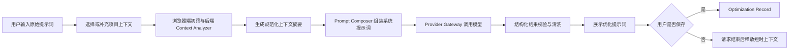

# 产品与范围设计

## 1. 产品定位

Prompt Optimizer Platform 是一个面向开发者、独立开发者和研发团队的提示词工程工具。产品不直接替用户完成软件开发，而是把“我想让模型做什么”整理成包含目标、上下文、约束、输入输出格式和验收标准的高质量提示词。

## 2. 首发用户

| 用户 | 主要问题 | 核心价值 |
| --- | --- | --- |
| 独立开发者 | 不会描述完整技术背景，反复修改提示词 | 用项目上下文快速补足约束 |
| 后端/前端工程师 | 需求描述分散，模型输出不稳定 | 生成可复制、可审查的结构化提示词 |
| 技术负责人 | 团队提示词风格不统一 | 统一工作区偏好、模板和历史 |
| AI 应用开发者 | 需要跨模型复用提示词 | 屏蔽供应商差异，保留模型元数据 |

## 3. MVP 范围

### 必须具备

- 输入原始提示词。
- 粘贴自定义描述，或选择浏览器本地文件/目录并生成项目上下文摘要。
- 识别常见技术栈、语言、框架、构建工具和关键依赖。
- 调用至少一个 OpenAI 兼容模型端点，返回结构化优化提示词。
- 支持“一键增强”：自动补全背景、任务、输出和约束四要素，并根据场景模板追加验收标准和示例。
- 支持项目级上下文、当前优化会话历史和用户自定义项目说明的分层注入。
- 支持权限红线输出，明确哪些文件和动作必须人工确认。
- 支持增强结果二次编辑、撤销、复制和再次增强。
- 支持 Provider 配置、模型参数和 API Key 的安全保存。
- 可选保存优化记录，支持查看、复制、删除和再次优化。
- 展示加载、失败、超时、额度不足和内容截断等状态。

### 可以延后

- 完整注册登录、团队邀请和组织权限。
- 订阅支付、发票和多区域计费。
- VS Code / IntelliJ 插件。
- 实时流式输出和多轮对话式优化。
- 完整的 Agent 执行权限拦截；MVP 只生成权限红线，不执行用户项目操作。
- 语义搜索、团队模板市场和提示词评分基准。

## 4. 核心用户流程

## 5. 优化结果的标准结构

首发版本不强制模型输出 JSON 给用户，但后端应把结果规范为以下语义结构，方便未来做评分、模板和版本对比：

1. 背景：技术栈、已有模块、相关文件和业务背景。
2. 任务：明确要完成的动作、范围和成功定义。
3. 输出：输出格式、文件修改范围或接口契约。
4. 约束：兼容性、安全、性能、风格、禁止事项和权限红线。
5. 执行步骤：推荐模型按什么顺序工作。
6. 验收标准：可验证的结果和测试要求。
7. 示例：仅在能减少歧义时添加。

## 6. 商业化边界

- 所有可计费模型调用都关联租户和用量事件。
- 个人用户和团队用户统一抽象为租户，避免后续重构数据隔离。
- 免费试用、订阅套餐和企业自带 API Key（BYOK）通过策略层实现，而不是写死在优化流程中。
- 用户自有 API Key 默认只用于模型调用，不参与任何提示词内容分析或日志记录。
- 未来可将“团队模板、组织级上下文策略、质量评分、审计导出”作为付费能力。

## 7. 成功指标

首发阶段建议关注：

- 首次优化成功率。
- 从提交到结果展示的 P50/P95 耗时。
- 优化结果复制率和再次优化率。
- 用户主动保存历史的比例。
- 每次优化的输入/输出 Token、成本和毛利。
- 因上下文过大、敏感信息或 Provider 失败导致的失败率。
