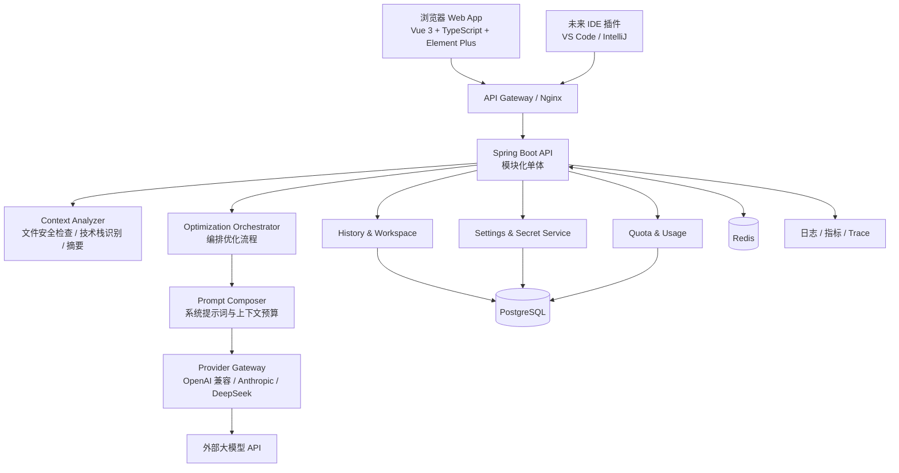
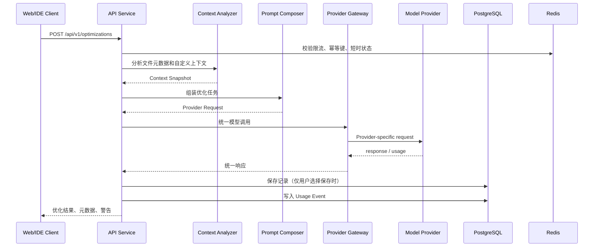

# 系统架构设计

## 1. 架构结论

首发采用“前后端分离 + 模块化单体后端 + PostgreSQL + Redis + 外部模型 Provider”的架构。后端按领域模块隔离依赖，但以一个 Spring Boot 应用部署，降低早期运维和跨服务一致性成本。

## 2. 逻辑架构图

## 3. 单次优化时序

## 4. 关键边界

### 浏览器与本地文件

纯 Web 应用不能安全地读取用户机器上的任意本地路径。首发版本应使用浏览器的目录选择/文件上传能力，由用户主动授权文件集合；后端只接收允许的文件元数据和必要内容。`projectPath` 只能作为用户手动描述或 IDE 插件协议字段，不能被服务器当作本地路径直接读取。

### 上下文与持久化

Context Analyzer 输出的 Context Snapshot 默认是请求级对象。只有用户主动保存历史，或租户策略明确允许时，才持久化经过截断与脱敏的摘要；默认不保存原始源码。

### 模型供应商

业务层只依赖 `ModelProvider` 语义接口，不直接依赖具体 SDK。Provider Gateway 负责认证、超时、重试、错误映射、Token 统计和响应规范化。

## 5. 扩展为多服务的触发条件

只有出现以下信号才考虑拆分：

- Context Analyzer 需要独立的 CPU/内存弹性，且与 API 流量明显不同。
- Provider Gateway 的并发、队列和故障隔离需要独立伸缩。
- 团队、计费或审计模块拥有独立发布节奏。
- 单体模块间出现稳定的领域事件边界，并且拆分收益超过分布式事务成本。

