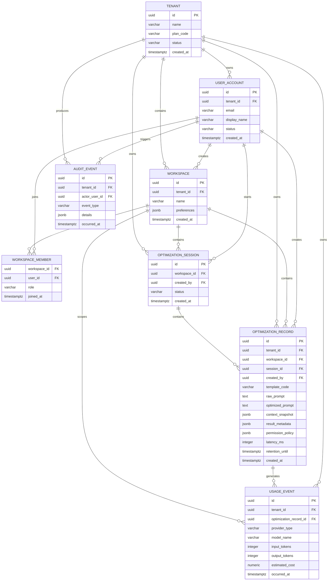

# 数据模型与 ER 图

## 1. 建模原则

- 所有业务数据都通过 `tenant_id` 做租户隔离；即使第一阶段只有个人用户，也不省略这个边界。
- 主键使用 UUID，避免暴露连续数量和跨服务迁移成本。
- 用户可见业务记录和技术日志分离。
- 原始源码默认不落库；可持久化字段必须经过策略、截断和脱敏。
- 模型供应商凭据和默认模型由平台运行环境管理，不存储为租户或工作区业务数据。

## 2. ER 图

下面的图只展示业务表及其核心外键关系。字段清单以本文第 6 节和 Flyway 迁移脚本为准。

### 2.1 Flyway 元数据表

`flyway_schema_history` 由 Flyway 自动创建和维护，用来记录每个数据库迁移脚本是否执行、执行顺序、版本号、校验和、执行耗时及成功状态。它不是业务表，因此不与上面的业务表建立外键关系，也不计入业务数据模型。

当前数据库表数量如下：

| 分类 | 数量 | 表 |
| --- | ---: | --- |
| 业务表 | 8 | `tenant`、`user_account`、`workspace`、`workspace_member`、`optimization_session`、`optimization_record`、`usage_event`、`audit_event` |
| Flyway 元数据表 | 1 | `flyway_schema_history` |
| 合计 | 9 | 8 张业务表 + 1 张迁移元数据表 |

V1 是不可改写的历史初始化迁移，曾创建租户级 `provider_config` 表和 `optimization_record.provider_config_id`；V7 通过前向迁移退役这两项结构。应用 V7 会永久删除 `provider_config` 中已有的全部配置和加密 API Key，以及历史记录上的 Provider 外键。新数据库仍会按顺序执行全部迁移，最终结构不包含用户自定义 Provider 配置表。

Flyway 表的字段注释由 `V2__comment_flyway_history.sql` 添加。不要直接修改该表中的数据，也不要手动删除它；如果迁移脚本已经执行，应通过新增 `V3`、`V4` 等迁移继续演进数据库。

Flyway 表的主要字段如下：

| 字段 | 作用 |
| --- | --- |
| `installed_rank` | 记录迁移执行顺序 |
| `version` | 记录迁移版本号 |
| `description` | 记录迁移说明 |
| `type` | 记录迁移类型，例如 SQL |
| `script` | 记录实际执行的脚本名称 |
| `checksum` | 检查已执行脚本是否被修改 |
| `installed_by` | 记录执行迁移的数据库用户 |
| `installed_on` | 记录迁移执行时间 |
| `execution_time` | 记录迁移耗时，单位为毫秒 |
| `success` | 记录迁移是否成功 |

## 3. 首发建表范围

当前 MVP 已落地的业务表包括：

- `tenant`：个人或组织的计费与隔离主体。
- `user_account`：登录和用户资料。
- `workspace` / `workspace_member`：历史和偏好隔离边界。
- `optimization_session`：一次优化流程的容器。
- `optimization_record`：用户可见历史及其结果。
- `usage_event`：Token、耗时和成本事实。
- `audit_event`：敏感配置变更与管理事件。

平台模型路由从服务端部署配置读取，不在业务数据库中保存用户 API Key、endpoint 或模型偏好。首发迁移还会自动产生 `flyway_schema_history`，它属于框架元数据，不属于业务表。

后续再增加 `plan`、`subscription`、`quota_bucket`、`invoice`、`prompt_template`、`evaluation_run` 等商业化表。

本次提示词增强能力还需要预留以下实体：

### `prompt_template`

保存内置或用户自定义的模块化模板，包括场景、背景模块、输出模块、约束模块、权限模块、版本和可见范围。内置模板由系统维护，用户模板按租户或工作区隔离。

### `optimization_revision`

保存用户主动保存的增强结果版本，用于二次编辑、撤销后的版本恢复、差异对比和再次增强。浏览器临时撤销栈不要求写入数据库，只有用户保存或历史记录开启时才持久化。

### `workspace_memory`

保存用户主动确认的项目级摘要、架构偏好和编码规则，不保存原始源码。每条记忆应包含来源、确认状态、版本和可撤销标记。

### `conversation_message`

保存用户授权的优化会话消息，区分用户输入、系统澄清和模型结果。默认可以只保存在短时上下文中，避免把所有对话内容自动转成长久记忆。

## 4. 持久化策略

| 数据 | 默认策略 | 说明 |
| --- | --- | --- |
| 原始提示词 | 仅在用户保存历史时持久化 | 可配置租户级保留期限 |
| 优化提示词 | 用户保存时持久化 | 支持复制、重载和审计 |
| 原始源码 | 不持久化 | 只参与本次 Context Snapshot |
| 上下文摘要 | 默认不持久化；保存历史时可选择保存 | 只保留必要摘要、文件路径和哈希 |
| API Key | AES-256-GCM 密文 | 密钥由环境变量/KMS 提供，不写入代码库 |
| 用量事件 | 按计费和审计策略保留 | 不保存完整模型请求内容 |

## 5. 索引建议

- `user_account(tenant_id, email)` 唯一索引。
- `workspace(tenant_id, created_at)`。
- `optimization_record(session_id, created_at desc)`。
- `optimization_record(workspace_id, created_at desc)`，实现历史列表；是否保留记录由业务层和 `retention_until` 决定。
- `usage_event(tenant_id, occurred_at)`，实现账期聚合。
- 对 `context_snapshot` 和 `result_metadata` 仅在确有查询需求时添加 GIN 索引，避免过早索引 JSONB。

## 6. 首版逻辑表结构

下面是首版建议结构。它是数据库设计，不代表当前已经执行过建表；真正实现时使用 Flyway 迁移脚本，禁止依赖 Hibernate 自动改生产表。

约定：

- 主键统一使用应用生成的 UUID，避免依赖 PostgreSQL 扩展；
- 时间字段使用 `timestamptz`；
- 状态和角色先使用 `varchar` 加检查约束，方便后续增加取值；
- 所有业务表保留 `tenant_id`，查询时同时校验租户和用户权限；
- `jsonb` 只放结构会演进或不需要经常筛选的内容，核心查询字段单独建列。

### 6.1 租户与用户

#### `tenant`

| 字段 | 类型 | 约束 | 说明 |
| --- | --- | --- | --- |
| `id` | `uuid` | PK | 个人或组织的计费、隔离主体 |
| `name` | `varchar(120)` | NOT NULL | 租户显示名称 |
| `tenant_type` | `varchar(20)` | NOT NULL，默认 `PERSONAL` | `PERSONAL` / `TEAM` |
| `plan_code` | `varchar(40)` | NOT NULL，默认 `FREE` | 当前套餐，后续关联 `plan` |
| `status` | `varchar(20)` | NOT NULL，默认 `ACTIVE` | `ACTIVE` / `SUSPENDED` / `DELETED` |
| `created_at` | `timestamptz` | NOT NULL | 创建时间 |
| `updated_at` | `timestamptz` | NOT NULL | 最后更新时间 |

索引：`tenant(status, created_at)`。

#### `user_account`

| 字段 | 类型 | 约束 | 说明 |
| --- | --- | --- | --- |
| `id` | `uuid` | PK | 用户 ID |
| `tenant_id` | `uuid` | FK，NOT NULL | 所属租户 |
| `email` | `varchar(320)` | NULL | 联系邮箱兼容字段；登录身份由 `user_identity` 管理 |
| `display_name` | `varchar(80)` | NOT NULL | 显示名称 |
| `password_hash` | `varchar(255)` | NULL | BCrypt 密码哈希，禁止保存明文密码 |
| `status` | `varchar(20)` | NOT NULL，默认 `ACTIVE` | `ACTIVE` / `LOCKED` / `DISABLED` |
| `platform_role` | `varchar(24)` | NOT NULL，默认 `USER` | CHECK 仅允许 `USER` / `PLATFORM_ADMIN`；平台角色独立于工作区成员角色 |
| `last_login_at` | `timestamptz` | NULL | 最近登录时间 |
| `created_at` | `timestamptz` | NOT NULL | 创建时间 |
| `updated_at` | `timestamptz` | NOT NULL | 最后更新时间 |

`platform_role` 的数据库 CHECK 保证仅有 `USER`（普通平台用户）和 `PLATFORM_ADMIN`（平台级管理员）；新增账号默认 `USER`。这是 `VARCHAR + CHECK`，并非 PostgreSQL 原生 ENUM。V5 已将邮箱唯一性从 `user_account` 移至登录身份表；`user_identity` 通过 `(identity_type, issuer, normalized_identifier)` 唯一索引防止同一身份绑定多个账号。V9 将身份类型 CHECK 扩展为 `EMAIL`、`PHONE`、`WECHAT`、`USERNAME`。手机号和微信认证流程尚未开放。

### 6.2 工作区与成员

#### `workspace`

| 字段 | 类型 | 约束 | 说明 |
| --- | --- | --- | --- |
| `id` | `uuid` | PK | 工作区 ID |
| `tenant_id` | `uuid` | FK，NOT NULL | 所属租户 |
| `name` | `varchar(120)` | NOT NULL | 工作区名称 |
| `description` | `varchar(1000)` | NULL | 工作区说明 |
| `preferences` | `jsonb` | NOT NULL，默认 `{}` | 模板、界面和上下文偏好，不放密钥 |
| `created_by` | `uuid` | FK，NOT NULL | 创建用户 |
| `status` | `varchar(20)` | NOT NULL，默认 `ACTIVE` | `ACTIVE` / `ARCHIVED` / `DELETED` |
| `created_at` | `timestamptz` | NOT NULL | 创建时间 |
| `updated_at` | `timestamptz` | NOT NULL | 最后更新时间 |

索引：`workspace(tenant_id, created_at desc)`。

#### `workspace_member`

| 字段 | 类型 | 约束 | 说明 |
| --- | --- | --- | --- |
| `workspace_id` | `uuid` | 复合 PK，FK | 工作区 |
| `user_id` | `uuid` | 复合 PK，FK | 成员 |
| `role` | `varchar(20)` | NOT NULL | `OWNER` / `EDITOR` / `VIEWER` |
| `joined_at` | `timestamptz` | NOT NULL | 加入时间 |
| `updated_at` | `timestamptz` | NOT NULL | 角色更新时间 |

约束：一个工作区只能有一个有效 `OWNER`，删除用户前必须处理其工作区归属。

### 6.3 平台模型路由

供应商 endpoint、API Key 和默认模型只从 API 服务环境变量或外部密钥管理系统读取。它们不是用户可写的业务记录，也不会经设置页或业务 API 返回。实际 Provider/模型以增强结果元数据和 `usage_event` 追溯。

### 6.4 优化业务数据

#### `optimization_session`

| 字段 | 类型 | 约束 | 说明 |
| --- | --- | --- | --- |
| `id` | `uuid` | PK | 优化会话 ID |
| `tenant_id` | `uuid` | FK，NOT NULL | 租户隔离 |
| `workspace_id` | `uuid` | FK，NOT NULL | 所属工作区 |
| `created_by` | `uuid` | FK，NOT NULL | 发起用户 |
| `title` | `varchar(160)` | NULL | 可由用户修改的会话标题 |
| `status` | `varchar(20)` | NOT NULL，默认 `ACTIVE` | `ACTIVE` / `ARCHIVED` |
| `created_at` | `timestamptz` | NOT NULL | 创建时间 |
| `updated_at` | `timestamptz` | NOT NULL | 最后更新时间 |

索引：`optimization_session(workspace_id, updated_at desc)`。

#### `optimization_record`

| 字段 | 类型 | 约束 | 说明 |
| --- | --- | --- | --- |
| `id` | `uuid` | PK | 单次优化记录 ID |
| `tenant_id` | `uuid` | FK，NOT NULL | 租户隔离 |
| `workspace_id` | `uuid` | FK，NOT NULL | 查询历史时的边界 |
| `session_id` | `uuid` | FK，NOT NULL | 所属优化会话 |
| `created_by` | `uuid` | FK，NOT NULL | 发起用户 |
| `template_code` | `varchar(40)` | NOT NULL | 使用的提示词模板 |
| `raw_prompt` | `text` | NOT NULL | 只有用户保存历史时持久化 |
| `optimized_prompt` | `text` | NOT NULL | 结构化增强结果 |
| `context_snapshot` | `jsonb` | NULL | 截断、脱敏后的上下文摘要 |
| `result_metadata` | `jsonb` | NOT NULL，默认 `{}` | 段落、歧义、约束等结构化元数据 |
| `permission_policy` | `jsonb` | NOT NULL，默认 `{}` | 权限红线和人工确认规则 |
| `latency_ms` | `integer` | NULL | 本次优化耗时 |
| `retention_until` | `timestamptz` | NULL | 数据保留截止时间 |
| `deleted_at` | `timestamptz` | NULL | 逻辑删除时间；NULL 表示可见记录 |
| `created_at` | `timestamptz` | NOT NULL | 创建时间 |

索引：`optimization_record(workspace_id, created_at desc)`、`optimization_record(session_id, created_at desc)`，以及仅覆盖 `deleted_at IS NULL` 记录的租户/工作区分页索引。用户删除只设置 `deleted_at`；所有历史查询继续限定租户和工作区并过滤已删除行。原始项目源码不进入本表；上下文摘要是否保存必须由用户操作或租户策略决定。

### 6.5 用量与审计

#### `usage_event`

| 字段 | 类型 | 约束 | 说明 |
| --- | --- | --- | --- |
| `id` | `uuid` | PK | 用量事件 ID |
| `tenant_id` | `uuid` | FK，NOT NULL | 计费主体 |
| `workspace_id` | `uuid` | FK，NULL | 归属工作区 |
| `optimization_record_id` | `uuid` | FK，NULL | 关联优化记录 |
| `request_id` | `varchar(64)` | NOT NULL | 便于排查一次请求 |
| `provider_type` | `varchar(40)` | NOT NULL | Provider 类型 |
| `model_name` | `varchar(120)` | NOT NULL | 模型名称 |
| `input_tokens` | `integer` | NULL | 上游返回缺失时保持 NULL |
| `output_tokens` | `integer` | NULL | 上游返回缺失时保持 NULL |
| `latency_ms` | `integer` | NULL | Provider 调用耗时 |
| `estimated_cost` | `numeric(18,8)` | NULL | 估算成本，不伪造精确账单 |
| `currency` | `char(3)` | NULL | 例如 `USD` |
| `usage_status` | `varchar(20)` | NOT NULL | `COMPLETED` / `FAILED` / `INCOMPLETE` |
| `metadata` | `jsonb` | NOT NULL，默认 `{}` | 供应商返回的非敏感元数据 |
| `occurred_at` | `timestamptz` | NOT NULL | 发生时间 |

这是追加型事实表，原则上不更新历史用量。索引：`usage_event(tenant_id, occurred_at)`、`usage_event(request_id)`。

#### `audit_event`

| 字段 | 类型 | 约束 | 说明 |
| --- | --- | --- | --- |
| `id` | `uuid` | PK | 审计事件 ID |
| `tenant_id` | `uuid` | FK，NOT NULL | 租户隔离 |
| `actor_user_id` | `uuid` | FK，NULL | 系统任务可为空 |
| `event_type` | `varchar(60)` | NOT NULL | 管理或安全事件类型 |
| `resource_type` | `varchar(40)` | NULL | 资源类型 |
| `resource_id` | `uuid` | NULL | 资源 ID |
| `details` | `jsonb` | NOT NULL，默认 `{}` | 只保存非敏感变更摘要 |
| `occurred_at` | `timestamptz` | NOT NULL | 发生时间 |

禁止写入 API Key、密码、完整源码、完整请求正文和未经脱敏的上下文。

### 6.6 后续功能表

以下表先完成设计，等历史、设置和登录功能确定后再建立：

- `prompt_template`：系统模板和用户自定义模板，字段包括 `id`、`tenant_id`、`workspace_id`、`owner_user_id`、`template_code`、`name`、`content jsonb`、`version`、`visibility`、`status`、时间字段。
- `optimization_revision`：用户二次编辑版本，字段包括 `id`、`record_id`、`revision_no`、`editor_user_id`、`optimized_prompt`、`sections jsonb`、`change_summary`、`created_at`，唯一约束为 `(record_id, revision_no)`。
- `workspace_memory`：用户确认的项目摘要和规则，字段包括 `id`、`tenant_id`、`workspace_id`、`created_by`、`memory_type`、`title`、`content`、`source`、`confirmed_at`、`version`、`status`、`expires_at`、时间字段；不保存原始源码。
- `conversation_message`：用户主动开启历史对话时使用，字段包括 `id`、`tenant_id`、`session_id`、`sequence_no`、`role`、`content`、`token_count`、`created_at`；默认短时上下文不写入此表。

商业化阶段再设计 `plan`、`subscription`、`quota_bucket`、`invoice` 等计费表，不能把套餐额度直接硬编码在 `tenant` 中长期使用。

## 7. Redis 不替代 PostgreSQL

Redis 只保存短生命周期数据，不承担用户历史和账务事实：

| Key 示例 | 用途 | TTL |
| --- | --- | --- |
| `rate_limit:{tenantId}:{route}` | 接口限流计数 | 秒级到分钟级 |
| `context:{requestId}` | 本次上下文临时缓存 | 分钟级 |
| `idempotency:{tenantId}:{key}` | 防止重复提交 | 分钟级 |
| `session:{sessionId}` | 登录或优化会话元数据 | 按会话策略 |

Redis 数据丢失后可以重新登录、重新分析或重新提交；PostgreSQL 中的历史、配置、用量和审计数据则需要备份。

## 8. 当前实现边界

当前工程已经完成 ER、逻辑表设计和首版 Flyway 迁移，已具备：

- `V1__init_schema.sql`：创建 9 张业务表、索引、约束和业务字段注释；
- `V2__comment_flyway_history.sql`：补充 Flyway 元数据表及字段注释；
- PostgreSQL/Redis 的 Docker Compose 配置。

当前仍未完成：

- MyBatis Mapper、模块化 XML SQL 与历史/配置持久化接口；
- 真实 PostgreSQL/Redis 集成测试；
- 登录、历史记录页面和配置持久化业务接口。

数据库迁移属于不可逆影响较大的操作。已经执行的迁移脚本不得直接修改；后续字段或约束变更必须新增版本化迁移，并在测试数据库验证后再应用到正式环境。
