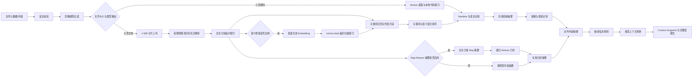

# 上下文分析设计

## 1. 输入方式

### 浏览器目录/文件选择

前端使用目录选择或多文件选择能力，向后端提交相对路径、文件名、大小、扩展名和允许范围内的内容。浏览器不需要、也不应该提交用户本机的真实绝对路径。

### 压缩包上传

作为增强功能支持 zip，但必须在隔离临时目录中解压，防止 Zip Slip、压缩炸弹、软链接逃逸和超大文件占用。解压后仍走统一扫描流程。

### 手动上下文

用户可以直接填写项目描述、架构约束、编码偏好和不可违反的规则。手动上下文的优先级高于自动推断，但系统应把“用户声明”和“工具推断”分开标记。

### 支持与不支持的文件类型

当前浏览器版按文件类型选择两条处理链路：小型源码在浏览器 Worker 中读取；Office、PDF、图片和超过 1 MB 的普通文档按 1 MiB 分片交给后端异步解析并建立临时全文索引。大型文档不再转换成 Base64 JSON：

| 类型 | 后缀 | 处理方式 | 单文件上限 |
| --- | --- | --- | --- |
| 代码与文本 | `css`、`go`、`gradle`、`html`、`java`、`js/ts/jsx/tsx`、`json`、`md`、`py`、`rs`、`scss`、`sql`、`txt`、`vue`、`xml`、`yaml/yml`、`properties` 等 | 读取为文本；项目索引按代码结构分块 | 1 MB |
| 表格 | `xlsx`、`xls`、`et`、`ods` | 分片上传；按工作表和行流式产出文本块并建立索引 | 50 MiB |
| Word / WPS 文档 | `docx`、`doc`、`wps`、`odt` | 分片上传；按正文 XML、段落和页眉页脚提取文本 | 50 MiB |
| 演示文稿 | `pptx`、`ppt`、`dps`、`odp` | 分片上传；按幻灯片提取文本 | 50 MiB |
| PDF | `pdf` | 分片上传；逐页提取已有文本层；扫描版明确提示尚未 OCR | 50 MiB |
| 图片 | `jpg/jpeg`、`png`、`gif`、`webp`、`bmp` | 分片上传；后端只提取格式、尺寸、颜色模型和帧数等元数据，不进行 OCR 或视觉识别 | 50 MiB |

文件经过解析后会返回短时内容片段、独立 `summary` 和 `fileCoverage` 完整度信息。`summary` 默认使用无费用的规则摘要；显式启用 Map-Reduce 后，会让当前聊天模型分批覆盖全文并逐层合并摘要。原始上传文件在解析结束后立即删除，文本分块索引和可选向量索引最长保留 2 小时且不写入数据库或历史记录。解析失败、内容为空、触发安全上限或图片未 OCR 时均返回可读警告，不会假装读取成功。

当前暂不支持以下后缀，界面会明确展示：

`.zip/.rar/.7z/.tar/.gz`、`.exe/.dll/.so/.jar/.class/.bin`、音视频格式、字体文件和 `.psd` 等。

其中扫描版 PDF OCR、`.zip` 解压和图片 Vision 输入属于后续待办能力；在能力落地前，图片只返回元数据，扫描版 PDF 会返回没有可提取文本层的警告。

## 2. 分析流水线



### 2.1 上下文感知 Plan Mode

用户已经提供文件或文件夹时，一键增强不会先做纯文本提问。前端先以原始需求和项目概览词从浏览器本地索引选出初步相关代码；大型文档仍传递 `documentId`，由后端临时全文索引按原始需求召回片段。用户确认发送范围后，`POST /api/v1/context/planning` 完成受保护路径过滤和上下文分析。

计划模型只接收 `PlanningContextDigest`：项目描述、技术栈名称、依赖、目录概览、文件摘要、分析状态和非敏感警告。它不会接收 `ContextSnapshot.fileSnippets[].content`。这样既能避免重复询问文件已经说明的事实，也能限制计划阶段的源码暴露和 Token 消耗。

用户完成弹窗回答后，前端使用“原始需求 + 问题 + 答案”再次检索浏览器本地索引；最终编排器使用相同组合查询大型文档索引。上下文版本是过滤后文件输入和分析查询的 SHA-256 指纹：查询或文件变化时重新分析，全部一致时复用服务端保存的短期快照。上下文和计划会话默认 30 分钟过期，Redis 不可用时仅支持当前进程内降级。

完整时序、接口示例和错误处理见[内置 Plan Mode](./12-内置Plan-Mode交互与接口.md)，逐步代码导读见[上下文感知 Plan Mode 实现教学](./development/上下文感知Plan-Mode实现教学.md)。

### 2.2 语义向量检索

大型文档临时索引支持可选的语义向量检索。文档解析完成后，系统按有限批次调用独立的 Embedding 模型，将每个文本块转换为向量并归一化，再顺序写入同一上传会话目录中的 `vectors.data`。向量不会写入 PostgreSQL、Redis 或优化历史，会与 `chunks.data` 一起在用户删除文件、服务关闭或会话过期时清理。

执行“一键增强”时，原始提示词只生成一次查询向量。系统使用余弦相似度扫描磁盘向量索引，取有限个候选片段，然后按“标准化关键词得分 55% + 语义相似度 45%”进行混合排序。类名、字段名、错误码等精确词仍优先受关键词检索保护，而“汽车保养”与“机动车制动系统检修”这类没有共同字面的相关内容可以通过语义向量进入上下文。

语义检索是增强项，不是单点依赖：功能默认关闭；向量端点不可用、响应数量不一致、模型改变、维度不一致或索引损坏时，当前文档仍可完成解析，并自动退回关键词检索与全文均匀采样。Embedding 使用独立的 `EMBEDDING_*` 配置，不能把 DeepSeek 聊天模型名称直接当作向量模型使用。

当前语义索引覆盖由后端分片处理的大型文档。浏览器本地代码项目仍使用路径、符号、依赖和关键词检索，避免在用户未授权时把整个源码发送给远程 Embedding 服务；后续如扩展到代码项目，应优先接入浏览器本地模型或本地代理，并保留明确的远程传输确认。

### 2.3 Map-Reduce 全文摘要

大型文档的规则摘要只抽取少量代表片段，适合零费用快速预览，但不能稳定概括每个章节。可选的 Map-Reduce 摘要会读取已经建立的全部 `chunks.data`：Map 阶段按批次让当前聊天模型概括所有文本块，Reduce 阶段把中间摘要分组并递归合并，直到得到一份受字符预算约束的最终摘要。

该能力通过 `DocumentSummaryModel` 接口与模型协议解耦，当前 OpenAI 兼容适配器复用 `MODEL_ENDPOINT`、`MODEL_NAME` 和 `MODEL_API_KEY`，不需要第二份聊天模型密钥。`MapReduceDocumentSummarizer` 负责批次大小、全文覆盖、递归归并、进度和调用次数保护，`TemporaryDocumentIndexService` 只提供磁盘分块读取器。摘要模型请求在上传会话锁外执行，因此前端查询状态或取消任务不会被长时间阻塞。

默认配置如下：

```text
MAP_REDUCE_SUMMARY_ENABLED=false
MAP_REDUCE_MAP_BATCH_SIZE=8
MAP_REDUCE_REDUCE_BATCH_SIZE=24
MAP_REDUCE_MAX_BATCH_CHARACTERS=48000
MAP_REDUCE_INTERMEDIATE_CHARACTERS=1200
MAP_REDUCE_FINAL_CHARACTERS=1800
MAP_REDUCE_MAX_MAP_CALLS=256
MAP_REDUCE_MAX_REDUCE_CALLS=32
```

功能默认关闭，因为 Map 阶段可能产生多次模型请求和费用。启用后，如果模型未装配、鉴权失败、超时、响应格式错误或达到调用保护上限，系统会只对受影响批次使用本地规则摘要，并继续保留完整全文索引和检索能力。达到调用上限不代表跳过后续文本块：剩余块仍会进入本地 Map 摘要，再与模型摘要共同参加 Reduce。

Map-Reduce 与语义检索解决的问题不同：前者生成覆盖全文主题的概览，后者根据用户当前任务寻找相关原文片段。“一键增强”仍应使用检索片段作为事实依据，不能用摘要替代原文。开启远程 Map-Reduce 等于允许后端把文档正文分批发送给当前聊天模型，部署时必须在界面和隐私政策中明确告知用户。

## 3. 识别规则

| 文件 | 提取内容 |
| --- | --- |
| `package.json` | Node.js、TypeScript、Vue、React、Next.js 和关键依赖 |
| `pom.xml` | Java、Spring Boot、Spring Cloud、数据库驱动、构建插件 |
| `build.gradle` / `build.gradle.kts` | Java/Kotlin、Spring、Android 和插件 |
| `requirements.txt` / `pyproject.toml` | Python 版本倾向、Django、FastAPI、数据库库 |
| `go.mod` | Go 版本和主要模块 |
| `Cargo.toml` | Rust 版本倾向和主要 crate |
| `composer.json` | PHP、Laravel 等依赖 |
| `Dockerfile` / `docker-compose.yml` | 运行时、服务组件和基础设施 |
| `.github/workflows/*` | CI、构建命令和部署线索 |

识别结果要带来源、置信度和版本，例如：`Spring Boot 3.x / source=pom.xml / confidence=0.98`，避免把猜测当成事实。

## 4. 文件过滤和预算

默认忽略：`.git`、`node_modules`、`target`、`build`、`dist`、`.idea`、`.vscode` 缓存、锁文件中的无关大段内容和生成文件。`.env`、私钥、凭据和明确的生产配置在前后端均会拦截，不进入分析结果。

建议首发默认值：

- 浏览器普通上传单次最多读取 1,000 个候选文件；大型源码目录优先使用 File System Access API 建立完整本地索引。
- 小型源码内联读取上限为 1 MB；Office、PDF、WPS、图片和大型普通文档单文件分片上传上限为 50 MiB。
- 一批文档默认最多 100 个、原文件合计 200 MiB；服务端单进程同时处理的原文件容量上限为 512 MiB。
- 服务端单文档提取安全上限为 100,000,000 字符，压缩文档正文展开保护上限为 256 MiB。
- Context Snapshot 最多返回 40 个相关文件摘要、单文件片段 60,000 字符、片段总量 120,000 字符；这些是临时模型上下文限制，不是本地项目索引上限。
- 文档检索先保留全文代表位置，再加入提示词命中的高相关片段；提示词没有命中或命中不足时，使用均匀分布片段补足预算，不从文件开头顺序填充。
- Map-Reduce 单次模型输入默认不超过 48,000 字符，中间摘要不超过 1,200 字符，最终摘要不超过 1,800 字符；模型调用保护上限与全文索引容量相互独立。
- 发送给提示词增强模型前的上下文预算：按模型上下文窗口动态计算，预留输出 Token 和系统提示词空间。
- 超限处理顺序：先移除生成文件，再截断低相关文件，最后返回可解释警告；不能静默丢弃全部上下文。

## 5. 敏感信息策略

扫描疑似 API Key、JWT、私钥、数据库 URL、密码和云凭证。首发可以采用规则检测 + 掩码；命中高风险信息时默认阻止发送，并允许用户明确确认后只发送脱敏内容。敏感检测结果本身也不应写入普通业务日志。

## 6. Context Snapshot 结构语义

```json
{
  "technologyStack": [
    {"name": "Spring Boot", "source": "services/api/pom.xml", "confidence": 0.98}
  ],
  "dependencies": [],
  "directoryTree": [],
  "fileSnippets": [
    {
      "path": "docs/需求说明.txt",
      "language": "text",
      "content": "短时分析片段",
      "summary": "文件主要说明了需求目标、处理步骤和预期结果。",
      "truncated": false
    }
  ],
  "analysisStatus": "COMPLETE",
  "fileCoverage": [
    {
      "path": "docs/需求说明.txt",
      "extractionStatus": "COMPLETE",
      "sourceBytes": 12582912,
      "extractedCharacters": 9300000,
      "indexedChunks": 1661,
      "selectedChunks": 10,
      "selectedCharacters": 60000,
      "contextLimited": true,
      "message": "全文已建立临时索引，本次只发送与任务相关的片段"
    }
  ],
  "customDescription": "",
  "warnings": [],
  "redactions": [],
  "analysisVersion": "v3"
}
```

本地项目索引会先扫描和保存符合条件的代码块，执行“分析上下文”或“一键增强”时才检索与当前任务相关的片段。后端会去除索引路径中的 `#chunk-N` 标记后再识别 Manifest、语言和框架，避免技术栈漏判。

大型文档采用相同的“索引容量与模型上下文分离”原则：临时索引保存全部已提取分块，而 `Context Snapshot` 和模型请求只携带最多 10 个相关或代表片段。`contextLimited=true` 表示模型上下文经过选择，不表示源文档解析不完整；是否完整应查看 `extractionStatus` 和 `analysisStatus`。
