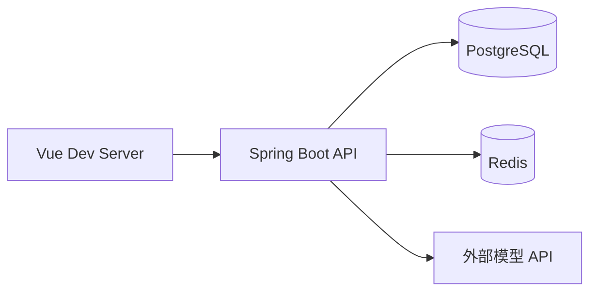
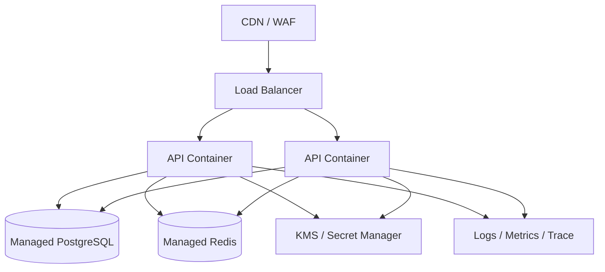

# 部署与运维设计

## 1. 本地开发拓扑

本地开发建议用 Docker Compose 启动 PostgreSQL 和 Redis；前端与后端使用各自开发服务器运行。模型 API Key 只通过本地环境变量或开发配置注入，不提交到仓库。

## 2. 测试环境

- 前端静态资源由 Nginx 或云 CDN 提供。
- API 使用一个无状态容器，可水平扩展。
- PostgreSQL 和 Redis 使用独立持久化服务。
- 通过环境变量或密钥管理系统注入数据库、Redis 和平台 Provider 路由凭据。
- 数据库迁移在发布流水线中执行，应用启动不应隐式修改生产 schema。

## 3. 生产拓扑

## 4. 环境变量分类

| 分类 | 示例 | 说明 |
| --- | --- | --- |
| 应用 | `APP_ENV`, `SERVER_PORT` | 不含秘密 |
| 数据库 | `DB_URL`, `DB_USERNAME`, `DB_PASSWORD` | 使用 Secret Manager |
| Redis | `REDIS_URL`, `REDIS_PASSWORD` | 用于限流、缓存和会话 |
| 模型并发 | `MODEL_CONCURRENCY_GLOBAL_LIMIT`, `MODEL_CONCURRENCY_USER_LIMIT` | 默认 50 个上游调用、每账号 3 个模型相关请求；所有 API 实例使用相同配置。 |
| 并发存储 | `MODEL_CONCURRENCY_STORE_MODE`, `MODEL_CONCURRENCY_KEY_PREFIX` | 默认 `REDIS` / `prompt-optimizer:model-concurrency`。同一部署共用 Redis 和前缀；不同环境必须隔离前缀。`MEMORY` 仅用于本地单实例。 |
| 安全 | `APP_ENCRYPTION_KEY`, `JWT_ISSUER` | 禁止写入仓库 |
| Provider | `DEFAULT_PROVIDER`, `DEFAULT_MODEL` | API Key 仍应进入密钥服务 |
| 观测 | `OTEL_EXPORTER_OTLP_ENDPOINT` | 测试/生产启用 |

## 5. 监控指标

- `optimization_requests_total`：按租户、Provider、结果统计。
- `optimization_latency_ms`：API、Context Analyzer、Provider 分段耗时。
- `provider_errors_total`：鉴权、限流、超时、上下文超限。
- `context_input_bytes` 和 `context_tokens`：监控上下文大小。
- `usage_input_tokens`、`usage_output_tokens`、`estimated_cost`。
- `quota_rejections_total` 和 `rate_limit_rejections_total`。

## 6. 结构化日志与故障定位

后端通过 SLF4J 输出单行 `key=value` 事件。本地开发时查看 API 服务控制台；容器部署时由平台采集容器标准输出。日志默认不持久化到应用本地文件，生产环境应由容器平台或日志服务设置访问权限、保留期和告警规则。

所有 HTTP 请求结束时输出 `event=http.request.completed`，包含 `requestId`、HTTP 方法、Spring 路由模板、状态码和耗时。`X-Request-Id` 响应头会返回同一请求标识；请求传入不安全或超长标识时，服务端会生成新的 UUID。排查前端错误时，先按 requestId 搜索这条请求日志，再搜索同一 requestId 下的阶段或模型日志。

主要业务事件如下：

| 事件 | 说明 |
| --- | --- |
| `context.prepare.completed` / `context.prepare.failed` | Plan 上下文准备结果；记录分析文件数、字符数、警告数、耗时，并标明 `modelCall=false`，因为该阶段只执行上下文分析。 |
| `plan.completed` / `plan.failed` | Plan 问题生成的结果、模板、问题数量或失败类别。 |
| `optimization.completed` / `optimization.failed` | 最终增强结果的段落数、歧义项数、Mock 状态及耗时。 |
| `model.call.completed` / `model.call.failed` | 每次实际模型调用的操作类型、Provider 路由、服务端解析后的模型 ID、平台默认路由来源、尝试次数、输入条目数、明确返回的 Token 用量、耗时及失败分类。结构化输出修复重试会逐次记录。 |
| `document.index.started` / `document.index.completed` / `document.index.failed` / `document.index.cancelled` | 文档后台处理阶段的文件字节数、分块数、摘要调用统计、失败类别及总耗时。后台任务会继承触发处理的完成上传请求 ID。 |
| `document.index.stage.completed` | 区分 `EXTRACTING`（解析和正文分块）、`INDEXING`（可选向量建立）、`SUMMARIZING`（摘要）阶段；记录 requestId、workflowId、fileBytes、chunks 和该阶段的 durationMs。阶段结束不等于模型功能启用或未降级，需结合最终状态、警告及模型调用事件判断。 |
| `request.unexpected_failure` | 未预期异常的安全诊断，包含请求标识、路由和有限的异常类型/代码位置，不记录异常消息或请求正文。 |

`workflowId` 是上下文、计划或文档资源标识的短哈希，用于关联跨请求或异步事件，不输出原始 ID。`providerRoute` 和 `resolvedModelId` 只记录平台服务端默认路由和实际模型标识，不记录端点或凭据。Token 数量仅在上游响应明确提供时记录，缺失时为 `-`；系统不会估算 Token 或成本。当前日志不包含租户/用户身份标签，也不直接计算成本，避免将个人标识加入普通技术日志。

`inputItems` 表示本次调用的逻辑输入数量：提示词增强或 Plan 请求通常为 `1`，文档摘要为输入片段数，向量模型为批次文本数。它不是原始正文长度。

日志严格不包含提示词、对话、文件名/路径/正文、HTTP 请求或响应正文、API Key、密码、Token、私钥、模型端点和上游错误消息。新增日志字段应保持低敏、有限长度并经过单行规整；不得为排障记录请求体或整个异常对象。

## 7. 备份与恢复

- PostgreSQL 开启自动备份和 PITR，定期演练恢复。
- Redis 只保存可重建的短时数据时可降低持久化要求；若存会话，则必须评估故障恢复体验。
- 备份数据同样视为敏感数据，单独加密并限制访问。
- 删除请求应定义备份中的延迟清除窗口，并在隐私政策中明确。
