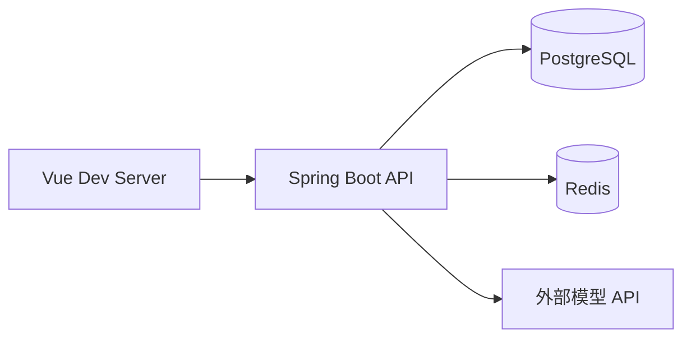
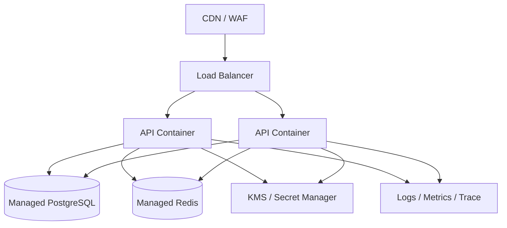

# 部署与运维设计

## 1. 本地开发拓扑

本地开发建议用 Docker Compose 启动 PostgreSQL 和 Redis；前端与后端使用各自开发服务器运行。模型 API Key 只通过本地环境变量或开发配置注入，不提交到仓库。

## 2. 测试环境

- 前端静态资源由 Nginx 或云 CDN 提供。
- API 使用一个无状态容器，可水平扩展。
- PostgreSQL 和 Redis 使用独立持久化服务。
- 通过环境变量注入数据库、Redis、加密主密钥和 Provider 配置。
- 数据库迁移在发布流水线中执行，应用启动不应隐式修改生产 schema。

## 3. 生产拓扑

## 4. 环境变量分类

| 分类 | 示例 | 说明 |
| --- | --- | --- |
| 应用 | `APP_ENV`, `SERVER_PORT` | 不含秘密 |
| 数据库 | `DB_URL`, `DB_USERNAME`, `DB_PASSWORD` | 使用 Secret Manager |
| Redis | `REDIS_URL`, `REDIS_PASSWORD` | 用于限流、缓存和会话 |
| 安全 | `APP_ENCRYPTION_KEY`, `JWT_ISSUER` | 禁止写入仓库 |
| Provider | `DEFAULT_PROVIDER`, `DEFAULT_MODEL` | API Key 仍应进入密钥服务 |
| 观测 | `OTEL_EXPORTER_OTLP_ENDPOINT` | 测试/生产启用 |

## 5. 监控指标

- `optimization_requests_total`：按租户、Provider、结果统计。
- `optimization_latency_ms`：API、Context Analyzer、Provider 分段耗时。
- `provider_errors_total`：鉴权、限流、超时、上下文超限。
- `context_input_bytes` 和 `context_tokens`：监控上下文大小。
- `usage_input_tokens`、`usage_output_tokens`、`estimated_cost`。
- `quota_rejections_total` 和 `rate_limit_rejections_total`。

## 6. 备份与恢复

- PostgreSQL 开启自动备份和 PITR，定期演练恢复。
- Redis 只保存可重建的短时数据时可降低持久化要求；若存会话，则必须评估故障恢复体验。
- 备份数据同样视为敏感数据，单独加密并限制访问。
- 删除请求应定义备份中的延迟清除窗口，并在隐私政策中明确。

