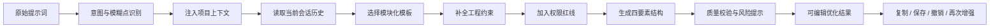

# 提示词增强能力设计

## 1. 产品定位

提示词增强是本产品的核心工作流：用户输入一句模糊需求，系统结合用户选择的项目上下文、当前优化会话、历史消息和模板策略，生成一份可直接交给开发型大模型执行的结构化提示词。

这里的“增强”不是替用户决定业务方案，也不是自动执行代码修改，而是补齐意图、工程背景、输出格式、约束和验收标准。

## 2. 一键增强流程



## 3. 五步增强法

### 第一步：四要素结构化

所有增强结果至少包含：

1. 背景（Background）：项目类型、技术栈、当前状态、相关上下文。
2. 任务（Task）：要完成的具体动作、范围和优先级。
3. 输出（Output）：希望模型返回什么，格式、文件、接口或解释要求是什么。
4. 约束（Constraints）：性能、安全、兼容性、编码规范、禁止事项和边界条件。

可选扩展：实施步骤、验收标准、示例输入输出、风险和待确认问题。

### 第二步：一键增强

用户点击“增强”后，系统执行以下动作：

- 识别模糊动词和缺少对象的描述。
- 将宽泛需求转换为可执行任务。
- 从项目上下文中补充已有技术栈和文件位置。
- 从模板中添加常见工程约束。
- 对不确定内容标记为“待确认”，不伪造项目事实。

例如“弄个排序”不应直接假定为快速排序，而应根据上下文判断；如果没有足够信息，应输出待确认项或给出合理默认并明确标注。

### 第三步：项目级上下文记忆

上下文分为三层：

| 层级 | 内容 | 生命周期 |
| --- | --- | --- |
| 请求上下文 | 本次用户选择的文件、目录摘要和自定义描述 | 单次优化 |
| 工作区上下文 | 用户确认过的技术栈、架构偏好、编码规范和项目说明 | 工作区配置 |
| 会话上下文 | 当前对话中的原始需求、澄清问题和上一次结果 | 当前优化会话 |

项目源码默认不进入长期记忆。工作区记忆只保存用户主动确认的摘要和规则，不默认保存原始代码。

### 第四步：权限红线

权限红线用于约束优化结果和未来 IDE Agent 的执行范围。首发阶段系统只负责生成并展示红线，不执行文件修改；未来插件或 Agent 执行时再强制校验。

建议支持：

- 禁止访问的目录或文件：`.env`、证书、私钥、生产配置。
- 禁止执行的动作：删除数据库、批量删除文件、发布生产、修改权限。
- 必须人工确认的动作：数据库迁移、依赖升级、外部网络请求、删除或覆盖文件。
- 允许自动执行的范围：指定工作区内的源代码和测试文件。
- 敏感信息规则：不得输出 API Key、密码、Token 或完整凭证。

红线必须出现在优化结果的“约束”或“权限边界”部分，并且不能被用户上传文件中的文本覆盖。

### 第五步：模块化 Prompt 模板

模板是可组合的提示词模块，不是不可修改的固定话术。首发内置：

- 新功能开发
- Bug 修复
- 代码重构
- API 设计
- 数据库变更
- 单元测试补充
- 性能优化
- 安全审查
- 技术文档编写

模板由场景模块、技术栈模块、输出格式模块、质量约束模块和权限模块组合而成。未来支持用户自定义模板、团队共享模板和模板版本。

## 4. 模糊需求处理规则

系统应识别以下问题：

- 缺少目标对象：例如“弄个排序”没有说明数据类型和用途。
- 缺少范围：没有说明修改哪些模块或文件。
- 缺少输出：没有说明需要代码、方案、接口还是解释。
- 缺少验收标准：没有说明什么结果算完成。
- 技术栈冲突：用户描述与项目文件识别结果不一致。
- 高风险动作：需求可能涉及删除、迁移、权限或生产操作。

处理优先级：使用已确认事实 → 询问关键问题 → 给出明确标注的默认值。不得把猜测包装成项目事实。

## 5. 对话历史与二次编辑

用户可以对增强结果进行修改、复制、再次增强和撤销。首发建议：

- 浏览器端保留当前编辑历史栈，支持撤销/恢复。
- 后端保存用户主动保存的原始提示词、增强结果和版本号。
- 再次增强时使用当前编辑结果作为输入，并保留原始版本。
- 对话历史只在用户授权或保存会话时持久化。

未来可以增加差异对比、版本标签、评论和团队评审。

## 6. 输出结构示例

```markdown
## 背景
这是一个 Vue 3 + Spring Boot 3 的前后端分离项目，当前已有用户模块。

## 任务
为用户模块增加基于 JWT 的登录能力，支持登录、刷新令牌和退出登录。

## 输出
请先分析现有认证相关代码，再给出实现步骤、接口定义、关键代码和测试方案。

## 约束
- 保持现有 API 兼容性。
- API Key、密码和 Token 不得写入日志。
- 使用参数化查询，防止 SQL 注入。
- 关键逻辑补充单元测试和接口测试。
- 未经确认不得删除或覆盖现有文件。

## 验收标准
列出正常登录、错误密码、过期 Token、重复刷新和退出登录场景。
```

## 7. MVP 与后续版本

### MVP 必须实现

- 一键增强按钮。
- 四要素结构化输出。
- 原始提示词与自定义项目描述输入。
- Context Snapshot 注入。
- 至少 4 个内置模板：新功能、Bug 修复、重构、测试。
- 基础约束补全和权限红线输出。
- 前端编辑、复制、撤销和再次增强。

### 后续实现

- 持久化对话历史和版本差异。
- 工作区长期记忆。
- 用户/团队模板市场。
- IDE Agent 的真实权限执行拦截。
- 提示词质量评分和 A/B 测试。

