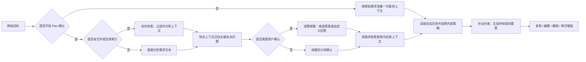

# 提示词增强能力设计

## 1. 产品定位

提示词增强是本产品的核心工作流：开发人员、科研工作者、学生或其他用户输入一句初步需求，可直接生成优化提示词，也可主动开启 Plan 确认。有文件且开启 Plan 时，系统先分析相关上下文，再用自然语言确认仍会影响结果的细节，最后结合确认答案、当前会话和内部生成策略，产出一份可直接交给大模型使用的结构化提示词。

增强围绕用户原始意图，补充有依据的背景、明确必要约束，并组织输出与验收要求。平台最终交付物始终是优化提示词；报告、统计结果和代码实现是用户随后交给模型或工具执行的任务。

### 原始意图与交付物边界

- **保持任务目标**：用户要求撰写报告时，优化提示词继续要求撰写报告，不擅自改成统计分析方案、提纲或补材料问卷。用户明确只要方案、提纲或模板时，同样保留该范围，不反向扩展成完整报告。
- **材料辅助理解**：用户提供的报告、数据字典、代码和其他文件用于补充相关背景与事实，不能因附件属于某一行业或包含某些关键词就替换当前任务。事实与假设、建议及用户确认分别表达。
- **结构服务内容**：四要素和场景模板用于梳理原有需求，不强行追加交付物、必答问题或大片通用填空内容。信息充分时允许少改；信息不足时，只保留影响结果的必要边界，不把完整填写资料作为增强的通用前置条件。
- **Plan 服务增强**：提问用于澄清会改变任务结果的关键决定，答案用于更新优化提示词。普通组织与表达细节可交给下游执行者，真正未知的专业事实不能自动写成已确认。
- **区分增强与执行**：增强模型输出面向下游执行者的指令，不在增强阶段直接撰写报告或执行统计计算。文中“先起草”“继续交付”等要求均属于优化提示词的内容；评测脚本调用下游模型生成实际作品，仅用于检验提示词质量，不代表产品提供任务执行功能。

后续修改增强策略、Plan、任务模板或结果组装时，至少核对：原始任务及交付物是否保留、增强结果是否仍为提示词、附加约束是否有依据、资料不足是否造成目标降级。具体反例应同时覆盖“写报告”“只要分析方案”“明确要求模板”以及材料不足的情况；规范明确不等于所有模型输出已通过验收。

## 2. 一键增强流程



## 3. 五步增强法

### 第一步：四要素结构化

所有增强结果至少包含：

1. 背景（Background）：项目类型、技术栈、当前状态、相关上下文。
2. 任务（Task）：要完成的具体动作、范围和优先级。
3. 输出（Output）：希望模型返回什么，格式、文件、接口或解释要求是什么。
4. 约束（Constraints）：性能、安全、兼容性、编码规范、禁止事项和边界条件。

可选扩展：实施步骤、验收标准、示例输入输出、风险和待确认问题。

### 第二步：一键增强

用户点击“增强”后，系统根据 Plan 开关选择路径。默认关闭时只准备一次最终上下文，以 `AUTO` 策略直接生成，并把仍缺失的关键信息放入 `ambiguities`。用户主动开启 Plan 时，系统执行以下动作：

- 识别模糊动词和缺少对象的描述。
- 将宽泛需求转换为可执行任务。
- 识别答案会明显改变最终结果的未决问题。
- 已提供文件时，先使用脱敏后的技术栈、目录和文件摘要排除资料中已经明确的问题。
- 为有限选项推断可直接采用的候选答案，同时保留自定义回答。
- 在弹窗中逐题询问，全部回答后才生成最终提示词。
- 全部回答后用确认事实再次检索上下文，再按内部策略补充可验证事实和领域约束。

#### 正文交付与资料缺口（2026-10-09）

要求“撰写报告／分析正文”的需求不能因为资料不全而降级为分析方案、补材料问卷或大片待填模板。`DraftDeliveryContract` 在增强模型请求和最终结果组装中保持优化提示词的正文交付目标，并向下游执行者传达以下要求：先完成有依据的连贯初稿，缺数据的结果章节集中说明结论边界，只在必要的具体值处标注缺口。平台本身仍只生成提示词。常规组织与有适用前提的方法建议交给执行者，不将建议写成用户已确认，也不虚构实际数据、研究结果或引用。

用户明确只要方案、提纲、纯 JSON／CSV、译文、只读比较，或要求先提问／禁止占位／确认前不得起草时，仍按原要求交付。一个计算参数待定只暂停依赖它的内容；不同指标的独立依据、观察起止、原定指标表／代码及真实冲突继续保留。研究报告附带代码时，仍由原有共享任务判定决定五条动态平台约束，不另建工程分类器。

直接增强保留必要资料提示，其用途是让下游执行者知道哪些内容可继续、哪些结论受资料限制，而非要求用户先逐项回答。完整未决清单仍保存在可复制的优化提示词正文；展示数量上限不删掉独立条件。确定重复的独立整行只在对象、年份、条件、运算符等均相同的情况下合并；引用、表格、代码及新信息不做模糊删除。验证范围及真实作品中的残留问题见[报告初稿交付与资料缺口修复](./testing/报告初稿交付与资料缺口修复-2026-10-09.md)。

例如“弄个排序”不应直接假定为快速排序；开启 Plan 时，只询问数据类型、排序规则或交付形式中真正影响结果且尚未明确的部分。科研需求同样按当前交付目标判断是否需要确认地区、数据来源或指标口径，不机械地逐项询问所有专业参数，不向用户展示“缺失输入维度”之类的内部术语。

### 第三步：项目级上下文记忆

上下文分为三层：

| 层级 | 内容 | 生命周期 |
| --- | --- | --- |
| 请求上下文 | 本次用户选择的文件、目录摘要和自定义描述 | 单次优化 |
| 工作区上下文 | 用户确认过的技术栈、架构偏好、编码规范和项目说明 | 工作区配置 |
| 会话上下文 | 当前对话中的原始需求、澄清问题和上一次结果 | 当前优化会话 |

项目源码默认不进入长期记忆。工作区记忆只保存用户主动确认的摘要和规则，不默认保存原始代码。

### 第四步：权限红线

权限红线用于约束优化结果和未来 IDE Agent 的执行范围。首发阶段系统只负责生成并展示红线，不执行文件修改；未来插件或 Agent 执行时再强制校验。

建议支持：

- 禁止访问的目录或文件：`.env`、证书、私钥、生产配置。
- 禁止执行的动作：删除数据库、批量删除文件、发布生产、修改权限。
- 必须人工确认的动作：数据库迁移、依赖升级、外部网络请求、删除或覆盖文件。
- 允许自动执行的范围：指定工作区内的源代码和测试文件。
- 敏感信息规则：不得输出 API Key、密码、Token 或完整凭证。

代码任务的默认红线必须出现在优化结果的“约束”部分，并且不能被用户上传文件中的文本覆盖。服务端受保护路径过滤与敏感信息检测对所有任务执行，不依赖提示词显示开关。

#### 平台固定条款与任务规则分组

`TaskIntentResolver` 根据用户本次肯定目标及服务端绑定的 Plan 答案判断。显式软件模板保持优先；研究／写作附带明确代码交付时保留主任务画像，并启用代码固定条款。附件含 Java/Vue、选择 R 作为分析工具、否定代码要求、翻译中的源文本、尚未确认的代码选项，均不能单独升级为开发任务。

代码任务的“平台强制约束（不得删除或弱化）”固定为：

- 明确区分已知事实、用户确认信息和必要假设，不得把猜测写成事实。
- 不得在代码、日志或响应中泄露密码、Token、API Key 或私钥。
- 输出应直接回应用户目标，遵守已明确的交付范围和格式；仅在任务需要且未限制额外说明时，说明关键依据、适用范围和限制条件。
- 禁止读取或输出受保护路径：.env、**/*.pem、**/*.key、生产环境配置。
- 以下操作必须先获得人工确认：删除或覆盖文件、数据库结构迁移、升级核心依赖、生产环境部署。

非代码任务的固定块只包含第一条。该变化只决定固定块显示：业务规则、用户指定格式与篇幅、研究／工程规范、用户补充权限、真正未决条件继续保留。`ConstraintBundle` 在内部区分平台固定、任务和用户权限三组；Provider 接收适用列表，`OptimizationResultAssembler` 在普通规则去重后追加权威固定块，`appliedConstraints`、段落和可复制正文保持对应。

再次增强仅归一化旧平台标题内的完整固定行，用户独立声明的同文限制仍保留；引文、表格、代码块和带新增条件的业务条款不按关键词删除。编辑补回沿用后端结果中的分组，不由前端重新推断任务。历史原记录不重写。

### 第五步：内部生成策略

生成策略是服务端内部使用的组合规则，不是要求用户理解或选择的固定话术。当前包含：

- 通用任务；
- 研究分析；
- 新功能开发；
- Bug 修复；
- 代码重构；
- 测试补充。

服务端根据本次任务意图自动选择策略，前端主流程不显示模板卡片或模板代码。策略由场景指导、技术栈、输出格式、质量约束和权限模块组合；后续可在不增加用户认知负担的前提下扩展。

## 4. 模糊需求处理规则

系统应识别以下问题：

- 缺少目标对象：例如“弄个排序”没有说明数据类型和用途。
- 缺少范围：没有说明修改哪些模块或文件。
- 缺少输出：没有说明需要代码、方案、接口还是解释。
- 缺少验收标准：没有说明什么结果算完成。
- 技术栈冲突：用户描述与项目文件识别结果不一致。
- 高风险动作：需求可能涉及删除、迁移、权限或生产操作。

处理优先级：使用已确认事实 → 开启 Plan 时在生成前询问关键问题 → 对低影响细节使用明确标注且可撤销的默认值。不得把猜测包装成项目事实。完成弹窗确认后，最终结果不再重复展示同一批待确认项；直接增强允许把未决问题明确列入 `ambiguities`。

## 5. 对话历史与二次编辑

用户可以对增强结果进行修改、复制、再次增强和撤销。当前实现：

- 浏览器端保留最近 20 个结果版本，支持撤销上一次编辑或再次增强结果。
- 后端在最终生成后保存原始提示词、最终结果和已确认答案；不保存项目文件正文。
- 再次增强时使用当前编辑结果作为输入并保留原始版本；是否再次进入 Plan 由当前开关决定。
- 编辑时被删除的平台强制约束会自动补回。
- 对话历史只在对应选项启用时进入模型和历史元数据。

未来可以增加差异对比、版本标签、评论和团队评审。

## 6. 输出结构示例

```markdown
## 背景
这是一个 Vue 3 + Spring Boot 3 的前后端分离项目，当前已有用户模块。

## 任务
为用户模块增加基于 JWT 的登录能力，支持登录、刷新令牌和退出登录。

## 输出
请先分析现有认证相关代码，再给出实现步骤、接口定义、关键代码和测试方案。

## 约束
- 保持现有 API 兼容性。
- API Key、密码和 Token 不得写入日志。
- 使用参数化查询，防止 SQL 注入。
- 关键逻辑补充单元测试和接口测试。
- 未经确认不得删除或覆盖现有文件。

## 验收标准
列出正常登录、错误密码、过期 Token、重复刷新和退出登录场景。
```

## 7. MVP 与后续版本

### MVP 必须实现

- 一键增强按钮。
- 默认直接增强和用户主动开启的 Plan 确认开关。
- 首次开启说明、自然语言问题弹窗与候选答案。
- 四要素结构化输出。
- 原始提示词与自定义项目描述输入。
- Context Snapshot 注入。
- 通用、研究分析和至少 4 个软件任务内部策略。
- 基础约束补全和权限红线输出。
- 前端编辑、复制、撤销和再次增强。

### 后续实现

- 持久化对话历史和版本差异。
- 工作区长期记忆。
- 用户/团队模板市场。
- IDE Agent 的真实权限执行拦截。
- 提示词质量评分和 A/B 测试。

