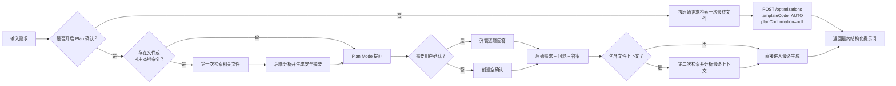
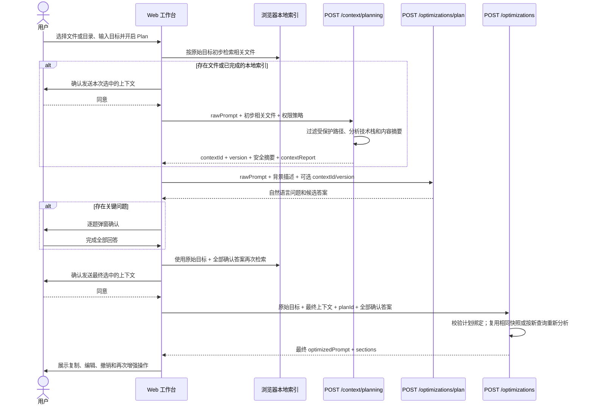
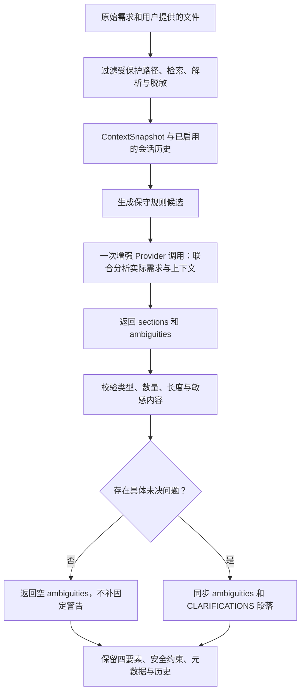

# 内置 Plan Mode：先确认关键问题，再生成最终提示词

## 1. 目标与交互原则

工作台默认关闭 Plan 确认，用户点击“直接增强提示词”后只准备一次最终上下文，并直接生成结果。用户主动打开“Plan 确认”后，流程变为“上下文准备、计划确认、最终生成”三阶段：没有上传资料时根据需求提出少量业务问题；已经上传文件或建立本地目录索引时，先分析初步相关资料，再结合需求与安全摘要提问。用户逐项回答后，系统按确认信息再次检索上下文，并一次生成可复制、可编辑的最终提示词。

用户界面遵循以下原则：

- Plan 确认默认关闭，开关状态保存在当前浏览器；首次开启先展示用途说明，用户可以接受，也可以改为直接增强。
- 主按钮明确显示当前动作：关闭时为“直接增强提示词”，开启时为“先确认并增强”；生成期间禁止切换模式。
- 不展示 `TemplateCode`、字段名、缺失维度或内部分类依据。
- 问题使用用户所在领域的自然语言。例如科研任务询问地区、数据来源和统计工具，软件任务询问运行环境和验收结果。
- 一次只展示一个问题，给出进度、候选答案和自定义输入。
- 只询问答案会明显改变最终结果的问题；已明确的信息不重复询问。
- 文件已经说明的技术栈、数据格式、目录结构或既有实现不重复询问。
- 全部问题回答完成后才调用最终生成接口。
- 需求已经足够完整时不弹窗，直接生成最终提示词。

## 2. 实现模块

| 模块 | 主要职责 |
| --- | --- |
| `PlanningContextController` | 接收初步相关文件，返回可引用的短期上下文分析结果 |
| `PlanningSessionService` | 生成上下文版本、绑定计划问题与用户回答、判断最终阶段能否复用快照 |
| `PlanningSessionStore` | 以 30 分钟 TTL 保存上下文与计划；优先 Redis，本地联调可降级到进程内存储 |
| `OptimizationPlanningService` | 调用计划 Provider、校验问题数量与可读性、拦截内部术语和疑似凭据 |
| `PromptPlanningProvider` | 隔离计划生成能力，Mock 与 OpenAI 兼容实现共享契约 |
| `MockPromptPlanningProvider` | 为本地联调提供科研、软件、写作和通用场景的确定性问题 |
| `OpenAiCompatiblePromptEnhancementProvider` | 使用当前模型生成领域问题与最终结构化段落 |
| `PromptTemplateRegistry` | 在服务端内部推断通用、研究分析或软件生成策略 |
| `DefaultEnhancementOrchestrator` | 过滤受保护上下文、读取确认答案、补全约束并调用最终 Provider |
| `OptimizationResultAssembler` | 强制四要素完整，合并确认答案和平台红线，渲染 `optimizedPrompt` |
| `ProtectedContextFilter` | 在上下文分析和模型调用前移除默认及用户追加的受保护路径 |
| `PlanQuestionDialog.vue` | 在工作台中逐题展示问题、候选答案、自定义回答和生成入口 |
| `optimization` Pinia Store | 维护上下文引用、计划、最终结果、编辑撤销栈与再次增强输入 |
| `optimizationRequest.ts` | 统一构建上下文准备请求、计划请求、最终请求和包含确认答案的二次检索词 |

## 3. 调用流程

下面的流程图同时展示直接增强与上下文感知 Plan 两条路径。直接增强跳过 `/context/planning` 和 `/optimizations/plan`；Plan 路径在有文件时先分析安全摘要，再提问，并在用户回答后用确认信息构造最终检索词。



### Plan 路径接口时序图



Plan 路径采用方案 B：**先分析用户主动提供的相关上下文，再基于上下文发起 Plan Mode，最后生成结果**。`/optimizations/plan` 本身仍不接收文件正文，只接收 `/context/planning` 返回的短期引用；计划 Provider 只看到裁剪后的 `PlanningContextDigest`。未过滤的原始文件正文和完整本地索引不会写入计划请求、Redis 或优化历史；Redis 上下文会话只短期保存分析后已脱敏、受预算限制的 `ContextSnapshot`。

直接增强不会创建 `contextId` 或 `planId`。有文件时，浏览器按原始需求检索一次并在用户确认发送后随 `/optimizations` 提交；后端仍执行受保护路径过滤、上下文分析、模板推断、权限红线和结果校验。两条路径共享最终生成接口与安全边界。

第二次检索使用“原始需求 + 服务端校验后的问题文本 + 用户答案”。这对两类索引都生效：浏览器本地项目索引会重新选择代码块，后端大型文档索引会用同一组合查询重新召回相关片段。若没有确认问题且文件集合、内容和查询均未变化，最终编排器直接复用首次 `ContextSnapshot`；否则重新分析，避免把过期或不相关的快照当作最终依据。

## 4. Plan 前上下文准备接口

### `POST /api/v1/context/planning`

只有用户已经选择文件、文档或已完成本地目录索引时，工作台才调用该接口。前端先按原始需求检索一批初步相关文件，并按隐私设置要求用户确认本次发送范围。后端随后执行受保护路径过滤、文档片段检索、技术栈识别、摘要和完整度分析。

请求示例：

```json
{
  "rawPrompt": "给用户模块添加登录功能",
  "context": {
    "customDescription": "Spring Boot 用户服务",
    "files": [
      {
        "path": "pom.xml",
        "content": "<project>...</project>",
        "language": "xml"
      }
    ]
  },
  "permissionPolicy": {
    "protectedPaths": [],
    "requireConfirmationFor": []
  }
}
```

响应示例：

```json
{
  "requestId": "req_context_01",
  "data": {
    "contextId": "ea9d3453-5bd7-487b-bafb-5ef608dfd895",
    "version": "sha256:aaaaaaaaaaaaaaaaaaaaaaaaaaaaaaaaaaaaaaaaaaaaaaaaaaaaaaaaaaaaaaaa",
    "digest": {
      "description": "Spring Boot 用户服务",
      "technologies": ["Java 21", "Spring Boot 3"],
      "dependencies": ["maven:spring-boot-starter-web@3.3.13"],
      "directoryOverview": ["pom.xml", "src/main/java/"],
      "fileSummaries": ["pom.xml：Maven 项目配置"],
      "analysisStatus": "COMPLETE",
      "analyzedFileCount": 1,
      "warnings": []
    },
    "contextReport": {
      "customDescription": "Spring Boot 用户服务",
      "technologyStack": [],
      "dependencies": [],
      "directoryTree": ["pom.xml", "src/main/java/"],
      "fileSnippets": [],
      "analysisStatus": "COMPLETE",
      "fileCoverage": [],
      "warnings": [],
      "redactions": [],
      "analysisVersion": "v3"
    },
    "expiresAt": "2026-09-14T08:30:00Z",
    "latencyMs": 12
  }
}
```

| 字段 | 必填 | 默认值 | 范围与含义 |
| --- | --- | --- | --- |
| `rawPrompt` | 是 | 无 | 非空，最多 8,000 个字符；也是首次大型文档检索词 |
| `context` | 否 | 空描述与空文件 | 与普通上下文分析契约相同；文件最多 1,000 项 |
| `permissionPolicy` | 否 | 空的用户追加规则 | 平台默认受保护路径始终生效，用户规则只能追加 |
| `contextId` | 响应 | 无 | UUID；后续计划和最终确认引用这次短期分析 |
| `version` | 响应 | 无 | `sha256:` 加 64 位十六进制摘要；绑定过滤后的文件、内容引用和首次分析查询 |
| `digest` | 响应 | 无 | 只含描述、技术栈、依赖、目录概览、文件摘要、完整度和非敏感警告；计划 Provider 只能看到这一部分 |
| `contextReport` | 响应 | 无 | 返回给工作台展示的完整脱敏分析报告，不直接传给计划 Provider |
| `expiresAt` | 响应 | 无 | 默认创建后 30 分钟；过期后必须重新准备上下文和计划 |
| `latencyMs` | 响应 | 无 | 本次过滤与分析耗时，单位毫秒 |

`PlanningSessionStore` 会保存脱敏后的 `ContextSnapshot` 和摘要，以便相同输入在最终阶段复用。Redis 可用时写入带 TTL 的键；Redis 未配置或临时不可用时，本地 MVP 降级到当前 Java 进程内存。多实例部署必须保证 Redis 可用，否则后续请求落到其他实例时会找不到 `contextId`。

## 5. 计划接口

### `POST /api/v1/optimizations/plan`

请求：

```json
{
  "rawPrompt": "分析2015-2025年某地区心脑血管疾病死亡率，并进行YLL和Arriaga分解",
  "contextDescription": "公共卫生研究",
  "conversationHistory": [],
  "planningContext": {
    "contextId": "ea9d3453-5bd7-487b-bafb-5ef608dfd895",
    "version": "sha256:aaaaaaaaaaaaaaaaaaaaaaaaaaaaaaaaaaaaaaaaaaaaaaaaaaaaaaaaaaaaaaaa"
  }
}
```

请求字段：

| 字段 | 必填 | 默认值 | 范围与含义 |
| --- | --- | --- | --- |
| `rawPrompt` | 是 | 无 | 非空，最多 8,000 个字符；用户本次真实目标 |
| `contextDescription` | 否 | `""` | 最多 4,000 个字符；用户主动填写的领域或项目背景 |
| `conversationHistory` | 否 | `[]` | 最多 20 条；每条 `role` 为 `user` 或 `assistant`，`content` 最多 4,000 个字符 |
| `planningContext` | 否 | `null` | 有上传资料时传入 `/context/planning` 返回的 `contextId` 和 `version`；无资料时省略 |

响应：

```json
{
  "requestId": "req_plan_01",
  "data": {
    "summary": "我已理解你的研究目标。还需要确认研究范围、数据口径和交付方式。",
    "questions": [
      {
        "id": "research-region",
        "question": "这项研究具体覆盖哪个地区？",
        "hint": "请填写明确的省、市、国家或区域名称。",
        "type": "FREE_TEXT",
        "options": [],
        "examples": ["广东省", "北京市"],
        "allowCustomAnswer": true
      },
      {
        "id": "research-tool",
        "question": "你希望使用哪种分析工具？",
        "hint": "系统会据此调整方法说明、代码和图表实现。",
        "type": "SINGLE_CHOICE",
        "options": [
          {
            "id": "r",
            "label": "R",
            "description": "适合流行病学统计和可复现报告",
            "answer": "使用 R 完成数据处理、统计分析、Arriaga 分解和图表绘制。",
            "recommended": true
          },
          {
            "id": "python",
            "label": "Python",
            "description": "适合数据处理和自动化分析",
            "answer": "使用 Python 完成数据处理、统计分析、Arriaga 分解和图表绘制。",
            "recommended": false
          }
        ],
        "examples": [],
        "allowCustomAnswer": true
      }
    ],
    "templateCode": "RESEARCH_ANALYSIS",
    "provider": {
      "provider": "mock",
      "model": "deterministic-planner-v2",
      "mock": true
    },
    "latencyMs": 9,
    "planId": "d53d3b67-62b2-4505-89dd-4ca88f837391",
    "planningContext": {
      "contextId": "ea9d3453-5bd7-487b-bafb-5ef608dfd895",
      "version": "sha256:aaaaaaaaaaaaaaaaaaaaaaaaaaaaaaaaaaaaaaaaaaaaaaaaaaaaaaaaaaaaaaaa"
    },
    "expiresAt": "2026-09-14T08:30:00Z"
  }
}
```

响应字段：

| 字段 | 范围与含义 |
| --- | --- |
| `summary` | 非空，最多 500 个字符；向用户说明已理解的目标和提问原因 |
| `questions` | 0—8 个问题；为空时前端直接进入最终生成 |
| `questions[].id` | 1—64 位英文、数字、`_` 或 `-`，同一计划内唯一 |
| `questions[].question` | 非空，最多 300 个字符；用户可直接理解并回答的问题 |
| `questions[].hint` | 最多 500 个字符；解释回答方式或影响 |
| `questions[].type` | `FREE_TEXT`、`SINGLE_CHOICE`、`MULTIPLE_CHOICE` |
| `questions[].options` | 选择题为 2—5 个，自由输入题为空；多选答案合并后不超过 1,500 个字符 |
| `questions[].examples` | 0—4 个，每个最多 120 个字符 |
| `allowCustomAnswer` | 是否允许用户在候选答案外自行填写；自定义回答作为完整替代答案，自由输入题固定为 `true` |
| `templateCode` | 服务端内部生成策略，用于最终调用和追踪；工作台不向用户展示模板选择 |
| `provider` | 计划生成所用 Provider、模型和是否为 Mock |
| `latencyMs` | 计划阶段服务端耗时，非负整数，单位毫秒 |
| `planId` | 服务端生成的 UUID；最终请求用它证明回答属于本次实际展示的问题 |
| `planningContext` | 本计划使用的上下文引用；无文件时为 `null` |
| `expiresAt` | 计划默认在创建后 30 分钟过期，与上下文会话使用同一时限 |

`templateCode` 当前取值为 `AUTO`、`GENERAL`、`RESEARCH_ANALYSIS`、`FEATURE_DEVELOPMENT`、`BUG_FIX`、`REFACTORING`、`TESTING`。工作台直接增强时始终发送 `AUTO`，避免沿用上一次 Plan 或历史记录留下的模板；Plan 路径采用计划接口返回的内部策略。未命中研究或软件场景时使用 `GENERAL`。

服务端用需求文本、背景描述和会话历史的指纹绑定 `planId`，并保存实际展示的问题。最终请求不能少答、多答或重复回答，也不能替换问题文本；写入最终提示词时使用服务端保存的问题文案，只接受客户端提供的答案。

## 6. 最终生成接口

### `POST /api/v1/optimizations`

Plan 路径中用户完成全部问题后的请求：

```json
{
  "rawPrompt": "分析2015-2025年某地区心脑血管疾病死亡率，并进行YLL和Arriaga分解",
  "context": {
    "customDescription": "公共卫生研究",
    "files": [
      {
        "path": "data/广东省死因登记.xlsx",
        "content": "",
        "language": "xlsx",
        "documentId": "doc_7f7d8c9a",
        "sizeBytes": 2483200
      }
    ]
  },
  "enhancement": {
    "templateCode": "RESEARCH_ANALYSIS",
    "includeConversationHistory": false,
    "includePermissionBoundaries": true,
    "includeExamples": false
  },
  "conversationHistory": [],
  "permissionPolicy": {
    "protectedPaths": [],
    "requireConfirmationFor": []
  },
  "planConfirmation": {
    "planId": "d53d3b67-62b2-4505-89dd-4ca88f837391",
    "planningContext": {
      "contextId": "ea9d3453-5bd7-487b-bafb-5ef608dfd895",
      "version": "sha256:aaaaaaaaaaaaaaaaaaaaaaaaaaaaaaaaaaaaaaaaaaaaaaaaaaaaaaaaaaaaaaaa"
    },
    "answers": [
      {
        "questionId": "research-region",
        "question": "这项研究具体覆盖哪个地区？",
        "answer": "广东省"
      },
      {
        "questionId": "research-tool",
        "question": "你希望使用哪种分析工具？",
        "answer": "使用 R 完成数据处理、统计分析、Arriaga 分解和图表绘制。"
      }
    ]
  }
}
```

直接增强路径不创建计划，最小差异如下。若有文件，`context.files` 是浏览器按原始需求一次检索得到并经用户同意发送的集合。

```json
{
  "rawPrompt": "给用户模块添加登录功能",
  "context": {"customDescription": "Spring Boot 用户服务", "files": []},
  "enhancement": {
    "templateCode": "AUTO",
    "includeConversationHistory": false,
    "includePermissionBoundaries": true,
    "includeExamples": false
  },
  "conversationHistory": [],
  "permissionPolicy": {"protectedPaths": [], "requireConfirmationFor": []},
  "planConfirmation": null
}
```

新增与关键字段：

| 字段 | 必填 | 默认值 | 范围与含义 |
| --- | --- | --- | --- |
| `planConfirmation` | 否 | `null` | 直接增强为 `null`；Plan 路径非空并回传计划编号、上下文引用和答案 |
| `planConfirmation.planId` | Plan 路径必填 | 无 | 必须是 `/optimizations/plan` 返回的 UUID；兼容旧历史调用时允许省略 |
| `planConfirmation.planningContext` | 条件必填 | `null` | 计划使用过文件上下文时必须与计划响应完全一致；无文件时为 `null` |
| `planConfirmation.answers` | 条件必填 | `[]` | 最多 8 条；弹窗有问题时必须全部回答，问题编号不得重复 |
| `answers[].questionId` | 是 | 无 | 1—64 位安全编号 |
| `answers[].question` | 是 | 无 | 最多 300 个字符；服务端会用计划会话中的原问题替换该值，防止篡改问题语义 |
| `answers[].answer` | 是 | 无 | 用户选择或填写的答案，最多 1,500 个字符 |
| `context.files` | 否 | `[]` | Plan 路径按“原始需求 + 问题 + 答案”再次检索；直接路径按原始需求检索一次。最多 1,000 项；受保护路径在分析前过滤，不进入 Provider |
| `permissionPolicy.protectedPaths` | 否 | `[]` | 最多 50 条，每条最多 256 个字符；只能追加平台默认规则 |
| `permissionPolicy.requireConfirmationFor` | 否 | `[]` | 最多 50 条，每条最多 64 个字符；只能追加平台默认规则 |

`includePermissionBoundaries` 是向后兼容字段，不能关闭平台默认红线。默认受保护路径包括 `.env`、`**/*.pem`、`**/*.key` 和生产配置；删除或覆盖文件、数据库结构迁移、升级核心依赖和生产部署必须人工确认。

最终阶段先把已确认答案规范化，再用以下规则构造上下文查询：

```text
原始需求
问题 1
答案 1
问题 2
答案 2
...
```

浏览器用该查询再次检索本地项目索引；后端也用同一查询检索 `documentId` 指向的大型文档临时索引。`version` 同时覆盖文件输入和分析查询，因此只有“零问题或零答案、文件未变、查询未变”时才会命中首次快照。只要答案、代码块、文件内容、文档引用或项目描述发生变化，最终阶段就重新分析。

最终响应：

```json
{
  "requestId": "req_final_01",
  "data": {
    "optimizedPrompt": "## 背景\n……\n\n## 任务\n……\n\n## 输出\n……\n\n## 约束\n……",
    "sections": [
      {"type": "BACKGROUND", "title": "背景", "content": "广东省2015-2025年心脑血管疾病死亡率研究……"},
      {"type": "TASK", "title": "任务", "content": "完成长期趋势、季节性趋势、分层比较、YLL与Arriaga分解……"},
      {"type": "OUTPUT", "title": "输出", "content": "输出数据质量报告、统计表、图表、方法说明和可运行的R代码……"},
      {"type": "CONSTRAINTS", "title": "约束", "content": "不得编造数据或引用；说明指标定义、偏倚和不确定性；保留平台权限红线……"},
      {"type": "ACCEPTANCE", "title": "验收标准", "content": "分析口径可复现，结果表和图表可由代码重新生成……"}
    ],
    "contextReport": {
      "customDescription": "公共卫生研究",
      "technologyStack": [],
      "dependencies": [],
      "directoryTree": [],
      "fileSnippets": [],
      "warnings": [],
      "redactions": [],
      "analysisVersion": "v1"
    },
    "ambiguities": [],
    "appliedConstraints": [
      "明确区分已知事实、用户确认信息和必要假设，不得把猜测写成事实。",
      "不得在代码、日志或响应中泄露密码、Token、API Key 或私钥。"
    ],
    "templateCode": "RESEARCH_ANALYSIS",
    "provider": {
      "provider": "mock",
      "model": "deterministic-enhancer-v1",
      "mock": true
    },
    "latencyMs": 42
  }
}
```

`sections` 至少包含 `BACKGROUND`、`TASK`、`OUTPUT`、`CONSTRAINTS`，可包含 `ACCEPTANCE` 和 `EXAMPLES`。完成 Plan 确认后不会返回 `CLARIFICATIONS`，`ambiguities` 为空。工作台直接增强时没有确认答案，服务端会保留模糊点检测，因而可以返回 `CLARIFICATIONS` 与 `ambiguities`；界面会提示用户可开启 Plan 后再次增强。

### 6.1 直接增强中的上下文感知歧义检测

直接增强不额外调用 Plan 接口。后端完成文件过滤、检索与分析后，将原始需求、项目描述、技术栈、依赖、目录、实际文件片段及摘要交给增强 Provider；会话历史仅在启用时参与。真实 Provider 在同一次增强调用中返回结构化提示词和顶层 `ambiguities`，而不是把“未出现输入、返回、测试关键词”当作信息缺失。



- 模型应逐项核对已知事实、冲突及会影响结果的业务决定，忽略无关文件，不把依赖安装、目录存在或自己生成的方案当作业务实现证据。
- 例如资料已说明登录接口和 Session 实现时，不再问输入来源或登录状态机制；订单状态代码只有 `PENDING/PAID/CANCELLED`，而需求未说明退款规则时，可询问“已支付订单取消后是否退款，还是只允许未支付订单取消？”。
- Provider 内部新增 `ambiguities`：字符串数组，0—8 项，每项非空且不超过 500 字符。`[]` 表示已经分析且没有歧义，不能被规则候选覆盖。重复项去重，旧的三条通用占位警告被过滤；非法类型、超限或凭据内容通过统一异常处理返回 `RESULT_INVALID`，不回显上游文本。
- 外部 `OptimizationResult.ambiguities` 字段不变。结果组装器让它与 `CLARIFICATIONS` 保持一致；`optimizedPrompt` 仍保持原有规则，不把待确认段落混入可复制正文。完成 Plan 确认时继续返回空歧义列表。
- 兼容只返回 `sections` 的旧 Provider：优先解析其 `CLARIFICATIONS`；该段也不存在时使用保守规则候选。缺少新字段与显式返回空数组有不同含义；显式 `null` 是无效模型输出。
- Mock 仅支持有限的确定性场景规则（排序、登录、研究范围、YLL 等），会读取相关文件实际内容和用户历史，但不具备大模型的跨领域推理能力。真实模型的语义准确性仍需实际场景评估；单元测试验证数据流、契约、安全与回归，不代表模型一定没有误判。
- 截断或检索覆盖不足继续通过 `contextReport.warnings` 报告；系统只能依据本次实际可见内容判断，不能宣称已检查整个未上传项目。

## 7. 编辑、撤销、再次增强与历史

- 编辑：前端以 `sections` 为权威数据重新组装 `optimizedPrompt`；缺失的平台强制约束会自动补回。
- 复制：复制当前编辑后的完整 `optimizedPrompt`。
- 撤销：浏览器内保存最近 20 个结果版本，可撤销上一次编辑或再次增强结果。
- 再次增强：以当前编辑后的 `optimizedPrompt` 作为新输入，并遵循当前 Plan 开关；开启时重新进入计划阶段，关闭时直接增强。新的最终调用自动生成一条新历史记录，原记录不被覆盖。
- 历史重试：后端保存已确认答案；重新优化时保留这些事实，但移除已经过期的 `planId/contextId` 绑定，不依赖短期会话继续存在；不需要数据库结构迁移。
- 隐私：历史只保存脱敏上下文摘要，不保存文件正文。

## 8. 校验与错误

| 场景 | HTTP | 错误码或处理 |
| --- | --- | --- |
| 原始提示词为空或超过 8,000 字符 | 400 | `INVALID_ARGUMENT`，返回字段级校验信息 |
| 会话超过 20 条、问题回答超过 8 条 | 400 | `INVALID_ARGUMENT` |
| 受保护路径或人工确认动作超过 50 条 | 400 | `INVALID_ARGUMENT` |
| 回答为空或问题编号重复 | 400 | `INVALID_ARGUMENT`，给出可读原因 |
| `contextId/version` 不存在、过期或被替换 | 400 | 要求重新分析文件上下文 |
| `planId` 过期，或需求、背景、会话与计划不一致 | 400 | 要求重新生成确认问题 |
| 回答集合与服务端计划问题不完全一致 | 400 | 要求完成本次计划中的全部问题 |
| 输入疑似包含真实密码、Token、API Key 或私钥 | 400 | `INVALID_ARGUMENT`，要求移除凭据 |
| Provider 超时、限流或不可用 | 504、503 或 502 | 稳定错误码与 `retryable`，不返回上游敏感详情 |
| Provider 返回无效问题或缺少必需段落 | 502 | `RESULT_INVALID` |
| 上下文为空 | 继续生成 | `contextReport` 明确为空，不伪造项目事实 |
| 文档解析或检索部分失败 | 降级生成 | 在 `contextReport.warnings` 和覆盖报告中说明原因 |

## 9. 测试范围

- `OptimizationPlanningServiceTest`：科研六类问题、内部术语拦截、问题数量上限。
- `PlanningSessionServiceTest`：受保护文件过滤、摘要隔离、需求与上下文绑定、问题防篡改、完整回答和快照复用规则。
- `PlanningContextControllerTest`：上下文准备接口正常响应与 Bean Validation 异常。
- `OptimizationControllerTest`：计划与最终接口、空输入、长度、会话、回答和权限列表上限、Provider 异常。
- `DefaultEnhancementOrchestratorTest`：确认答案进入最终结果且不再出现待确认项；大型文档会按确认答案重新检索。
- `OptimizationResultAssemblerTest`：四要素、答案合并、权限红线和 `CLARIFICATIONS` 清理。
- `ProtectedContextFilterTest`、`SensitiveValueDetectorTest`：受保护路径前置过滤和凭据检测。
- `JpaOptimizationHistoryServiceTest`：确认答案随历史重新优化恢复。
- `optimizationRequest.test.ts`、`optimization.test.ts`：上下文准备引用、二次检索词，以及直接增强强制使用 `AUTO` 且清理旧 Plan 状态的前端单元测试。
- `usePlanModePreference.test.ts`：默认关闭、偏好持久化和异常存储值回退。
- `prompt-workbench.spec.ts`：Plan 路径的“上下文准备 → 计划弹窗 → 二次检索 → 最终结果”，以及默认直接增强、首次开启说明、拒绝说明、刷新后保持偏好、再次增强分流和计划过期后重新创建。
