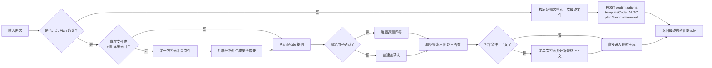
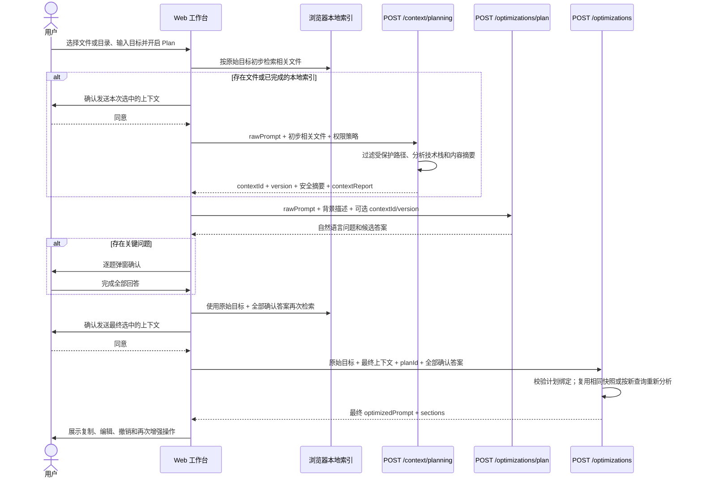
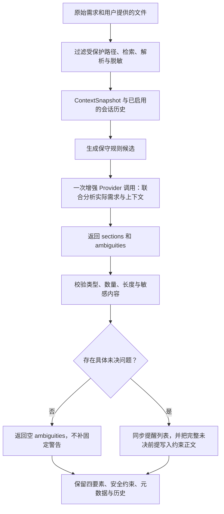

# 内置 Plan Mode：先确认关键问题，再生成最终提示词

## 1. 目标与交互原则

工作台默认关闭 Plan 确认，用户点击“直接增强提示词”后只准备一次最终上下文，并直接生成结果。用户主动打开“Plan 确认”后，流程变为“上下文准备、计划确认、最终生成”三阶段：没有上传资料时根据需求提出少量业务问题；已经上传文件或建立本地目录索引时，先分析初步相关资料，再结合需求与安全摘要提问。用户逐项回答后，系统按确认信息再次检索上下文，并一次生成可复制、可编辑的最终提示词。

用户界面遵循以下原则：

- Plan 确认默认关闭，开关状态保存在当前浏览器；首次开启先展示用途说明，用户可以接受，也可以改为直接增强。
- 主按钮明确显示当前动作：关闭时为“直接增强提示词”，开启时为“先确认并增强”；生成期间禁止切换模式。
- 不展示 `TemplateCode`、字段名、缺失维度或内部分类依据。
- 问题使用用户所在领域的自然语言。例如科研任务询问地区、数据来源和统计工具，软件任务询问运行环境和验收结果。
- 一次只展示一个问题，给出进度、候选答案和自定义输入。
- 选择题保留 2—5 个真实方案；事实未知时保留自由填写问题，不强制凑四个选项，也不因没有推荐项而丢弃问题。
- 推荐项需要主动选择，展示 `recommendationReason` 依据；没有证据时允许不推荐，不用随机地名或技术替用户作答。当前明确偏好优先于历史偏好，明确排除的技术不应被推荐。
- 推荐依据匹配完整技术名称或有证据的具体实践；`Vue` 不能为 `Vuex` 或 `Ant Design Vue` 背书，“超过”不能被改成“大于等于”，“统一/仅使用”的适用范围也需证据。没有唯一受支持选项时清除推荐标记，选项本身仍可由用户选择；该保守校验不等于证明全局最优。
- 模型将多个选项同时标为推荐时，先检查全部问题、选项和推荐理由的结构及敏感内容，再执行既有证据校准，最后检查至多一个推荐。只调整推荐标记及相应理由，不删除合法问题或候选答案，也不替用户选择答案。
- 用户可展开已填答案，返回任意问题修改。最终检索、发送确认和模型生成期间锁定回答，避免重复提交和答案与实际请求不一致。
- 只询问答案会明显改变最终结果的问题；已明确的信息不重复询问。
- 文件已经说明的技术栈、数据格式、目录结构或既有实现不重复询问。
- 计划确认必须携带属于当前用户的有效 `planId`；旧版无编号回答不能冒充已完成计划。
- 全部问题回答完成后才调用最终生成接口。
- 二次检索若发现此前未覆盖的冲突或缺口，最终结果继续显示具体待确认事项，不会因为完成过 Plan 而一律清空。
- 需求已经足够完整时不弹窗，直接生成最终提示词。

## 2. 实现模块

| 模块 | 主要职责 |
| --- | --- |
| `PlanningContextController` | 接收初步相关文件，返回可引用的短期上下文分析结果 |
| `PlanningSessionService` | 生成上下文版本、绑定计划问题与用户回答、判断最终阶段能否复用快照 |
| `PlanningSessionStore` | 以最长 30 分钟 TTL 保存上下文与计划；本地可降级到内存，多实例必须配置 `REDIS_REQUIRED` |
| `PlanQuestionFilter` | 对服务端已校验问题去除完全重复及明确事实已回答的问题；无法判断或存在冲突时保留问题 |
| `PlanQualityMetrics` | 记录问题数、过滤数、受控重试和交互事件；指标不包含需求、答案或文件正文 |
| `OptimizationPlanningService` | 调用计划 Provider、校验问题数量与可读性、拦截内部术语和疑似凭据 |
| `PromptPlanningProvider` | 隔离计划生成能力，Mock 与 OpenAI 兼容实现共享契约 |
| `MockPromptPlanningProvider` | 为本地联调提供科研、软件、写作和通用场景的确定性问题 |
| `OpenAiCompatiblePromptEnhancementProvider` | 使用当前模型生成领域问题与最终结构化段落 |
| `PromptTemplateRegistry` | 在服务端内部推断通用、研究分析或软件生成策略 |
| `DefaultEnhancementOrchestrator` | 过滤受保护上下文、读取确认答案、补全约束并调用最终 Provider |
| `OptimizationResultAssembler` | 强制四要素完整，合并确认答案和平台红线，渲染 `optimizedPrompt` |
| `ProtectedContextFilter` | 在上下文分析和模型调用前移除默认及用户追加的受保护路径 |
| `PlanQuestionDialog.vue` | 在工作台中逐题展示问题、候选答案、自定义回答和生成入口 |
| `optimization` Pinia Store | 维护上下文引用、计划、最终结果、编辑撤销栈与再次增强输入 |
| `optimizationRequest.ts` | 统一构建上下文准备请求、计划请求、最终请求和包含确认答案的二次检索词 |

## 3. 调用流程

下面的流程图同时展示直接增强与上下文感知 Plan 两条路径。直接增强跳过 `/context/planning` 和 `/optimizations/plan`；Plan 路径在有文件时先分析安全摘要，再提问，并在用户回答后用确认信息构造最终检索词。



### Plan 路径接口时序图



Plan 路径采用方案 B：**先分析用户主动提供的相关上下文，再基于上下文发起 Plan Mode，最后生成结果**。`/optimizations/plan` 本身仍不接收文件正文，只接收 `/context/planning` 返回的短期引用；计划 Provider 只看到裁剪后的 `PlanningContextDigest`。未过滤的原始文件正文和完整本地索引不会写入计划请求、Redis 或优化历史；Redis 上下文会话只短期保存分析后已脱敏、受预算限制的 `ContextSnapshot`。

混合上下文（项目代码目录加单独上传的方案文件）会一起进入首次准备请求。单独添加的文档在随后选择代码目录或完成本地索引时继续保留，并优先进入本次文件预算。后端在最多 30 条计划文件摘要中为文档保留最多 4 个位置；这些文档可以附带从已脱敏、任务相关片段中选出的有限业务摘录，帮助模型区分项目现状与方案规则。摘录会再次排除常见受保护路径字样，完整文档正文仍不会直接出现在 `/optimizations/plan` 请求中。若文件解析失败或摘要覆盖不足，查看 `contextReport.warnings` 和 `digest.warnings`，不要把缺失内容当作已核实事实。

提问服务优先用原始需求判断任务类型，附件不再把“开发订单接口”改判为科研任务。已知事实过滤保留来源类别，对明确写出的地区、工具、受众、格式、法域与已识别技术栈做保守去重；问题同时涉及多个决定、材料相互冲突或用户要求变更时继续提问。材料中同名且不同值的明确字段会形成可见冲突问题。最终结果还会在背景段落保留最多 4 条来自已选文档的简短规则及来源，文档内容只作资料证据，不能覆盖平台安全约束。语义等价、未召回文件和非结构化跨文件冲突仍需真实 Provider 评测与人工复核。

直接增强不会创建 `contextId` 或 `planId`。有文件时，浏览器按原始需求检索一次并在用户确认发送后随 `/optimizations` 提交；后端仍执行受保护路径过滤、上下文分析、模板推断、权限红线和结果校验。两条路径共享最终生成接口与安全边界。

第二次检索使用“原始需求 + 服务端校验后的问题文本 + 用户答案”。这对两类索引都生效：浏览器本地项目索引会重新选择代码块，后端大型文档索引会用同一组合查询重新召回相关片段。若没有确认问题且文件集合、内容和查询均未变化，最终编排器直接复用首次 `ContextSnapshot`；否则重新分析，避免把过期或不相关的快照当作最终依据。

## 4. Plan 前上下文准备接口

### `POST /api/v1/context/planning`

只有用户已经选择文件、文档或已完成本地目录索引时，工作台才调用该接口。前端先按原始需求检索一批初步相关文件，并按隐私设置要求用户确认本次发送范围。后端随后执行受保护路径过滤、文档片段检索、技术栈识别、摘要和完整度分析。

请求示例：

```json
{
  "rawPrompt": "给用户模块添加登录功能",
  "context": {
    "customDescription": "Spring Boot 用户服务",
    "files": [
      {
        "path": "pom.xml",
        "content": "<project>...</project>",
        "language": "xml"
      }
    ]
  },
  "permissionPolicy": {
    "protectedPaths": [],
    "requireConfirmationFor": []
  }
}
```

响应示例：

```json
{
  "requestId": "req_context_01",
  "data": {
    "contextId": "ea9d3453-5bd7-487b-bafb-5ef608dfd895",
    "version": "sha256:aaaaaaaaaaaaaaaaaaaaaaaaaaaaaaaaaaaaaaaaaaaaaaaaaaaaaaaaaaaaaaaa",
    "digest": {
      "description": "Spring Boot 用户服务",
      "technologies": ["Java 21", "Spring Boot 3"],
      "dependencies": ["maven:spring-boot-starter-web@3.3.13"],
      "directoryOverview": ["pom.xml", "src/main/java/"],
      "fileSummaries": ["[PROJECT_SOURCE] pom.xml：Maven 项目配置"],
      "analysisStatus": "COMPLETE",
      "analyzedFileCount": 1,
      "factCards": [],
      "warnings": []
    },
    "contextReport": {
      "customDescription": "Spring Boot 用户服务",
      "technologyStack": [],
      "dependencies": [],
      "directoryTree": ["pom.xml", "src/main/java/"],
      "fileSnippets": [],
      "analysisStatus": "COMPLETE",
      "fileCoverage": [],
      "warnings": [],
      "redactions": [],
      "analysisVersion": "v3"
    },
    "expiresAt": "2026-09-14T08:30:00Z",
    "latencyMs": 12
  }
}
```

| 字段 | 必填 | 默认值 | 范围与含义 |
| --- | --- | --- | --- |
| `rawPrompt` | 是 | 无 | 非空，最多 8,000 个字符；也是首次大型文档检索词 |
| `context` | 否 | 空描述与空文件 | 与普通上下文分析契约相同；文件最多 1,000 项 |
| `permissionPolicy` | 否 | 空的用户追加规则 | 平台默认受保护路径始终生效，用户规则只能追加 |
| `contextId` | 响应 | 无 | UUID；后续计划和最终确认引用这次短期分析 |
| `version` | 响应 | 无 | `sha256:` 加 64 位十六进制摘要；绑定过滤后的文件、内容引用和首次分析查询 |
| `digest` | 响应 | 无 | 包含描述、技术栈、依赖、目录概览、文件摘要、最多 20 条明确事实卡片、完整度和非敏感警告；计划 Provider 只能看到这一部分 |
| `contextReport` | 响应 | 无 | 返回给工作台展示的完整脱敏分析报告，不直接传给计划 Provider |
| `expiresAt` | 响应 | 无 | 默认创建后 30 分钟；过期后必须重新准备上下文和计划 |
| `latencyMs` | 响应 | 无 | 本次过滤与分析耗时，单位毫秒 |

`digest.fileSummaries` 仍为字符串数组，现在以 `[来源用途]` 标记每份材料；调用方不应依赖旧版摘要的文本前缀。`digest.factCards[].origin` 保留 `PROJECT_SOURCE`（项目实现或配置）和 `USER_MATERIAL`（用户文档），新增 `PROJECT_DOCUMENT`（项目说明文档）、`TEST_SOURCE`（测试代码）、`TEST_FIXTURE`（测试数据或夹具）、`EXAMPLE_MATERIAL`（示例材料）、`GENERATED_REPORT`（生成报告）、`UNKNOWN`（未识别用途）。这些值由服务端生成，不是用户新增必填参数；无法识别时使用 `UNKNOWN`。用途主要根据路径和文件类型判定，不证明材料真实、已经部署或适用于当前业务。

常规业务任务的计划摘要不选用测试、夹具、示例或生成报告；任务明确涉及相应材料或点名文件时仍可使用，并保留用途标记。事实卡片还需经过片段相关性校验，Markdown 明确示例小节不会提升为业务事实，`OUTPUT_FORMAT` 与输入的 `DATA_FORMAT` 分开处理。筛选只影响计划证据，不删除上传文件、本地索引或完整 `contextReport` 中的文件。摘要覆盖提醒的分母为用途筛选后的候选文件数，不代表完整项目的文件总数；原有解析失败、截断等警告继续保留。

用途判定不把“不得将测试样例当事实”等禁止语句当作测试任务，并先剥离本地索引的 `#chunk-N` 后缀再识别文件用途。与当前任务无关的竞品/调研资料、research 目录中的产品资料核对和内部模型指令代码不参与规则提取；普通科研目录仍可使用，点名审查相应文件时也保留资料访问能力。源码字符串模板、正则和提示词的原文可作为审查数据，但不自动提升为统计日志等业务规则。这是基于用途、语句和相关词的保守过滤，不能替代跨领域语义评审。

最终生成使用原始提示词与确认答案重新校验已绑定卡片，并对补充资料执行相同的相关性筛选；未再次召回原文件不等于已绑定证据失效。同名字段冲突检测也遵循用途筛选，避免测试数据通过冲突提醒重新进入结果。接口字段、会话过期时间和所有权规则保持不变；新增来源值需要外部枚举调用方兼容，滚动部署时应避免新旧服务版本交叉读取包含新来源值的计划缓存。

确认答案经服务端问题 ID 校验后才形成内部结构化决定，包含主题、作用范围和来源；客户端不新增这些可伪造字段。二次检索以原始需求和实际选中的答案为查询，不拼入问题中的其他候选项。最终事实集合保留首次绑定的有效事实，并补入二次检索的新事实；超出预算给出可见提醒。明确的当前状态与目标方案分别显示，已确认的执行选择落实到 `TASK` 或 `OUTPUT`，仍未确定的决定保留在 `ambiguities`。同字段冲突仍只作保守的规则识别，跨句语义冲突和真实模型质量必须另行验收。

用户明确要求保留规则代号时，相关正式文档或用户资料中同句写明的代号、业务边界及适用条件优先进入现有事实预算（直接增强最多 4 条、Plan 最多 20 卡）。支持“规则代号表示边界”及“业务边界；规则代号为 X”两种顺序；相关性核对业务正文，不继承文件名或摘要主题。不从代号中的数字推算业务含义，不跨句拼接，不把源码、夹具、示例或资料指令提升为规则；无明确保留要求时沿用原路径。已绑定完整规则在二次检索和最终组装时继续核对来源，同代号的冲突表述不自动裁决。

以下字段仅用于服务端向最终 Provider 传递 `confirmedDecisions`，不改变浏览器的 `PlanConfirmation` 请求契约。直接增强时默认为 `[]`，最多继承已验证的 8 个问题答案；旧适配器仍可使用 `planAnswers`，同一批答案不会同时在两个字段重复发送。

| 内部字段 | 含义与取值 |
| --- | --- |
| `questionId`、`question` | 服务端 Plan 中的编号和问题原文，沿用既有 64/300 字限制 |
| `topic` | 从问题抽取的短主题，无法识别时为“本次选择”；该兜底主题不用于自动消除歧义 |
| `scope` | `CURRENT_STATE` 用户说明的现状；`TARGET` 希望达成的目标；`CHOICE` 本次方案选择；`UNRESOLVED` 仍未确定。不能证明实现已存在 |
| `answer` | 用户答案，沿用最多 1,500 字限制，不由模型补写 |
| `source` | 固定 `USER_CONFIRMED`，表示已完成服务端问题绑定验证，不代表文件事实已经外部核实 |

`planningFacts` 在最终阶段的总预算为 24 条；Plan 摘要本身仍最多 20 条。首次证据和新证据都继续遵守本次权限策略，未再次召回的首次规则仍参与新冲突检测。`ambiguities` 对外仍为字符串数组，现有工作台和历史展示无需改动。

冲突确认只从服务端绑定的问题及其已知取值解析；“本次以新审批方案中的五万元阈值为准”与标准选项可表达同一决定。否定、条件、不确定或多值答案不自动消除冲突。二次出现八万元时优先与已确认五万元比较；同来源同取值的确认催促合并，但附加的新数值或业务适用条件继续显示。任意自然语言仍可能无法解析，此时保留提醒，不猜测用户选择。

最终提醒由 `PlanAmbiguityMerger` 统一组装：先以字段、双方来源及取值登记新冲突，再按服务端问题 ID 登记未决原问题，最后核对模型补充。同一旧冲突、常见维度的纯催促确认和可验证的问题改写可以合并；新金额、版本、对象或条件继续保留。旧 Provider 未返回关联时，仅在能够唯一匹配且未增加信息时合并；相似主题不等于同一事项。比较符、版本小数点和代码标识符不当作无意义标点删除。去重结束后才应用 8 项展示限额，超出部分通过 `warnings` 告知数量，避免静默截断。

增强 Provider 可选返回 `ambiguityReferences`，默认 `[]`，省略或 `null` 均表示旧端点未提供关联。最多 8 个对象，每个对象包含 `message`（与 `ambiguities` 中某条非空文本完全对应，最多 500 字符）和 `questionId`（1—64 个英文字母、数字、下划线或连字符）。两字段仅规范化首尾空白，不猜测 ID 或修补正文语义。格式非法、超长或正文不匹配的条目被丢弃；数组超限或不是数组时整体弃用；同一正文指向多个不同问题时弃用该组关联。其余有效条目继续使用。辅助关联错误只记录安全诊断，不触发模型重试或让有效增强失败，原始提醒仍参加保守归并；JSON、四要素、提醒正文及安全校验保持严格。

未知问题 ID 不作为绑定依据；有效 ID 也必须结合每个子句核对，不能授权清空新业务条件。例如已回答“输出格式是什么”，模型随后提醒“输出格式需要确认；是否需要提供数据”，第二个问题不能因去除通用词而被吞掉，无法可靠分离时保留整条提醒。该字段仅在 Provider 与应用服务之间使用，不进入浏览器确认请求，也不增加独立模型调用。降级日志事件为 `model.response.optional_references_ignored`，仅包含请求标识、处理阶段和丢弃数量，不记录关联正文、问题 ID 或凭据。

`PlanningSessionStore` 会保存脱敏后的 `ContextSnapshot` 和摘要，以便相同输入在最终阶段复用。默认 `LOCAL_FALLBACK` 允许本地单实例回退内存；多实例部署设置 `PLANNING_STORE_MODE=REDIS_REQUIRED`，此时只从 Redis 读取，Redis 故障返回 503，避免请求落到其他实例时找不到计划。

计划阶段返回的问题已经由服务端做保守相关性过滤，并与短期计划会话中保存的问题完全一致。服务端结合原文、用户历史、技术栈/依赖元数据和有来源事实卡片，过滤已明确的地区、数据来源/格式、病种、人群、方法/工具、受众、交付、验收和法域等单一事实问题；冲突、复合问题、变更选择和主题不吻合的问题继续保留。显式同字段冲突会成为服务端必问项。最终确认仍须使用当前问题 ID，不能提交旧计划的答案。

明确标签的事实必须同时匹配对象与属性范围，不能仅因某类别只有一个取值便消除其它对象的问题：甲医院 CSV 不代表乙医院格式已知，年龄组不回答城乡分组，正文格式不回答附表格式。比较符、小数点和完整条件参与问题／提醒身份；题干相同但提示、选项或示例包含额外选择时不能直接删整题。纯章节排版和工程组织仍可委派，元信息出现真实业务或专业参数则保留。上述范围识别采用有限文字规则，不能替代真实跨行业语义评审，验证范围见[对象与运算条件修复记录](./testing/Plan过滤对象与运算条件安全修复-2026-10-04.md)。

工作台收到 `409 PLANNING_SESSION_EXPIRED` 后重新经过原有上下文发送确认、准备摘要、生成计划。文案及选项没有变化的问题可恢复回答草稿；变化的问题显示旧回答供参考，用户必须再次确认。交互计数通过 `POST /api/v1/optimizations/plan-events` 发送 `{ "planId": "...", "event": "CANCELLED" }`，枚举限于 `CANCELLED`、`CONFIRMED`、`CUSTOM_ANSWER`、`RESULT_EDITED`、`EXPIRED_RECOVERED`；接口先校验当前用户拥有的有效计划，最多按事件类型记一次，不接收回答正文。事件发送失败不阻止业务流程。

## 5. 计划接口

### `POST /api/v1/optimizations/plan`

请求：

```json
{
  "rawPrompt": "分析2015-2025年某地区心脑血管疾病死亡率，并进行YLL和Arriaga分解",
  "contextDescription": "公共卫生研究",
  "conversationHistory": [],
  "planningContext": {
    "contextId": "ea9d3453-5bd7-487b-bafb-5ef608dfd895",
    "version": "sha256:aaaaaaaaaaaaaaaaaaaaaaaaaaaaaaaaaaaaaaaaaaaaaaaaaaaaaaaaaaaaaaaa"
  }
}
```

请求字段：

| 字段 | 必填 | 默认值 | 范围与含义 |
| --- | --- | --- | --- |
| `rawPrompt` | 是 | 无 | 非空，最多 8,000 个字符；用户本次真实目标 |
| `contextDescription` | 否 | `""` | 最多 4,000 个字符；用户主动填写的领域或项目背景 |
| `conversationHistory` | 否 | `[]` | 最多 20 条；每条 `role` 为 `user` 或 `assistant`，`content` 最多 4,000 个字符 |
| `planningContext` | 否 | `null` | 有上传资料时传入 `/context/planning` 返回的 `contextId` 和 `version`；无资料时省略 |

响应：

```json
{
  "requestId": "req_plan_01",
  "data": {
    "summary": "我已理解你的研究目标。还需要确认研究范围、数据口径和交付方式。",
    "questions": [
      {
        "id": "research-region",
        "question": "这项研究具体覆盖哪个地区？",
        "hint": "请填写明确的省、市、国家或区域名称。",
        "type": "FREE_TEXT",
        "options": [],
        "examples": ["广东省", "北京市"],
        "allowCustomAnswer": true
      },
      {
        "id": "research-tool",
        "question": "你希望使用哪种分析工具？",
        "hint": "系统会据此调整方法说明、代码和图表实现。",
        "type": "SINGLE_CHOICE",
        "options": [
          {
            "id": "r",
            "label": "R",
            "description": "适合流行病学统计和可复现报告",
            "answer": "使用 R 完成数据处理、统计分析、Arriaga 分解和图表绘制。",
            "recommended": true
          },
          {
            "id": "python",
            "label": "Python",
            "description": "适合数据处理和自动化分析",
            "answer": "使用 Python 完成数据处理、统计分析、Arriaga 分解和图表绘制。",
            "recommended": false
          }
        ],
        "examples": [],
        "allowCustomAnswer": true
      }
    ],
    "templateCode": "RESEARCH_ANALYSIS",
    "provider": {
      "provider": "mock",
      "model": "deterministic-planner-v2",
      "mock": true
    },
    "latencyMs": 9,
    "planId": "d53d3b67-62b2-4505-89dd-4ca88f837391",
    "planningContext": {
      "contextId": "ea9d3453-5bd7-487b-bafb-5ef608dfd895",
      "version": "sha256:aaaaaaaaaaaaaaaaaaaaaaaaaaaaaaaaaaaaaaaaaaaaaaaaaaaaaaaaaaaaaaaa"
    },
    "expiresAt": "2026-09-14T08:30:00Z"
  }
}
```

响应字段：

| 字段 | 范围与含义 |
| --- | --- |
| `summary` | 非空，最多 500 个字符；向用户说明已理解的目标和提问原因 |
| `questions` | 0—8 个问题；为空时前端直接进入最终生成 |
| `questions[].id` | 1—64 位英文、数字、`_` 或 `-`，同一计划内唯一 |
| `questions[].question` | 非空，最多 300 个字符；用户可直接理解并回答的问题 |
| `questions[].hint` | 最多 500 个字符；解释回答方式或影响 |
| `questions[].type` | `FREE_TEXT`、`SINGLE_CHOICE`、`MULTIPLE_CHOICE` |
| `questions[].options` | 选择题为 2—5 个，自由输入题为空；多选答案合并后不超过 1,500 个字符 |
| `questions[].options[].recommended` | 布尔值；缺省为 `false`，一个问题最多一项；推荐不等于已经确认 |
| `questions[].options[].recommendationReason` | 可选字符串，默认 `""`，最多 300 字符；说明推荐依据或取舍，旧会话缺省时不显示；接受与其他模型文本相同的敏感内容校验 |
| `questions[].examples` | 0—4 个，每个最多 120 个字符 |
| `allowCustomAnswer` | 是否允许用户在候选答案外自行填写；自定义回答作为完整替代答案，自由输入题固定为 `true` |
| `templateCode` | 服务端内部生成策略，用于最终调用和追踪；工作台不向用户展示模板选择 |
| `provider` | 计划生成所用 Provider、调用标识 `model`、是否为 Mock 和模型版本快照 `modelVersion`；版本默认为空字符串，来源是管理员维护的 `displayName` |
| `latencyMs` | 计划阶段服务端耗时，非负整数，单位毫秒 |
| `planId` | 服务端生成的 UUID；最终请求用它证明回答属于本次实际展示的问题 |
| `planningContext` | 本计划使用的上下文引用；无文件时为 `null` |
| `expiresAt` | 计划最长在创建后 30 分钟过期；引用的上下文更早到期时，以其到期时间为准 |

`templateCode` 当前取值为 `AUTO`、`GENERAL`、`RESEARCH_ANALYSIS`、`FEATURE_DEVELOPMENT`、`BUG_FIX`、`REFACTORING`、`TESTING`。工作台直接增强时始终发送 `AUTO`，避免沿用上一次 Plan 或历史记录留下的模板；Plan 路径采用计划接口返回的内部策略。未命中研究或软件场景时使用 `GENERAL`。

服务端用需求文本、背景描述和会话历史的指纹绑定 `planId`，并保存实际展示的问题。最终请求不能少答、多答或重复回答，也不能替换问题文本；写入最终提示词时使用服务端保存的问题文案，只接受客户端提供的答案。

## 6. 最终生成接口

### `POST /api/v1/optimizations`

Plan 路径中用户完成全部问题后的请求：

```json
{
  "rawPrompt": "分析2015-2025年某地区心脑血管疾病死亡率，并进行YLL和Arriaga分解",
  "context": {
    "customDescription": "公共卫生研究",
    "files": [
      {
        "path": "data/广东省死因登记.xlsx",
        "content": "",
        "language": "xlsx",
        "documentId": "doc_7f7d8c9a",
        "sizeBytes": 2483200
      }
    ]
  },
  "enhancement": {
    "templateCode": "RESEARCH_ANALYSIS",
    "includeConversationHistory": false,
    "includePermissionBoundaries": true,
    "includeExamples": false
  },
  "conversationHistory": [],
  "permissionPolicy": {
    "protectedPaths": [],
    "requireConfirmationFor": []
  },
  "planConfirmation": {
    "planId": "d53d3b67-62b2-4505-89dd-4ca88f837391",
    "planningContext": {
      "contextId": "ea9d3453-5bd7-487b-bafb-5ef608dfd895",
      "version": "sha256:aaaaaaaaaaaaaaaaaaaaaaaaaaaaaaaaaaaaaaaaaaaaaaaaaaaaaaaaaaaaaaaa"
    },
    "answers": [
      {
        "questionId": "research-region",
        "question": "这项研究具体覆盖哪个地区？",
        "answer": "广东省"
      },
      {
        "questionId": "research-tool",
        "question": "你希望使用哪种分析工具？",
        "answer": "使用 R 完成数据处理、统计分析、Arriaga 分解和图表绘制。"
      }
    ]
  }
}
```

直接增强路径不创建计划，最小差异如下。若有文件，`context.files` 是浏览器按原始需求一次检索得到并经用户同意发送的集合。

```json
{
  "rawPrompt": "给用户模块添加登录功能",
  "context": {"customDescription": "Spring Boot 用户服务", "files": []},
  "enhancement": {
    "templateCode": "AUTO",
    "includeConversationHistory": false,
    "includePermissionBoundaries": true,
    "includeExamples": false
  },
  "conversationHistory": [],
  "permissionPolicy": {"protectedPaths": [], "requireConfirmationFor": []},
  "planConfirmation": null
}
```

新增与关键字段：

| 字段 | 必填 | 默认值 | 范围与含义 |
| --- | --- | --- | --- |
| `planConfirmation` | 否 | `null` | 直接增强为 `null`；Plan 路径非空并回传计划编号、上下文引用和答案 |
| `planConfirmation.planId` | Plan 路径必填 | 无 | 必须是 `/optimizations/plan` 返回的 UUID；兼容旧历史调用时允许省略 |
| `planConfirmation.planningContext` | 条件必填 | `null` | 计划使用过文件上下文时必须与计划响应完全一致；无文件时为 `null` |
| `planConfirmation.answers` | 条件必填 | `[]` | 最多 8 条；弹窗有问题时必须全部回答，问题编号不得重复 |
| `answers[].questionId` | 是 | 无 | 1—64 位安全编号 |
| `answers[].question` | 是 | 无 | 最多 300 个字符；服务端会用计划会话中的原问题替换该值，防止篡改问题语义 |
| `answers[].answer` | 是 | 无 | 用户选择或填写的答案，最多 1,500 个字符 |
| `context.files` | 否 | `[]` | Plan 路径按“原始需求 + 问题 + 答案”再次检索；直接路径按原始需求检索一次。最多 1,000 项；受保护路径在分析前过滤，不进入 Provider |
| `permissionPolicy.protectedPaths` | 否 | `[]` | 最多 50 条，每条最多 256 个字符；只能追加平台默认规则 |
| `permissionPolicy.requireConfirmationFor` | 否 | `[]` | 最多 50 条，每条最多 64 个字符；只能追加平台默认规则 |

`includePermissionBoundaries` 是向后兼容字段，不能关闭平台默认红线。默认受保护路径包括 `.env`、`**/*.pem`、`**/*.key` 和生产配置；删除或覆盖文件、数据库结构迁移、升级核心依赖和生产部署必须人工确认。

最终阶段先把已确认答案规范化，再用以下规则构造上下文查询：

```text
原始需求
问题 1
答案 1
问题 2
答案 2
...
```

浏览器用该查询再次检索本地项目索引；后端也用同一查询检索 `documentId` 指向的大型文档临时索引。`version` 同时覆盖文件输入和分析查询，因此只有“零问题或零答案、文件未变、查询未变”时才会命中首次快照。只要答案、代码块、文件内容、文档引用或项目描述发生变化，最终阶段就重新分析。

最终响应：

```json
{
  "requestId": "req_final_01",
  "data": {
    "optimizedPrompt": "## 背景\n……\n\n## 任务\n……\n\n## 输出\n……\n\n## 约束\n……",
    "sections": [
      {"type": "BACKGROUND", "title": "背景", "content": "广东省2015-2025年心脑血管疾病死亡率研究……"},
      {"type": "TASK", "title": "任务", "content": "完成长期趋势、季节性趋势、分层比较、YLL与Arriaga分解……"},
      {"type": "OUTPUT", "title": "输出", "content": "输出数据质量报告、统计表、图表、方法说明和可运行的R代码……"},
      {"type": "CONSTRAINTS", "title": "约束", "content": "不得编造数据或引用；说明指标定义、偏倚和不确定性；保留平台权限红线……"},
      {"type": "ACCEPTANCE", "title": "验收标准", "content": "分析口径可复现，结果表和图表可由代码重新生成……"}
    ],
    "contextReport": {
      "customDescription": "公共卫生研究",
      "technologyStack": [],
      "dependencies": [],
      "directoryTree": [],
      "fileSnippets": [],
      "warnings": [],
      "redactions": [],
      "analysisVersion": "v1"
    },
    "warnings": [],
    "ambiguities": [],
    "appliedConstraints": [
      "明确区分已知事实、用户确认信息和必要假设，不得把猜测写成事实。",
      "不得在代码、日志或响应中泄露密码、Token、API Key 或私钥。"
    ],
    "templateCode": "RESEARCH_ANALYSIS",
    "provider": {
      "provider": "mock",
      "model": "deterministic-enhancer-v1",
      "mock": true
    },
    "latencyMs": 42
  }
}
```

`sections` 至少包含 `BACKGROUND`、`TASK`、`OUTPUT`、`CONSTRAINTS`，可包含 `ACCEPTANCE` 和 `EXAMPLES`。通常 Plan 确认后不会重复原问题；若答案触发新的文件检索，系统发现之前未覆盖的冲突或关键缺口，会返回新的 `ambiguities`。文件解析、摘要覆盖和计划卡片上限通过独立的 `warnings` 展示，不会伪装成需要用户选择的业务问题。工作台直接增强时也保留歧义检测。

### 6.1 直接增强中的上下文感知歧义检测

直接增强不额外调用 Plan 接口。后端完成文件过滤、检索与分析后，将原始需求、项目描述、技术栈、依赖、目录、实际文件片段及摘要交给增强 Provider；会话历史仅在启用时参与。真实 Provider 在同一次增强调用中返回结构化提示词和顶层 `ambiguities`，而不是把“未出现输入、返回、测试关键词”当作信息缺失。



- 模型应逐项核对已知事实、冲突及会影响结果的业务决定，忽略无关文件，不把依赖安装、目录存在或自己生成的方案当作业务实现证据。
- 例如资料已说明登录接口和 Session 实现时，不再问输入来源或登录状态机制；订单状态代码只有 `PENDING/PAID/CANCELLED`，而需求未说明退款规则时，可询问“已支付订单取消后是否退款，还是只允许未支付订单取消？”。
- Provider 内部新增 `ambiguities`：字符串数组，0—8 项，每项非空且不超过 500 字符。`[]` 表示 Provider 没有发现额外问题；服务器独立检测到的明确冲突和二次检索缺口仍会合并。重复项去重，旧的三条通用占位警告被过滤；非法类型、超限或凭据内容通过统一异常处理返回 `RESULT_INVALID`，不回显上游文本。
- 外部 `OptimizationResult.ambiguities` 字段用于真实待确认问题，和 `CLARIFICATIONS` 保持一致，展示最多 8 项；`warnings` 单独提供上下文解析、覆盖、摘要上限或待确认列表展示上限提醒。`optimizedPrompt` 仍不直接渲染 `CLARIFICATIONS`，但归并后的完整未决条件会进入 `CONSTRAINTS` 的“执行前须确认”部分，随复制正文交付，不因展示上限而丢失。只有涉及这些条件的步骤需要等待确认，不阻断已明确的独立工作。Plan 答案全部明确且无新发现时不添加此部分；用户仍未确定的原问题和二次检索的新问题继续保留。
- 兼容只返回 `sections` 的旧 Provider：优先解析其 `CLARIFICATIONS`；该段也不存在时使用保守规则候选。缺少新字段与显式返回空数组有不同含义；显式 `null` 是无效模型输出。
- Mock 仅支持有限的确定性场景规则（排序、登录、研究范围、YLL 等），会读取相关文件实际内容和用户历史，但不具备大模型的跨领域推理能力。真实模型的语义准确性仍需实际场景评估；单元测试验证数据流、契约、安全与回归，不代表模型一定没有误判。
- 截断或检索覆盖不足通过结果 `warnings` 及 `contextReport.warnings` 报告；系统只能依据本次实际可见内容判断，不能宣称已检查整个未上传项目。

## 7. 编辑、撤销、再次增强与历史

- 编辑：前端以 `sections` 为权威数据重新组装 `optimizedPrompt`；缺失的平台强制约束会自动补回。
- 复制：复制当前编辑后的完整 `optimizedPrompt`。
- 撤销：Store 保存最近 20 个结果版本，`undoResult()` 可恢复上一次结果的完整段落与正文；当前结果面板未接入撤销按钮，不能将状态层测试描述为页面撤销验收。页面现有“取消”按钮仅放弃未保存的编辑。
- 再次增强：以当前编辑后的 `optimizedPrompt` 作为新输入，并遵循当前 Plan 开关；开启时重新进入计划阶段，关闭时直接增强。新的最终调用自动生成一条新历史记录，原记录不被覆盖。
- 历史重试：后端保存已确认答案；重新优化时保留这些事实，但移除已经过期的 `planId/contextId` 绑定，不依赖短期会话继续存在；不需要数据库结构迁移。
- 隐私：历史只保存脱敏上下文摘要，不保存文件正文。

### 7.1 明确规则与复制正文（2026-10-03）

- `RequirementFidelityGuard` 提取原始需求和明确执行答案中的规则，连同条件、否定与例外保留完整原句；示例、疑问和越权指令不升级为执行要求。已绑定答案明确改变同一业务边界时采用答案，同句中其他要求继续保留，平台强制约束不受影响。
- 先校验模型的任务、输出、约束与验收段落，再补回遗漏原句。可确定的取消行为反转、把补空值改为清空、0/false 误当空值、确认绕过、同对象否定和数值边界变化触发 `RULE_CONFLICT`。这不是开放域语义等价判定；未覆盖的改写仍需真实场景评审。
- 相关资料继续沿用来源用途与相关性过滤；测试样例不升级为业务规则。资料之间或与明确答案冲突时，不同时强制执行双方，继续保留来源和已有冲突处理流程。一次组装复用同一份资料规则提取结果。
- Plan 选项的答案、标签、说明与推荐理由也检查已明确规则。OpenAI 兼容适配器沿用解析和业务校验共用最多 3 次调用的预算，失败后返回既有 `RESULT_INVALID`；不新增独立语义模型调用，不输出错误草稿为成功结果。
- 对外请求、响应字段及权限校验不变。工作台、复制入口与历史使用同一份 `sections` / `optimizedPrompt`；编辑其他段落不会丢掉约束中的执行前提。用户主动修改业务内容仍然允许，平台权限红线继续强制保留。

实现与验证范围见 [规则保真与复制正文完整性](./testing/规则保真与复制正文完整性-2026-10-03.md)。

### 7.2 决定作用域、资料展开与阶段计时（2026-10-04）

- 问题去重比较完整业务对象、属性和适用条件。审批标准与退款标准是两个决定，紧急订单与一般订单不能因同属业务规则而合并；新增条件、冲突取值、复合题和无法证明等价的改写继续保留。提醒关联字段只能辅助匹配，不能仅凭模型自填的问题编号消除新问题。
- 已给定的材料冲突处理规则、常规提纲组织及关键伪代码粒度与真正缺失的业务选择分别处理。只对可由原文和合格资料证明的具体分支分流；用户明确要求选择、新指标或选项中的新业务范围继续可问，不要求每次都生成问题。
- 最终响应增加 `evidenceCards: PlanningFactCard[]`：元素为 `id`、`category`、`origin`、`sourcePath`、`evidence`。未提供时 Java 构造器默认为空数组，前端兼容旧响应缺少该字段；分类值与 Plan 的事实卡片契约相同。它是本次采用资料的短证据，受已有摘要预算限制，不表示完整文件或完整项目覆盖。
- 结果面板的“资料依据”默认折叠，展开后显示相对路径与短证据。正文继续保留必要定位路径、业务规则、确认决定、未决前提和权限红线；复制不依赖用户是否展开资料。内部来源分类与卡片编号无需重复进入正文。
- 自动任务适配增加翻译、新闻稿、用户指南、教学、机关报告及论文方法提纲的交付指导，不扩展对外模板枚举。显式模板仍优先；正向任务目标优先于附件关键词和失败分支，不将研究生身份当成科研任务。
- 日志事件 `pipeline.stage.completed` 记录 `operation`、`stage`、`model`、`status`、`durationMs` 和可用的请求/工作流标识。阶段包括 `context.analyze`、`model.upstream`、`model.validation`、`result.assemble`、`provider.total`。组装包含在校验阶段内，不能相加后计算总延迟；供应商总耗时包含受控重试。记录不包含提示词、文件正文、密钥或模型草稿。

本轮回归与真实执行对照见 [Plan 决策范围修复与下游执行复验](./testing/Plan决策范围修复与下游执行复验-2026-10-04.md)。这项新增字段与内部修复不改变登录、所有权、租户/工作区隔离、历史逻辑删除或文件读取范围。

### 7.3 准入条件、成对冲突与部分确认（2026-10-05）

- `PlanEligibilityGuard` 根据原始需求和已完成用途过滤的资料，单独守住“记录必须符合当前用户所属地区条件才可补值”这一明确前提。文档资料也可提供这个前提，不要求同时存在源码。可以询问隐藏候选、展示但禁用、先补齐并成功核验等策略；展示、提示或用户点击确认不能替代准入核验。Plan 的选项、说明与填写辅助和最终执行正文均经过校验，仍使用现有最多三次调用的受控修复预算。
- `PlanningConflictIdentity` 按字段、完整业务对象、属性、条件、比较符、取值及成对来源核对同一冲突。能证明唯一对应的模型改写题归入服务端原题；退款、紧急条件、另一机构、第三个金额及新增来源不借用旧确认。`>` 与 `>=`、小数和名称中的“标准”等字样不能当作排版噪声删除。同一机构下可识别的审批金额规则与退款金额规则分别比较；“尚未提供”的断言不是另一个已知取值。
- `ConfirmedDecisionSet` 保留原始回答及对外既有 `scope`，新增仅供服务端使用的已确认内容和未决子项视图。整题含未决内容时仍为 `UNRESOLVED`；明确分开的月份、空值规则或选定阈值可以参与检索、规则校验及结果组装，日期字段映射、分母、生效时间等剩余缺口继续作为执行前提。一题中的多个未决子项按原绑定 ID 和完整子项分别登记，不用同一个 ID 覆盖后面的缺口。
- `PlanAmbiguityMerger` 对可逐项核对的原题改写与完整未决对象归并提醒，并保留全部新解释。技术状态代码比较保留分隔符；新对象、代码值或适用条件无法证明等价时继续保留。必要未决内容同时进入 `optimizedPrompt` 和结构化段落，不只留在页面提醒中。
- 本次没有新增请求或响应字段、状态枚举值、缓存或数据库迁移。它是有明确证据边界的内部修复，不是任意跨行业语义等价判定；所有模型、所有专业表述的业务准确性仍需独立评审。

实现、首轮失败、最终候选及验证边界见 [Plan 资格约束、冲突关联与部分确认修复](./testing/Plan资格约束冲突关联与部分确认修复-2026-10-05.md)。

### 7.4 长提醒、授权现状与确认后旧状态（2026-10-05）

- `ConditionalCandidateDecision` 将同一完整条件的候选处理问句与长说明关联；`PlanAmbiguityMerger` 逐个核对代码补集的同题肯定映射，并保留完整解释。另一对象、数字、代码、期限和独立决定不能借同题 ID 被删掉。
- `PlanningAuthorizationState` 继承原始需求及用途合格资料的明确现状；“未获批准”是已知限制，不是让普通用户重新选择批准状态。具名医院状态不得泛化；未知、矛盾材料、新机构和未来授权申请继续保留。能证明为已知限制的最终提醒移到约束，原文不丢失。
- `PlanQuestionFilter` 不将“未提供、未指定、尚未确定”等缺失状态标签当成事实的唯一值。明确委派的三栏组织问题交给执行者；问题附带新指标或其他决定时仍保留。
- `ResolvedPlanState` 只以有效绑定冲突题的唯一选值修正当前执行状态，先修正执行视图，再提取保真规则，防止原始未知被补回。原始需求、答案与证据保持原样；新来源、新金额、生效时间、未签署和不自行折中仍交付。
- 映射禁令仍是硬规则，不能把同名直接当成同义，也不能以创建日期替代已规定的就诊日期。没有新增外部字段、数据库迁移、缓存或独立模型调用；上述机制只关闭有明确证据的反例，不声称任意行业所有改写均等价。

逐项回归、真实补验及仍未关闭的问题见[Plan 重复提醒、已知信息与状态一致性修复](./testing/Plan重复提醒已知信息与状态一致性修复-2026-10-05.md)。

## 8. 校验与错误

| 场景 | HTTP | 错误码或处理 |
| --- | --- | --- |
| 原始提示词为空或超过 8,000 字符 | 400 | `INVALID_ARGUMENT`，返回字段级校验信息 |
| 会话超过 20 条、问题回答超过 8 条 | 400 | `INVALID_ARGUMENT` |
| 受保护路径或人工确认动作超过 50 条 | 400 | `INVALID_ARGUMENT` |
| 回答为空或问题编号重复 | 400 | `INVALID_ARGUMENT`，给出可读原因 |
| `contextId` 不存在、过期或不属于当前用户 | 409 | `PLANNING_SESSION_EXPIRED`，重新分析文件上下文 |
| `planId` 不存在、过期或不属于当前用户 | 409 | `PLANNING_SESSION_EXPIRED`，重新生成问题并核对旧答案 |
| 上下文版本、需求、背景或会话与计划不一致 | 400 | `INVALID_ARGUMENT`，重新生成匹配当前需求的问题 |
| 回答集合与服务端计划问题不完全一致 | 400 | 要求完成本次计划中的全部问题 |
| 输入疑似包含真实密码、Token、API Key 或私钥 | 400 | `INVALID_ARGUMENT`，要求移除凭据 |
| Provider 超时、限流或不可用 | 504、503 或 502 | 稳定错误码与 `retryable`，不返回上游敏感详情 |
| Provider 返回无效问题或缺少必需段落 | 502 | `RESULT_INVALID` |
| 上下文为空 | 继续生成 | `contextReport` 明确为空，不伪造项目事实 |
| 文档解析或检索部分失败 | 降级生成 | 在 `contextReport.warnings` 和覆盖报告中说明原因 |

模型响应校验失败时，`error.details` 可包含固定服务端枚举 `validationReason`、代码定义的 `validationField` 和实际预算循环内的 `modelAttempts`（当前 1—3；未经循环时省略）。这些诊断不包含模型正文、用户文件路径或原始异常消息。例如 Plan JSON 无法解析为 `PLAN_JSON_INVALID / plan.json`，输出达到上限为 `RESPONSE_TRUNCATED / response.finishReason`。既有 HTTP、错误码与 `retryable` 行为保留。

## 9. 测试范围

- `PlanRecommendationRegressionTest`：真实失败响应的推荐标记回放，问题、候选答案及安全校验保持可用。
- `PlanningDecisionReplayTest`：实际重复追问及复合改写、作用对象隔离、主动重开、来源冲突、低价值工程核查与真正未知条件。
- `PlanFailureDiagnosticsTest`、`PlanProviderValidationBudgetTest`：非法 JSON/题型、空正文和截断的原因诊断，前端源码证据进入真实适配器，解析与业务校验共享三次预算。
- `OpenAiCompatibleValidatedResponseTest`：解析和最终组装共享三次修复预算、凭据持续拦截、实质未决条件及确认答案保留、服务端固定错误不重试。
- `ExplicitRuleEvidenceExtractorTest`、`RulePreservationAssemblyTest`：明确规则的来源、完整适用条件、预算、二次检索、最终四要素和冲突保留。
- `OptimizationPlanningServiceTest`：科研六类问题、内部术语拦截、问题数量上限。
- `PlanningSessionServiceTest`：受保护文件过滤、摘要隔离、代码目录与方案文件的混合分析、需求与上下文绑定、问题防篡改、完整回答和快照复用规则。
- `PlanningContextControllerTest`：上下文准备接口正常响应与 Bean Validation 异常。
- `OptimizationControllerTest`：计划与最终接口、空输入、长度、会话、回答和权限列表上限、Provider 异常。
- `DefaultEnhancementOrchestratorTest`：确认答案进入最终结果且不再出现待确认项；大型文档会按确认答案重新检索。
- `OptimizationResultAssemblerTest`：四要素、答案合并、权限红线和 `CLARIFICATIONS` 清理。
- `ProtectedContextFilterTest`、`SensitiveValueDetectorTest`：受保护路径前置过滤和凭据检测。
- `MybatisOptimizationHistoryServiceTest`：确认答案随历史重新优化恢复。
- `optimizationRequest.test.ts`、`optimization.test.ts`：上下文准备引用、二次检索词，以及直接增强强制使用 `AUTO` 且清理旧 Plan 状态的前端单元测试。
- `usePlanModePreference.test.ts`：默认关闭、偏好持久化和异常存储值回退。
- `prompt-workbench.spec.ts`：Plan 路径的“上下文准备 → 计划弹窗 → 二次检索 → 最终结果”，以及默认直接增强、首次开启说明、拒绝说明、刷新后保持偏好、再次增强分流和计划过期后重新创建。
