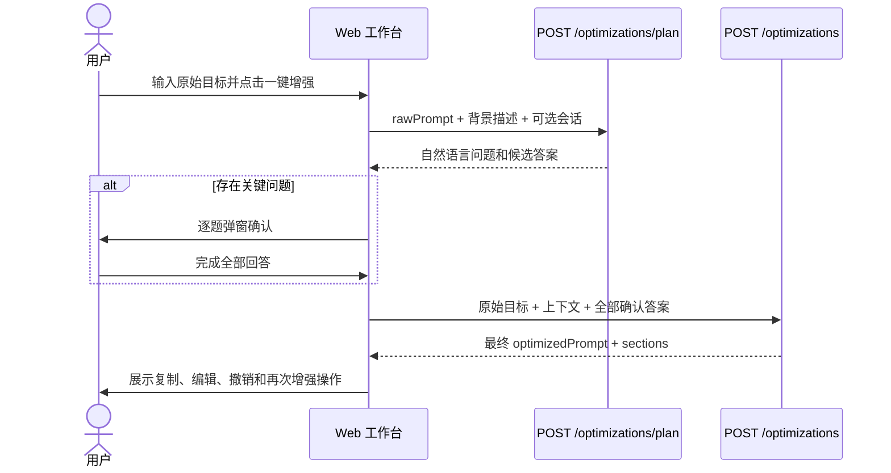

# 内置 Plan Mode：先确认关键问题，再生成最终提示词

## 1. 目标与交互原则

一键增强采用两阶段流程：系统先理解用户目标并提出少量业务问题，用户逐项回答后，系统一次生成可复制、可编辑的最终提示词。用户不需要在生成结果里寻找“待确认项”，也不需要反复手工改写原始提示词。

用户界面遵循以下原则：

- 不展示 `TemplateCode`、字段名、缺失维度或内部分类依据。
- 问题使用用户所在领域的自然语言。例如科研任务询问地区、数据来源和统计工具，软件任务询问运行环境和验收结果。
- 一次只展示一个问题，给出进度、候选答案和自定义输入。
- 只询问答案会明显改变最终结果的问题；已明确的信息不重复询问。
- 全部问题回答完成后才调用最终生成接口。
- 需求已经足够完整时不弹窗，直接生成最终提示词。

## 2. 实现模块

| 模块 | 主要职责 |
| --- | --- |
| `OptimizationPlanningService` | 调用计划 Provider、校验问题数量与可读性、拦截内部术语和疑似凭据 |
| `PromptPlanningProvider` | 隔离计划生成能力，Mock 与 OpenAI 兼容实现共享契约 |
| `MockPromptPlanningProvider` | 为本地联调提供科研、软件、写作和通用场景的确定性问题 |
| `OpenAiCompatiblePromptEnhancementProvider` | 使用当前模型生成领域问题与最终结构化段落 |
| `PromptTemplateRegistry` | 在服务端内部推断通用、研究分析或软件生成策略 |
| `DefaultEnhancementOrchestrator` | 过滤受保护上下文、读取确认答案、补全约束并调用最终 Provider |
| `OptimizationResultAssembler` | 强制四要素完整，合并确认答案和平台红线，渲染 `optimizedPrompt` |
| `ProtectedContextFilter` | 在上下文分析和模型调用前移除默认及用户追加的受保护路径 |
| `PlanQuestionDialog.vue` | 在工作台中逐题展示问题、候选答案、自定义回答和生成入口 |
| `optimization` Pinia Store | 维护计划、最终结果、编辑撤销栈与再次增强输入 |

## 3. 调用流程



计划阶段不会接收项目文件正文。文件只在最终生成前按现有“确认发送项目代码”规则选取并发送，受保护路径会先在服务端过滤。

## 4. 计划接口

### `POST /api/v1/optimizations/plan`

请求：

```json
{
  "rawPrompt": "分析2015-2025年某地区心脑血管疾病死亡率，并进行YLL和Arriaga分解",
  "contextDescription": "公共卫生研究",
  "conversationHistory": []
}
```

请求字段：

| 字段 | 必填 | 默认值 | 范围与含义 |
| --- | --- | --- | --- |
| `rawPrompt` | 是 | 无 | 非空，最多 8,000 个字符；用户本次真实目标 |
| `contextDescription` | 否 | `""` | 最多 4,000 个字符；用户主动填写的领域或项目背景 |
| `conversationHistory` | 否 | `[]` | 最多 20 条；每条 `role` 为 `user` 或 `assistant`，`content` 最多 4,000 个字符 |

响应：

```json
{
  "requestId": "req_plan_01",
  "data": {
    "summary": "我已理解你的研究目标。还需要确认研究范围、数据口径和交付方式。",
    "questions": [
      {
        "id": "research-region",
        "question": "这项研究具体覆盖哪个地区？",
        "hint": "请填写明确的省、市、国家或区域名称。",
        "type": "FREE_TEXT",
        "options": [],
        "examples": ["广东省", "北京市"],
        "allowCustomAnswer": true
      },
      {
        "id": "research-tool",
        "question": "你希望使用哪种分析工具？",
        "hint": "系统会据此调整方法说明、代码和图表实现。",
        "type": "SINGLE_CHOICE",
        "options": [
          {
            "id": "r",
            "label": "R",
            "description": "适合流行病学统计和可复现报告",
            "answer": "使用 R 完成数据处理、统计分析、Arriaga 分解和图表绘制。",
            "recommended": true
          },
          {
            "id": "python",
            "label": "Python",
            "description": "适合数据处理和自动化分析",
            "answer": "使用 Python 完成数据处理、统计分析、Arriaga 分解和图表绘制。",
            "recommended": false
          }
        ],
        "examples": [],
        "allowCustomAnswer": true
      }
    ],
    "templateCode": "RESEARCH_ANALYSIS",
    "provider": {
      "provider": "mock",
      "model": "deterministic-planner-v2",
      "mock": true
    },
    "latencyMs": 9
  }
}
```

响应字段：

| 字段 | 范围与含义 |
| --- | --- |
| `summary` | 非空，最多 500 个字符；向用户说明已理解的目标和提问原因 |
| `questions` | 0—8 个问题；为空时前端直接进入最终生成 |
| `questions[].id` | 1—64 位英文、数字、`_` 或 `-`，同一计划内唯一 |
| `questions[].question` | 非空，最多 300 个字符；用户可直接理解并回答的问题 |
| `questions[].hint` | 最多 500 个字符；解释回答方式或影响 |
| `questions[].type` | `FREE_TEXT`、`SINGLE_CHOICE`、`MULTIPLE_CHOICE` |
| `questions[].options` | 选择题为 2—5 个，自由输入题为空；多选答案合并后不超过 1,500 个字符 |
| `questions[].examples` | 0—4 个，每个最多 120 个字符 |
| `allowCustomAnswer` | 是否允许用户在候选答案外自行填写；自定义回答作为完整替代答案，自由输入题固定为 `true` |
| `templateCode` | 服务端内部生成策略，用于最终调用和追踪；工作台不向用户展示模板选择 |
| `provider` | 计划生成所用 Provider、模型和是否为 Mock |
| `latencyMs` | 计划阶段服务端耗时，非负整数，单位毫秒 |

`templateCode` 当前取值为 `AUTO`、`GENERAL`、`RESEARCH_ANALYSIS`、`FEATURE_DEVELOPMENT`、`BUG_FIX`、`REFACTORING`、`TESTING`。`AUTO` 只用于兼容直接调用最终接口的客户端；标准工作台采用计划接口返回的内部策略。未命中研究或软件场景时使用 `GENERAL`。

## 5. 最终生成接口

### `POST /api/v1/optimizations`

用户完成全部问题后的最小请求：

```json
{
  "rawPrompt": "分析2015-2025年某地区心脑血管疾病死亡率，并进行YLL和Arriaga分解",
  "context": {
    "customDescription": "公共卫生研究",
    "files": []
  },
  "enhancement": {
    "templateCode": "RESEARCH_ANALYSIS",
    "includeConversationHistory": false,
    "includePermissionBoundaries": true,
    "includeExamples": false
  },
  "conversationHistory": [],
  "permissionPolicy": {
    "protectedPaths": [],
    "requireConfirmationFor": []
  },
  "planConfirmation": {
    "answers": [
      {
        "questionId": "research-region",
        "question": "这项研究具体覆盖哪个地区？",
        "answer": "广东省"
      },
      {
        "questionId": "research-tool",
        "question": "你希望使用哪种分析工具？",
        "answer": "使用 R 完成数据处理、统计分析、Arriaga 分解和图表绘制。"
      }
    ]
  }
}
```

新增与关键字段：

| 字段 | 必填 | 默认值 | 范围与含义 |
| --- | --- | --- | --- |
| `planConfirmation` | 否 | `null` | 非空表示计划确认已完成；计划返回空问题时传 `{"answers":[]}` |
| `planConfirmation.answers` | 条件必填 | `[]` | 最多 8 条；弹窗有问题时必须全部回答，问题编号不得重复 |
| `answers[].questionId` | 是 | 无 | 1—64 位安全编号 |
| `answers[].question` | 是 | 无 | 原问题，最多 300 个字符，用于把答案作为可读事实写入最终结果 |
| `answers[].answer` | 是 | 无 | 用户选择或填写的答案，最多 1,500 个字符 |
| `context.files` | 否 | `[]` | 最多 1,000 项；受保护路径在分析前过滤，不进入 Provider |
| `permissionPolicy.protectedPaths` | 否 | `[]` | 最多 50 条，每条最多 256 个字符；只能追加平台默认规则 |
| `permissionPolicy.requireConfirmationFor` | 否 | `[]` | 最多 50 条，每条最多 64 个字符；只能追加平台默认规则 |

`includePermissionBoundaries` 是向后兼容字段，不能关闭平台默认红线。默认受保护路径包括 `.env`、`**/*.pem`、`**/*.key` 和生产配置；删除或覆盖文件、数据库结构迁移、升级核心依赖和生产部署必须人工确认。

最终响应：

```json
{
  "requestId": "req_final_01",
  "data": {
    "optimizedPrompt": "## 背景\n……\n\n## 任务\n……\n\n## 输出\n……\n\n## 约束\n……",
    "sections": [
      {"type": "BACKGROUND", "title": "背景", "content": "广东省2015-2025年心脑血管疾病死亡率研究……"},
      {"type": "TASK", "title": "任务", "content": "完成长期趋势、季节性趋势、分层比较、YLL与Arriaga分解……"},
      {"type": "OUTPUT", "title": "输出", "content": "输出数据质量报告、统计表、图表、方法说明和可运行的R代码……"},
      {"type": "CONSTRAINTS", "title": "约束", "content": "不得编造数据或引用；说明指标定义、偏倚和不确定性；保留平台权限红线……"},
      {"type": "ACCEPTANCE", "title": "验收标准", "content": "分析口径可复现，结果表和图表可由代码重新生成……"}
    ],
    "contextReport": {
      "customDescription": "公共卫生研究",
      "technologyStack": [],
      "dependencies": [],
      "directoryTree": [],
      "fileSnippets": [],
      "warnings": [],
      "redactions": [],
      "analysisVersion": "v1"
    },
    "ambiguities": [],
    "appliedConstraints": [
      "明确区分已知事实、用户确认信息和必要假设，不得把猜测写成事实。",
      "不得在代码、日志或响应中泄露密码、Token、API Key 或私钥。"
    ],
    "templateCode": "RESEARCH_ANALYSIS",
    "provider": {
      "provider": "mock",
      "model": "deterministic-enhancer-v1",
      "mock": true
    },
    "latencyMs": 42
  }
}
```

`sections` 至少包含 `BACKGROUND`、`TASK`、`OUTPUT`、`CONSTRAINTS`，可包含 `ACCEPTANCE` 和 `EXAMPLES`。完成计划确认后不会返回 `CLARIFICATIONS`，`ambiguities` 为空。兼容旧客户端直接调用最终接口且不传 `planConfirmation` 时，服务端仍可返回 `ambiguities`。

## 6. 编辑、撤销、再次增强与历史

- 编辑：前端以 `sections` 为权威数据重新组装 `optimizedPrompt`；缺失的平台强制约束会自动补回。
- 复制：复制当前编辑后的完整 `optimizedPrompt`。
- 撤销：浏览器内保存最近 20 个结果版本，可撤销上一次编辑或再次增强结果。
- 再次增强：以当前编辑后的 `optimizedPrompt` 重新进入计划阶段；新的最终调用自动生成一条新历史记录，原记录不被覆盖。
- 历史重试：后端把 `planConfirmation` 存入现有结果元数据，重新优化时恢复已确认答案；不需要数据库结构迁移。
- 隐私：历史只保存脱敏上下文摘要，不保存文件正文。

## 7. 校验与错误

| 场景 | HTTP | 错误码或处理 |
| --- | --- | --- |
| 原始提示词为空或超过 8,000 字符 | 400 | `INVALID_ARGUMENT`，返回字段级校验信息 |
| 会话超过 20 条、问题回答超过 8 条 | 400 | `INVALID_ARGUMENT` |
| 受保护路径或人工确认动作超过 50 条 | 400 | `INVALID_ARGUMENT` |
| 回答为空或问题编号重复 | 400 | `INVALID_ARGUMENT`，给出可读原因 |
| 输入疑似包含真实密码、Token、API Key 或私钥 | 400 | `INVALID_ARGUMENT`，要求移除凭据 |
| Provider 超时、限流或不可用 | 504、503 或 502 | 稳定错误码与 `retryable`，不返回上游敏感详情 |
| Provider 返回无效问题或缺少必需段落 | 502 | `RESULT_INVALID` |
| 上下文为空 | 继续生成 | `contextReport` 明确为空，不伪造项目事实 |
| 文档解析或检索部分失败 | 降级生成 | 在 `contextReport.warnings` 和覆盖报告中说明原因 |

## 8. 测试范围

- `OptimizationPlanningServiceTest`：科研六类问题、内部术语拦截、问题数量上限。
- `OptimizationControllerTest`：计划与最终接口、空输入、长度、会话、回答和权限列表上限、Provider 异常。
- `DefaultEnhancementOrchestratorTest`：确认答案进入最终结果且不再出现待确认项。
- `OptimizationResultAssemblerTest`：四要素、答案合并、权限红线和 `CLARIFICATIONS` 清理。
- `ProtectedContextFilterTest`、`SensitiveValueDetectorTest`：受保护路径前置过滤和凭据检测。
- `JpaOptimizationHistoryServiceTest`：确认答案随历史重新优化恢复。
- `prompt-workbench.spec.ts`：开发与科研场景的“计划弹窗 → 全部回答 → 最终结果”浏览器链路。
