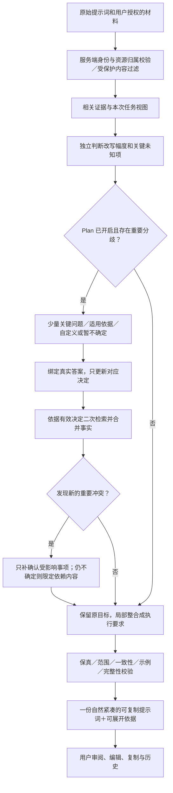

# 提示词增强与 Plan：最小必要干预、实施顺序与上线验收

日期：2026-10-09。状态：**现状评估与后续实施方案，尚未完成本方案的代码修复及候选验收**。源码核对基线为 `e795fb5`，最近相关代码修复为 `3e53d89`。后续执行须重新记录实际提交、模型目录和测试结果。

本文统一后续增强／Plan 的开发方向。与旧方案不一致的策略取舍按本文执行；历史报告和失败证据原样保留，不回写成通过。事实仍以当前代码和相应版本的验证为准。安全边界、动态平台约束、接口兼容及用户明确要求继续有效。

## 1. 产品目标与成功标准

产品只交付**优化提示词**，帮助用户更清楚地告诉执行者：做什么、依据什么、遵守什么、交付什么。用户可以口语化表达、存在错字或尚未想清全部细节。整理负担应由平台承担，不要求用户先成为提示词专家。

- 保留原始任务和交付物：写报告仍是写报告，只要方案仍是方案；不需要代码仅限制代码交付，不取消报告。
- 采用最小必要干预：保留有效原句，按需补入相关背景、有效决定和必要约束。信息充分时少改或保留原文也是合格结果。
- **Plan 必须询问会实质影响目标、事实准确性、业务行为、专业口径、授权或交付可用性，且尚无可靠答案的问题。** 减少问题数、允许零问题，不是删除重要未知项的理由。
- 允许执行者决定普通措辞、段落组织和常规实现细节；用户明确把这些列为验收要求时仍须遵守。专业建议带上适用条件，不冒充资料事实或用户确认。
- 缺少数据只限制依赖该数据的计算或实证结论；优化提示词应指示执行者完成有依据的可交付内容。不得编造结果，也不能把整份任务改成问卷或大片填空模板。
- 平台不执行报告写作、统计计算、代码或外部操作。下游作品生成是评测流程，用于验证提示词是否有用。

要改掉的是“无依据地细化、层层追加、以问完所有事为目标”的路线，而非移除事实校验或专业澄清。信息更长、更细、章节更齐不等于效果更好；目标是在代表性任务中提高实际交付质量，并在充分需求上避免退步。

## 2. 现状诊断与证据边界

### 2.1 已核实的实现缺口

下表是当前源码检查结论，不能直接推断每次真实模型输出都触发这些分支。

| 问题 | 当前实现依据 | 影响与后续处理 |
| --- | --- | --- |
| 少改策略不等于需求充分性 | `PromptRewriteStrategy.forPrompt` 只检查输出词、背景词和限制词数量；不读取相关上下文或 Plan 决定 | 清晰短翻译可能进入全面整理，长而模糊的请求反而进入少改。改用任务、对象、交付与关键分歧的共同判断 |
| 少改未贯穿组装 | `MinimalPromptOrganizer.organize` 要求四段 Markdown 且没有已知 Plan 决定；`OptimizationResultAssembler.assemble` 后续仍可追加契约、默认验收等 | 普通完整句、Plan 后的局部更新难以保持紧凑；应只补真正缺少的内容 |
| 答案传入但重复落实 | Provider 要求融入答案；组装器 `appendConfirmedAnswers/appendConfirmedDecisions` 主要检查完整行；`RequirementFidelityGuard` 又可能补回答案中的规则 | 自然表达已涵盖决定，仍追加答卷和规则。应共享覆盖判断并指定一处权威表达 |
| 决定主题与状态依赖关键词 | `ConfirmedDecisionSet` 采用题干主题匹配及目标／现状词；`EvidenceStateGuard`、`ResolvedPlanState` 等只覆盖部分句式 | “地区：采用年龄标准化”等错标签、局部未知或旧选择残留；须分别绑定对象、属性、值与状态 |
| 示例开关被兜底文字削弱 | `TaskDeliveryProfile.exampleGuidance` 的部分画像仍是“仅在用户要求且资料允许时…”；组装器在开关为真且缺段时直接采用该指导 | 开关已表达要求，却再次变成可选条件；需要验证内容语义，不能仅断言 EXAMPLES 存在 |
| 提醒有多处承载 | 组装器将必要前提写入约束，界面另展示 `ambiguities`；复制渲染已排除 CLARIFICATIONS | 界面重复不等于复制了两份同名段落；须分别比较模型响应、平台结果、复制正文和下游作品 |
| 指导过宽可能再次扩大任务 | `DraftDeliveryContract.guidance()` 包含背景、解释、讨论等起草指导 | 对两句邮件等短任务的污染目前是静态风险；先复现，再按交付目标限定，不给所有写作套报告章节 |

代码入口：后端 [Provider](../services/api/src/main/java/com/promptoptimizer/provider/infrastructure/openai/OpenAiCompatiblePromptEnhancementProvider.java)、[组装器](../services/api/src/main/java/com/promptoptimizer/enhancement/service/impl/OptimizationResultAssembler.java)、[策略](../services/api/src/main/java/com/promptoptimizer/provider/domain/PromptRewriteStrategy.java)、[决定集合](../services/api/src/main/java/com/promptoptimizer/enhancement/service/impl/ConfirmedDecisionSet.java)；前端 [请求构建](../apps/web/src/features/optimization/optimizationRequest.ts)、[Store](../apps/web/src/stores/optimization.ts)。

报告目标的直接增强路径已有修正，不能登记为完全未实现；但截图中的“Plan＋示例”是否由某个候选答案把报告改为方案，仍需实际绑定的原题、选项和答案证明，不能只看最终文本确定来源。

### 2.2 冲突与过滤的高风险边界

已有 `PlanQuestionFilter`、`PlanningFactMerger`、`PlanAmbiguityMerger`、`RequirementFidelityGuard` 等保护，仍不能把“字符串相似”当成“同一决定已解决”。后续先保留这些反例再修改：

- 审批标准与退款标准、甲院与乙院、2024 与 2025 年分别保留；同类字段不代表同一业务对象。
- 确认某指标阈值不等于确认其分母、起止点、计算依赖；“如果以后确认”不建立当前选值。
- `>` 与 `>=`、`code` 与 `Code`／`CODE`、版本、否定和例外均可能改变含义，不能被通用归一化吞掉。
- “两份材料是否同时保留，尚未确定”不能解析成已解决冲突；“同时保留两种方案供比较”也不等于已经选定执行口径。
- 长答案只确认部分事项时，其余未知仍在；二次检索发现真正的新条件或新取值时必须保留。

本轮源码审查发现，“同时保留”类冲突解析及提醒的小写归一化存在上述静态路径风险；尚未在完整接口复现，不登记为新线上必现故障。修复前检查调用方与前置保护，避免重复添加另一套解析器。

### 2.3 性能与前端体验

已有上下文预算、本地索引、临时文档引用、Plan 上下文快照、受控模型修复及逐题对话；不能以曾出现长等待就断定是索引或检索故障。本轮没有新增性能实测。

- `PipelineStageTiming` 已记录上下文、上游、校验、组装等阶段并包含失败；部分时间嵌套，不能直接求和。后续在现有埋点上补规模、复用命中和耗时分析，不重复建设一套计时。
- Plan 包含首次上下文准备、提问、回答后二次检索、最终增强等串行依赖。第二次检索有业务价值，不能为了速度直接取消；应复用未变化的解析／索引，只重选相关材料。
- 提问与增强的格式／业务修复可能增加模型调用。保留统一预算，不叠加无限“再问一个模型检查”的链路。
- 缺口指导、确认答卷和重复规则会增加输入／输出负担，但其耗时占比需测量，不能假定精简文字就解决模型长尾。
- 工作台已有文件选择版本检查、生成期间锁定、Plan 过期重建、逐题回看及移动端面板。仍需检查长答案、长选项、切换账号／材料、迟到响应、失败重试和新冲突回流的完整组合。
- Store 的部分异步结果直接写入状态；是否会覆盖更新后的任务还受页面锁定和生命周期约束。按风险补竞态测试，不把静态写入点直接认定为已发生串状态。

### 2.4 当前验证不能证明什么

[2026-10-09 报告修复](./testing/报告初稿交付与资料缺口修复-2026-10-09.md)记录 98 类、1493 项共享回归及 54 次真实请求、36 份作品。这是历史证据，且真实部分是三个候选各一轮、单个 Flash 路由、组件链调用；不等于冻结版三轮、多模型、HTTP／浏览器或 Plan＋示例组合验收。仍有事实扩写、专业假设和篇幅问题。

[分节点修复记录](./testing/衍生指标与完整交付分节点修复验收-2026-10-07.md)保留独立参数、确认范围、作品一致性、完整代码交付等历史失败。不得用新一轮调用成功或局部测试通过关闭全部旧问题；逐条注明已修复、已复验或仍开放。

## 3. 目标流程与决策规则（待实施）

这是目标流程。当前直接增强仍不弹 Plan；新增冲突的定向补确认、统一任务视图和覆盖判断属于后续节点，不能当作现有 API 行为。Plan 补确认须有界，用户可保留未知继续生成提示词，不能循环逼问或默认为已确认。

### 3.1 提问与少改分别判断

| 情形 | 增强方式 | Plan 行为 |
| --- | --- | --- |
| 清晰充分的短句或长需求 | `MINIMAL_ORGANIZATION`，保留有效原句，补适用且缺少的边界 | 不为凑题而问；若材料有实质冲突则仍需问 |
| 目标清楚，相关资料能补足信息 | 局部整合可靠证据 | 不重复让用户回答已知事实 |
| 目标／交付／专业口径存在实质分歧 | `CLARIFY_AND_STRUCTURE`，集中说明分歧与影响 | 必须问能改变结果的重要决定，不将资料缺字段一律变成必答题 |
| 用户委托探索、创作或不知道选什么 | 明确目标、可比较方向和适用条件，保留探索空间 | 给易懂选项和取舍；必要时保留未知，不伪造选择 |
| 仅缺普通排版、常规措辞、可查证实现细节 | 保留执行者合理处理空间 | 不强迫用户承担执行者工作；实际查证失败且影响结果时保留边界 |
| 缺少关键数据、授权或相互冲突的实证材料 | 只限制依赖部分，保持原交付目标 | 解释影响，询问用户能够决定的部分；不能让用户猜出不存在的数据 |

初次优先展示影响最大的少量问题；题数上限是交互预算，不是静默删除剩余重要问题的许可。内部记录每项的提问、采用事实、委托处理或保留未知原因，用户只看简短自然说明。

四个增强维度按需启用：明确动作与对象；补相关上下文；补适用约束；按任务组织输出。它们不是每次都必须填满的四份长模板。内部四要素/API 暂保持兼容；精简渲染不能通过删除字段破坏编辑、复制或历史。

推荐的验收必须有正例，不能靠全部取消推荐通过。例如，资料明确现有后端为 Java 21／Spring Boot，用户要求沿用现有架构新增接口，则兼容该架构的选项可标记 `recommended=true`，`recommendationReason` 简述来源和减少迁移成本的取舍。若用户明确要求迁移，则按迁移目标重新判断。只有甲机构 2025 年已审批的规则，不能为乙机构或未审批版本背书；无适用证据时保留选项但不强推推荐。这些是设计样例，不是新增的真实模型通过记录。

### 3.2 一份有效决定，多处校验，一处权威表达

在现有事实／确认结构上补齐共享语义，优先复用 `PlanningFactMerger`、`ConfirmedDecisionSet` 等，不另造平行的关键词分类器。内部应能追踪：业务对象、属性、适用机构／年份／版本／条件、来源与原文范围、原值／新值、否定及例外、状态、影响的交付物和正文位置。

状态至少区分资料事实、用户当前确认、建议、条件性假设、未决与冲突；“规则有依据”“参数已确认”“依赖齐备可以计算”分别判定。用户可改变目标或选择方案，不能据此改写历史原文事实；冲突解决视图与原始证据并存。

执行顺序：拆分一题多决定 → 校验答案实际范围 → 更新相同对象的有效状态 → 二次检索 → 区分新证据／新冲突 → 写入适合的段落 → 校验覆盖。语义完整的执行句已经存在时不再附整份答卷；确实缺失才补入原位置。无把握的覆盖关系不删除，先留证据进入定向修复。

### 3.3 正文、提醒与示例的职责

- 背景放相关事实，任务放实际动作，输出放交付要求，约束放必要边界；同一决定只保留一份完整权威表达，其余位置可简短引用而非复述。
- 已确定的选择直接写成执行要求，不反复写“已确认分组／口径”。主题从实际决定含义得出，不能取题干第一个关键词。
- 必要未决项在可复制正文中集中且自然地说明一次，明确只影响哪部分。界面可以显示摘要和定位；完整证据、确认过程放可展开说明，执行必需信息不能仅留在折叠区。
- `includeExamples=true` 已是用户明确请求。优化提示词应要求下游提供相关输入与预期输出示例；演示数据标为演示，不冒充真实结论。不能只补“仅当用户要求示例”。明确禁止示例、纯译文等限制优先，界面说明冲突及处理，不默默改变格式。
- 本文的说明表格与流程用于开发；不能整段灌入每一份用户提示词。采用按任务、按缺口的局部指令。

## 4. 安全、性能与兼容约束

### 4.1 上下文隔离

延续服务端身份、Plan 所有权、受保护路径过滤和发送确认。任何新快照／缓存至少按实际身份范围、工作区、材料版本、目标及有效决定区分；用户输入的资源 ID 不是授权证明。共享模型目录不等于可共享用户上下文。

当前边界需准确理解：历史查询有租户／工作区范围，Plan、上下文快照和临时文档主要按服务端 `userId` 校验所有者，并非全部缓存已绑定用户＋租户＋工作区。Plan 还校验需求／描述／对话指纹、上下文引用、完整问题集合及模型绑定，使用服务端问题文案。这些保护须保持；若开放工作区切换，先明确是否允许跨工作区复用，再补服务端绑定和失效测试。本轮没有据此认定已存在越权。

原始材料只作为证据，材料中的指令不能覆盖平台规则或扩大权限。相关性与可信度分开：测试样例可以帮助理解测试，但不能证明生产功能已实现；旧方案、引用和来源未说明都不得升级成现状事实。检索后的新增文件、文档引用及缓存命中同样校验归属和保护规则。

缓存必须明确 TTL、大小上限、材料变更／权限变化／账号切换时的失效方式；保留现有固定／滑动过期语义，Plan 不延长固定到期时间，文档维持既有滑动 TTL。若新增绝对保留上限，单独设计与验收。生产多实例核查共享存储要求。日志只记阶段、版本、数量、耗时和稳定错误码，不写原始需求、答案、文件正文或凭据。

现有 Plan／快照为 30 分钟，Plan 不超过关联快照寿命；临时文档采用可续期的 2 小时。到期不能继续使用、物理清理完成、跨实例数据一致是三项不同验收。内存 Plan 尚无显式容量上限，临时文档过期清理主要由后续请求触发；空闲回收和持续负载需补验，不宣称已发生泄漏。真实多实例的 Plan／上下文会话按 `REDIS_REQUIRED` 检查，不用单机内存回退证明共享状态可靠；该模式不使临时文档索引自动跨节点共享，文档会话仍在进程内，索引在本机临时目录。多实例上传、检索和节点故障恢复须另验；未支持前保持相应部署范围受限。

来源：[Plan 绑定与快照](../services/api/src/main/java/com/promptoptimizer/enhancement/service/impl/PlanningSessionServiceImpl.java)、[临时文档索引](../services/api/src/main/java/com/promptoptimizer/context/service/impl/TemporaryDocumentIndexService.java)、[阶段计时](../services/api/src/main/java/com/promptoptimizer/common/logging/PipelineStageTiming.java)。

### 4.2 先定位再提速

分别计时：浏览器读取／索引／本地检索、上传／后端抽取／摘要、服务端上下文合并、并发准入／拒绝、每次模型请求、校验／组装和前端渲染。当前并发超限直接拒绝，若以后引入队列再独立计量排队。记录输入规模、Token 用量、尝试次数、失败及取消，避免把验收脚本等待混入服务耗时。

优先复用已有安全快照和解析结果、限制重复字符串扫描、去掉重复 prompt 指导。仅无依赖的工作并行；二次检索依赖答案，不能与初始提问盲目并发。缓存键、取消和失效先验收，再考虑扩大缓存。对语义疑难项采用有界定向修复，不默认给每个请求增加一轮模型仲裁。

当前最终阶段以过滤后文件和查询的指纹判断快照复用，确认后的查询改变可能需要重新分析，不能只按“文件没变”复用旧结果。Provider 的格式解析与业务校验共享最多三次尝试，网络／鉴权错误不走该修复循环；全局名额覆盖每次上游 HTTP 调用至响应体关闭，账号名额覆盖整次模型相关业务请求，不能通过新重试绕过限流。

长等待显示实际阶段和可恢复错误；取消只承诺终止当前前端接收，只有后端／上游确实取消成功才能说不再调用或计费。性能改进不得靠截掉关键材料、跳过校验、删除重要问题来完成。

### 4.3 共享行为保持

沿用 `TaskIntentResolver` 与现有动态平台约束：普通非代码任务一条固定规则，代码或明确附带代码任务五条；任务业务约束和权限独立保留，`appliedConstraints` 总数不等于固定条款数。详见[动态约束验收](./testing/动态平台约束显示与真实验收-2026-10-08.md)。

保持公开 API、模型选择、身份隔离、历史、编辑／复制、统计口径及现有三栏／移动端视觉交互。新增字段优先向后兼容；若补确认需要扩展协议，先补版本与状态迁移方案及契约测试，再实现，不能伪造旧 `planId` 已确认。

## 5. 分节点实施顺序

所有节点当前均为**待实施／待复验**；已有基础见第 2 节，不从零重建。先复现再改，按节点提交中文 commit；不可在一个节点顺便重写所有过滤器。

| 节点 | 工作与主要模块 | 节点退出条件 | 难度／回归风险 |
| --- | --- | --- | --- |
| ME-00 基线与追踪 | 固定失败原题、实际答案、材料、Plan／示例组合；评测 trace 分离模型响应与平台追加；记录模型／源码版本 | 失败可重复定位到阶段；新样例留作盲测；无敏感数据落库／日志；预算和评分规则已冻结 | 中／低 |
| ME-01 确认与冲突边界 | `ConfirmedDecisionSet`、`PlanningFactMerger`、`ContextConflictDetector`、`PlanAmbiguityMerger`、`EvidenceStateGuard`；核对对象、属性、条件、状态，处理否定、假设、部分确认及新取值 | 固定误确认／误删反例通过；真正新冲突保留；“不需要代码”不缩减报告；共享动态约束通过 | 高／高 |
| ME-02 答案整合与示例 | `OptimizationResultAssembler`、`RequirementFidelityGuard`、`ExecutionRuleCompactor`、`TaskDeliveryProfile` 和 Provider；共享覆盖判断，只补缺项，同步旧状态，落实示例开关 | 截图对应 Plan＋示例场景真实复验；每项决定仅一次完整表达；新条件完整；开／关／明确禁例均正确 | 高；示例局部中／高 |
| ME-03 少改与重要提问 | `PromptRewriteStrategy`、`MinimalPromptOrganizer`、`PlanQuestionFilter`、`OptimizationPlanningServiceImpl`、Provider；共享有效任务视图，改写幅度与提问价值独立 | 短清晰／长模糊不误分；充分需求少改；重要未知全部保留；委托细节不重问；推荐有适用证据正反例 | 高／高 |
| ME-04 紧凑交付与前端闭环 | 组装器、`PromptWorkbenchPage.vue`、`PlanQuestionDialog.vue`、结果组件、Store／请求构建；集中提醒、依据展开、定向新冲突确认、旧响应隔离、开关与复制一致 | 直接／Plan、修改答案／材料、失败恢复、复制／编辑／历史及桌面移动全流程通过；不扩大输出格式 | 中高／中高 |
| ME-05 性能与隔离加固 | 编排器、快照／临时索引、Provider 并发与重试、前端读取／检索；按测量结果处理热点 | 有阶段基线与对照；缓存命中仍隔离；大目录／并发／超时／取消可恢复，达到预先冻结的预算 | 定位中，模型长尾高／中高 |
| ME-06 冻结候选与实际作品 | 复用 `prompt-comparison`、跨行业题库、正常身份 E2E 和全仓库检查；分开增强模型与执行模型 | 第 6 节门禁逐项给出证据；失败不被重跑覆盖；通过才按模型和能力范围开放 | 评测中高／需限制发布范围 |

依赖：ME-00 → ME-01 → ME-02 → ME-03 → ME-04 → ME-06。ME-05 的基线采集从 ME-00 开始，优化按证据实施并在冻结前完成。某节点只通过部分范围时，记录未决项，不能自动进入“上线已就绪”。

MVP 先使用现有模块和状态扩展，不引入新向量平台、复杂工作流引擎或多代理评审作为在线必经链路。上线后再考虑管理员规则分类／灰度配置、用户模板市场和更广模型适配；配置不能让管理员关闭身份、事实和敏感信息保护。

## 6. 上线前验收协议（待执行）

### 6.1 固定基线与样例

复用[实际交付闭环评测](./testing/提示词实际交付质量闭环评测.md)和[跨行业方案](./testing/Plan-Mode深度评估与跨行业测评方案-2026-10-04.md)，补充本轮失败；答案卡写关键事实、允许变化、重要未知和禁止行为，不要求生成文本逐字相同。

至少覆盖软件开发、项目／用户文档、翻译、新闻传播、教学、机关／企业报告、数据分析、研究生论文、医院管理、医学研究、法律、金融研究十二类，各一份中等需求和长需求，共至少 24 个主场景；另加开放创作、短句、口语／错字、跨行业混合材料和未参与修复的新反例。金融、法律、医学样例使用合成或公开授权资料，并以核实过的证据评分。

中等需求以约 300–800 中文字符、长需求以约 2000–6000 中文字符作为采样区间，实际字符数／Token 数分别记录，不当作产品长度限制。长材料另外覆盖文首／中段／尾部、相互矛盾文件、测试夹具、旧版本和检索预算溢出，不用长原始提示词代替长资料验收。

冻结候选后，对**拟开放的两个 DeepSeek 模型**按实际目录 ID／显示版本／路由和参数留档，至少三轮固定协议；先小规模冒烟再完整批次。TokenHub 超时／截断修复继续按用户决定延期，不纳入本轮开放范围；接入新模型或升级快照需重过适用门禁。

### 6.2 公平对照与归因

1. 区分两个实验：固定执行模型比较原始／直接增强／Plan 提示词；再固定同一份提示词比较执行模型。比较增强供应商时固定材料、答案与执行模型，避免两个变量同时变化。
2. 原始与增强组获得相同资料；Plan 的公平基线额外得到同样的有效回答。另行记录“原始不问、Plan 补充信息”的产品收益，但不将信息优势当作改写能力胜率。
3. 冻结 system、上下文、可用工具、输出预算、温度、模型版本和字数统计方法。预算要足够容纳指定作品，不用截断制造失败；超时、截断、重试仍独立计入可靠性。
4. 留存原始响应、平台组装、实际复制文本和下游作品及哈希。平台已写错的是平台缺陷；提示词准确而作品违约是执行模型问题；材料或评分器错误单列，不用其中一种归因免除发布风险。
5. 两名独立评审盲评准确性、完整性、清晰度、可执行性，0–4 分并给证据；AI 辅助评审须注明身份和局限，分歧复核，不伪称领域专家结论。代码实现和测试文件一起编译、运行独立断言；新闻只按约定正文范围计字；研究表格、伪代码与正文同时核对。
6. 每轮保留首次失败和重试，不挑最佳作品。按场景汇总胜／平／负／双方失败及严重错误，三次采样不视为三个独立业务场景；报告区间与样本限制，不能声称任何提示词在任意模型上必胜。

### 6.3 发布门禁

以下是本次制定的验收要求，**不是已经达到的指标**。

| 门禁 | 必须提供的通过证据 |
| --- | --- |
| G1 目标、事实与状态 | 固定回归及真实候选集内无擅自报告降级、无依据业务决定、假设变确认、跨对象误绑定；正文／表格／伪代码同一状态一致；出现任一严重例即阻断受影响能力 |
| G2 Plan 有效性 | 预标注关键未知与新冲突全部保留或有可核实解决依据；明确事实不重问，普通已委托细节不强迫选择；推荐对应机构、年份、审批状态、目标，且有有效推荐正例 |
| G3 完整与紧凑 | 必须规则、否定、例外及未决前提全部进入复制正文；同一决定没有多份完整重复；示例开关、原交付与严格格式一致；不出现内部协议名和整份确认答卷 |
| G4 实际质量 | 每个开放增强模型分别统计：充分需求相对原始无可复现质量下降；模糊需求组四维总分平均提升、胜出数多于退步数，任何关键事实／范围退步不被平均分掩盖。逐领域报告；样本或一致性不足时补样，不宣称稳定显著提升 |
| G5 作品可用 | 代码实际编译／独立测试、指定文件、新闻事实与正文篇幅、研究交付物和独立计算依赖通过对应样例；模型继续违约时限制该路由／场景的发布承诺，不能仅以平台已写明要求放行 |
| G6 流程与隔离 | 正常注册／登录，文件／目录→分析→Plan→答案→二次检索→增强→编辑／复制／历史完整可用；直接增强兼容。跨用户／租户／工作区引用、过期计划、改材料、切账号、撤权、取消／迟到响应、恶意附件指令均按边界处理 |
| G7 体验与性能 | 桌面与窄屏无遮挡／溢出，长题长答可操作、失败可恢复；分别提交平台耗时与模型耗时的 p50/p95、Token、错误／重试率、资源峰值；达到 ME-00 在压测前写入 manifest 的场景级预算 |
| G8 工程与发布 | 最终 commit 的相关单元／契约／集成／前端／全仓库检查有退出码和报告，注明基础设施或跳过项；目标部署环境健康检查、恢复和版本回退完成；文档与证据指向同一候选 |

ME-00 必须在调用前固定质量评分口径、允许格式变化、性能数值预算、调用次数／费用上限与停止条件。G4 是 MVP 的效果门槛；要宣称“显著提升”需预注册统计方法并按场景处理重复采样，区间／统计功效不足就不作该宣称。G7 没有冻结数值预算不得标记通过，禁止跑完后迁就结果修改门槛。

专业人员复核按用户决定安排在上线后；上线前仍由自动化和 AI 辅助方式完整测试专业场景，明确不等同专业认证。不能因此跳过可核实的医学／法律事实、计算依赖、隐私或严重误导检查。发布面向提示词辅助用途，按已通过的模型、场景与能力范围说明限制。

### 6.4 独立验收矩阵与失败处理

至少覆盖直接／Plan × 示例开／关；每种组合同时放入充分需求与真实重要缺口。再测明确禁示例、仅译文、严格 JSON、只方案、不需要代码但要报告、部分确认、条件假设、长答案、换答案、新冲突与未知维持。不能用直接增强且关闭示例的结果代表 Plan＋示例通过。

浏览器至少检查 390、820、1440 像素宽度下的长选项、自定义回答、返回修改、键盘操作和实际剪贴板内容；按部署支持范围选择浏览器。服务故障覆盖 401／403、Plan 过期、文档失效、429、超时、校验失败和网络断开，确认错误可理解且不会把失败伪装成成功或重复提交。

安全、事实和交付目标门禁失败即停止放行；保存证据，最小修复后生成新候选，重跑受影响链路和共享保护，冻结最终版后再完成固定协议。禁止反复重跑至偶然成功并覆盖旧结果。平台故障、上游不可用和下游违约分别建单；当前不修的模型保持关闭或清楚限制，不能用 Mock 成功代替真实供应商验收。

## 7. 资料采用与后续交接

采用依据是[现有 OpenAI 学习记录](./research/OpenAI提示工程全文学习与输出长度策略.md)及 2026-10-09 前一轮教程核对：

- [Qoder 官方说明](https://qoder.com/zh/blog/qoder-promt-enhancement)：借鉴目标集中、上下文补充、必要约束、可撤回增强。文章未提供可核验 A/B 数据；其 Python 快速排序示例不能变成所有排序任务的默认语言和算法。
- [Anthropic 上下文工程](https://www.anthropic.com/engineering/effective-context-engineering-for-ai-agents)：从最小充分提示开始，根据失败补相关指导，平衡精确性和灵活性；不把全部边缘规则永久叠入请求。
- [OpenAI 提示工程](https://developers.openai.com/api/docs/guides/prompt-engineering)与[推理模型建议](https://developers.openai.com/api/docs/guides/reasoning-best-practices)：清晰任务、分隔材料、按模型评测；特定模型的简洁／零样本建议不机械推广。
- [Google 提示设计](https://ai.google.dev/gemini-api/docs/prompting-strategies)：示例按任务与模型测试，避免数量过多导致过度贴合。用户明确开启示例的要求仍应落实。
- 本地 `G:\Myself\开发资料\AI\1.2 Prompts（提示词）` 前一轮选读 11 份 Markdown 正文／相关小节及一份框架索引。《提示词要素》《设计提示的通用技巧》《提示工程需要迭代》支持按需使用要素和以输出迭代；个人“先全部澄清、固定八项、重复重要信息”模板只作为特定习惯参考。不宣称全部 532 份文件或嵌入资源已研读。

每个节点收尾在[待办](./待办事项.md)更新状态，并记录：修复了什么、实际运行哪些检查、真实失败／新问题、未覆盖范围、下一步、源码与模型版本。提交标题和正文使用中文。结果没通过时如实登记；删除旧规则需先列调用方和替代保护，不能清空历史规则库或回滚其他会话的动态约束。

初次方案制定仅完成文档设计和源码／历史证据评估。2026-10-09 后续已开始 ME-00／ME-01 实施，修复可复现的确认／冲突边界及真实 Pro 原文误拒绝；专项／共享回归通过，最终真实验收进度见[本轮记录](./testing/确认范围与冲突边界真实复验-2026-10-09.md)。README 和 AGENTS 的入口用于引导遵守仓库规则的开发者／AI，不是模型训练，也不能保证未读取文档的所有工具自动遵循。
