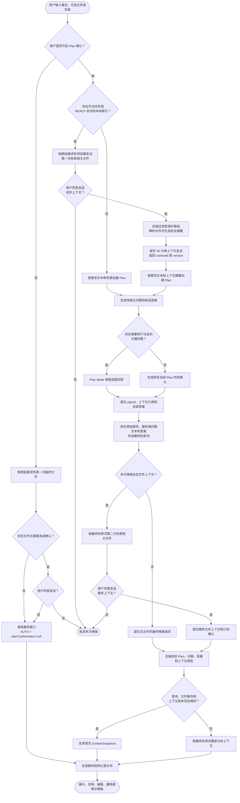
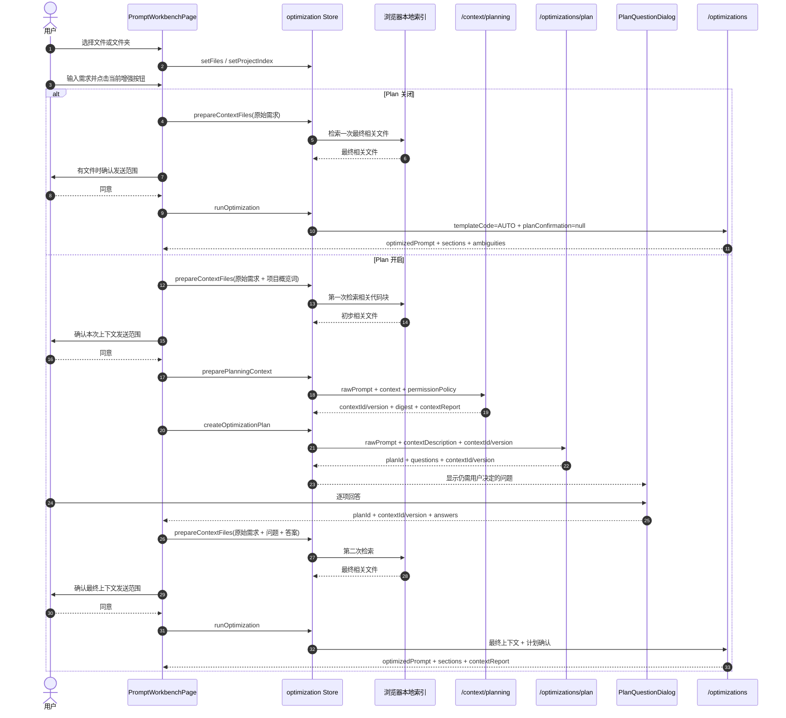
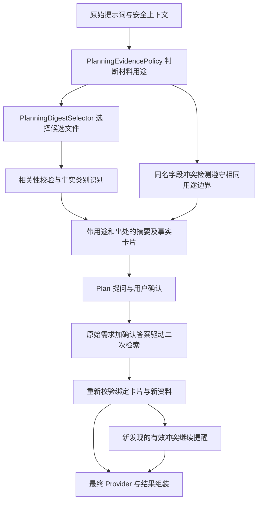
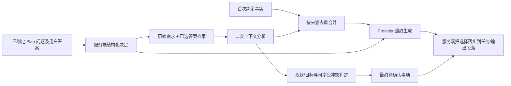
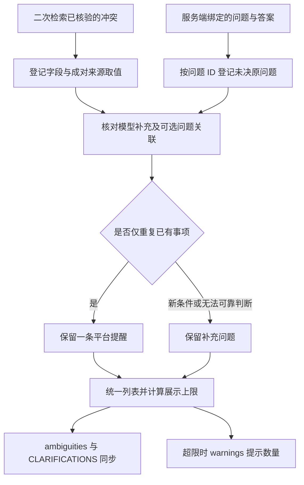

# 上下文感知 Plan Mode 实现教学

## 1. 要解决的问题

旧流程一律先根据用户输入的需求文本提问，等用户回答后才读取文件。这样既会强制不需要澄清的用户进入 Plan，也会出现两类重复问题：项目文件已经明确使用 Spring Boot，系统仍询问技术环境；研究数据已经是 Excel，系统仍询问数据格式。

当前实现把 Plan 改为用户主动开启，首次访问默认关闭并直接增强。用户开启 Plan 后采用方案 B：有文件时先分析上下文，再生成确认问题。这里的“先分析”不是把整个目录直接发给模型，而是先在浏览器或临时文档索引中选出初步相关内容，由后端过滤、解析和摘要，再把安全摘要交给计划模型。

关闭 Plan 时，无论是否有上传资料，都不会调用上下文准备接口和计划接口；有文件时按原始需求检索一次，用户同意发送后由最终接口完成分析。开启 Plan 但没有上传资料时，流程保持轻量：直接根据需求和背景生成确认问题，不调用上下文准备接口。

## 2. 上下文感知处理流程

### 2.1 决策流程图



直接增强只检索一次。Plan 路径中的第一次检索服务于提问，目标是让系统避免重复询问文件中已经明确的信息；第二次检索服务于最终生成，必须纳入用户刚刚确认的答案。只有查询、文件集合和上下文版本都没有变化时，后端才会复用首次分析快照。

### 2.2 完整执行时序



## 3. 前端代码如何串起来

入口位于 `apps/web/src/pages/PromptWorkbenchPage.vue`。

### 3.1 手动模式分流

`usePlanModePreference.ts` 用共享响应式状态和 `localStorage` 保存 `{ enabled, introSeen }`。默认值都是 `false`。首次主动开启后，`beginEnhancement()` 先显示用途说明；接受后进入 Plan，拒绝后关闭开关并立即直接增强。

`handleOptimize()` 和 `handleReEnhance()` 都先固定本次 `pendingPrompt`，再由 `continueEnhancement()` 根据当前开关分流：

```ts
if (planModeEnabled.value) {
  await runPlannedEnhancement();
  return;
}
await runDirectEnhancement();
```

因此“再次增强”也遵循当时的开关，而不是固定进入 Plan。生成期间开关被禁用，避免一次请求中途改变模式。

直接增强调用 `prepareContextTransmission(pendingPrompt, '直接增强提示词', true)`，然后执行 `runOptimization()`。Store 会清除旧的 `plan/planningContext`，将模板重置为 `AUTO`，并发送 `planConfirmation: null`，防止复用上一次 Plan 或历史记录中的模板。

### 3.2 第一次上下文检索

`runPlannedEnhancement()` 先调用 `prepareContextForPlan()`，成功后才创建计划：

```ts
if (!await prepareContextForPlan(pendingPrompt.value)) {
  return;
}
if (!await store.createOptimizationPlan(pendingPrompt.value)) {
  return;
}
```

`prepareContextForPlan()` 只在手动文件不为空或本地项目索引为 `READY` 时工作。索引仍在扫描、暂停或失败时，不会悄悄退回纯文本计划，而是提示用户先完成索引。

它调用 `prepareContextTransmission()` 完成三件事：

1. 通过 Store 检索当前任务相关文件；
2. 展示文件数、内联字符数和大型文档引用大小；
3. 按隐私设置等待用户确认发送。

第一次发送的目的文案明确为：后端先做安全分析，计划模型只看到裁剪摘要。

### 3.3 保存上下文引用

`apps/web/src/stores/optimization.ts` 中的 `preparePlanningContext()` 调用：

```text
POST /api/v1/context/planning
```

响应同时保存到两个状态：

- `planningContext`：保存 `contextId`、`version`、安全摘要和过期时间，供计划请求引用；
- `contextSnapshot`：保存可展示的分析报告，供工作台立即呈现技术栈、文件摘要和警告。

添加、替换、删除或清空文件，以及替换项目索引时，Store 会清除旧的 `planningContext`，避免下一次增强误用旧引用。

### 3.4 计划请求不重复发送文件

`buildOptimizationPlanRequest()` 只组装：

```ts
{
  rawPrompt,
  contextDescription,
  conversationHistory: [],
  planningContext: { contextId, version }
}
```

文件正文不会出现在 `/optimizations/plan` 请求中。后端根据引用取得已经分析过的安全摘要，再把摘要放进 `PlanningProviderRequest`。

### 3.5 第二次检索为什么必须包含答案

用户回答后，`buildRefinedContextQuery()` 按以下顺序拼接查询：

```ts
[
  rawPrompt,
  `${question1}\n${answer1}`,
  `${question2}\n${answer2}`,
].join('\n');
```

例如用户原始需求是“分析某地区心脑血管疾病死亡率”，确认地区为“广东省”、工具为“R”，第二次查询会同时包含这些事实。本地索引因此可以召回广东省数据字典、R 脚本或相关方法文件，而不是继续只按“某地区”检索。

`PlanQuestionDialog.vue` 回传 `planId`、`planningContext` 和全部答案。最终请求不能只传答案，否则服务端无法证明这些答案来自哪一次计划。

## 4. 后端代码如何串起来

### 4.1 上下文准备

`PlanningContextController` 把请求交给 `PlanningSessionService.prepareContext()`。应用服务依次执行：

```text
校验需求和描述中是否疑似包含真实凭据
→ ProtectedContextFilter 移除平台及用户声明的受保护路径
→ ContextAnalyzer 按原始需求分析或检索文件
→ 生成不含文件正文的 PlanningContextDigest
→ 计算 context version
→ 保存 30 分钟短期 ContextSession
```

`PlanningContextDigest` 只包含以下信息：

- 用户描述；
- 技术栈名称；
- 依赖名称与版本；
- 受限数量的目录节点；
- 文件路径与独立摘要；
- 分析状态、成功文件数和非敏感警告。

完整的脱敏 `ContextSnapshot` 留在短期会话中，并返回给工作台展示。计划 Provider 不接收 `fileSnippets[].content`。

### 4.2 上下文版本

`version` 是 SHA-256 指纹，输入包含：

```text
分析查询
项目描述
按路径排序后的文件路径
语言
documentId
文件大小
内联内容
```

文件顺序变化不会造成误判，文件内容、文档引用、描述或分析查询变化会得到新版本。版本只用于一致性比较，不能代替访问控制。

### 4.3 生成并注册计划

`OptimizationPlanningService.plan()` 先通过 `resolveForPlan()` 验证上下文引用属于同一份需求和项目描述，再调用 `PromptPlanningProvider`。Provider 返回的问题还会经过数量、长度、ID、候选答案、内部术语和凭据检查。

验证完成后，服务端生成 `planId` 并保存：

```text
需求 + 项目描述 + 会话历史的指纹
上下文引用
服务端实际展示的问题集合
过期时间
```

计划模型只负责提出问题。它不能生成 `planId`，也不能决定会话绑定规则。

### 4.4 校验最终确认

`DefaultEnhancementOrchestrator.optimize()` 首先调用 `PlanningSessionService.confirm()`。有 `planId` 的标准请求必须满足：

1. 计划仍在 30 分钟有效期内；
2. 需求、项目描述和会话历史未被替换；
3. `planningContext` 与生成问题时使用的引用一致；
4. 回答 ID 集合与服务端问题 ID 集合完全相同；
5. 每个答案非空且问题 ID 不重复。

服务端忽略客户端回传的问题文案，使用短期会话中保存的原问题和客户端答案重新组成 `PlanAnswer`。这样客户端不能通过修改 `question` 字段改变答案的语义背景。

### 4.5 最终上下文分析与复用

编排器用规范化后的问题和答案构造最终分析查询。随后比较最终输入与首次 `version`：

- 查询和文件完全一致：复用首次 `ContextSnapshot`；常见于计划没有问题的直接生成；
- 存在确认答案：查询已经变化，重新检索大型文档并分析；
- 本地索引选出了不同代码块：文件指纹变化，重新分析；
- 文件未变但内容改变：内容指纹变化，重新分析。

完成上下文处理后，原有链路继续执行：模板选择、工程约束补全、权限红线、Provider 生成、四要素校验、结果组装和历史保存。

## 5. Redis 与本地降级

`HybridPlanningSessionStore` 根据 `app.planning.store-mode` 工作。本地默认 `LOCAL_FALLBACK`：保留进程内副本，有 Redis 时也写入 Redis；多实例应设置 `REDIS_REQUIRED`：只以 Redis 为权威存储，读写失败返回 `503 PLANNING_STORE_UNAVAILABLE`，不能回退到其他实例无法读取的本地副本。

```text
prompt-optimizer:planning-context:v2:{contextId}
prompt-optimizer:plan:v2:{planId}
```

两类键的 TTL 都按会话 `expiresAt` 设置，默认 30 分钟。Redis 读写失败时日志只记录异常类型，不记录连接字符串、凭据或上游响应正文。

进程内降级仅适合单实例本地联调。生产多实例使用 `REDIS_REQUIRED`，同一个 `contextId`／`planId` 在任意实例读取相同 Redis 记录。登录用户所有权已由服务端 `CurrentActor.userId` 校验；不同登录用户无法读取对方的短期会话。计划有效期不超过其引用的上下文有效期。

生成问题时，摘要会先按原始需求与文件摘要的相关性排序，并为方案等文档预留最多 4 个位置，再留出部分位置给不同目录；总量仍限制最多 30 条并报告覆盖不足。单独添加的方案文档即使在随后选择项目目录或建立本地索引，也会留在首次准备的文件集合中。文档摘要会附上经过脱敏、限制长度的相关业务摘录，使方案里明确的规则进入 Plan Provider，而不是只留下文件名；完整文档不会直接放进 `/optimizations/plan` 请求。Provider 问题通过格式校验后，会按明确字段事实保守过滤重复提问，规范化去除完全重复的文案，最终只保存并展示过滤后的问题。对冲突、复合问题或模糊表述保留提问。兼容 Provider 已有自己的结构修复上限；应用层只对 Provider 成功返回但应用层校验失败的结果额外重试一次，认证、限流和上游不可用不会按结构错误重试。

过期的标准请求返回 `409 PLANNING_SESSION_EXPIRED`。工作台重新请求上下文和问题，匹配完全相同的问题文案及选项后恢复草稿；有变化的旧问题答案单独展示供核对，新问题仍需用户再次确认。重新获取文件需重新经过原有发送确认。匿名草稿不会提交到旧计划。监控只记录问题数、过滤数、受控重试次数和交互事件枚举，不把正文作为指标标签。指标在本机进程中聚合；多实例需要统一采集 Micrometer 指标。

## 6. 两种模式的伪代码

### 默认直接增强

```text
finalFiles = localIndex.retrieve(rawPrompt)  // 有文件或 READY 索引时
userConfirms(finalFiles)                    // 有发送确认设置且文件非空时
result = POST /optimizations(
  rawPrompt,
  finalFiles,
  templateCode = AUTO,
  planConfirmation = null
)
```

### 开启 Plan（有文件或目录索引）

```text
initialFiles = localIndex.retrieve(rawPrompt + projectOverviewTerms)
userConfirms(initialFiles)
prepared = POST /context/planning(rawPrompt, initialFiles, permissionPolicy)

plan = POST /optimizations/plan(
  rawPrompt,
  description,
  planningContext = prepared.contextId/version
)

answers = dialog.collectAll(plan.questions)
refinedQuery = rawPrompt + plan.questions + answers
finalFiles = localIndex.retrieve(refinedQuery)
userConfirms(finalFiles)

result = POST /optimizations(
  rawPrompt,
  finalFiles,
  planConfirmation = plan.planId + plan.planningContext + answers
)
```

开启 Plan 但没有文件时，跳过 `initialFiles`、`/context/planning` 和两次文件发送确认，直接创建 Plan；最终请求仍必须携带 `planId` 和完整答案。

## 7. 错误与降级判断

| 情况 | 行为 |
| --- | --- |
| 本地项目索引尚未 `READY` | 前端停止流程并提示等待，不生成缺少上下文的计划 |
| 用户取消首次发送 | 不调用上下文准备和计划接口 |
| 上下文为空 | 后端返回明确的空分析状态，计划仍可根据文本继续 |
| `contextId/version` 过期 | 返回 409 与 `PLANNING_SESSION_EXPIRED`，重新分析上下文；版本不匹配仍返回 400 |
| `planId` 过期 | 返回 409 与 `PLANNING_SESSION_EXPIRED`，工作台重新生成问题并供用户核对旧答案 |
| 少答、多答或重复回答 | 返回 400，不进入 Provider |
| 语义检索失败 | 保留关键词检索或代表片段，并在 `contextReport.warnings` 中说明 |
| 最终检索与首次输入不同 | 重新分析，不复用旧快照 |
| Redis 不可用 | `LOCAL_FALLBACK` 可单实例降级；`REDIS_REQUIRED` 返回 503，不保存不可跨实例读取的计划 |
| Provider 失败 | 返回稳定错误码，弹窗保留用户回答以便重试 |

## 8. 如何验证实现

后端重点测试：

```powershell
cd services/api
mvn.cmd -q "-Dtest=PlanningSessionServiceTest,DefaultEnhancementOrchestratorTest,PlanningContextControllerTest" test
```

前端重点测试：

```powershell
cd apps/web
npm.cmd test -- --run src/features/optimization/optimizationRequest.test.ts src/stores/optimization.test.ts
npm.cmd run typecheck
```

浏览器测试中的关键断言是请求顺序：

```text
/context/planning
→ /optimizations/plan
→ /optimizations
```

同时检查计划请求只含 `contextId/version`，最终请求含 `planId`、同一个上下文引用和全部回答。对于带 `documentId` 的大型文档，还要验证最终后端分析查询中出现用户确认答案。

直接增强还应断言：不会调用 `/context/planning` 和 `/optimizations/plan`，最终请求使用 `templateCode=AUTO`、`planConfirmation=null`；首次开启说明可接受或拒绝，偏好在刷新后保留，再次增强跟随当前开关。

## 9. 本地索引与推荐答案的实现更新

当前目录索引只有一次遍历，不再为了显示百分比预扫描整个目录；未知总数时显示实际处理数量。TXT、Markdown 与代码正文按连续窗口分块，优先照顾代码结构，单块最多 12,000 字符，单行长文也不会一直积攒到文件尾。每块检索词覆盖完整正文，并在约 4 MiB / 300 块的批次预算下写入 IndexedDB。读取失败会清理该文件的残留块，未完成指纹不可复用；完整扫描才清理未出现的旧文件，扫描达到上限不会误删后半段索引。格式版本升为 4，旧格式在增量更新时重建，无需修改 IndexedDB 表结构。

Plan 的问题清理、推荐对齐各自独立：`PlanQuestionFilter` 先过滤已知事实；`PlanChoiceCompleter` 保留经过校验的题型和候选项，不再凑四个选项或丢弃无推荐的问题；`PlanRecommendationAligner` 用当前需求、描述/历史偏好和安全文件证据进行保守匹配。明确否定的技术不能作为正向依据；推荐必须匹配完整选项或有证据的具体实践，不能截取共同词（如 `Vue`、`Plan`、`API`）背书。无法唯一判断时取消推荐标记，但保留所有候选项供用户选择；该规则不是完整语义推理，仍需真实 Provider 质量评测。

新增 `options[].recommendationReason`（可选，默认空字符串，最多 300 字）显示推荐理由。推荐不是用户确认，也不能用来决定真实地区或数据值。未知事实保留 `FREE_TEXT`；决策可保留两项选择。对话框不会预选推荐项，支持自定义替代回答、查看已填答案并返回修改。准备二次检索和等待发送确认时也锁定回答，避免答案和实际提交不一致；Plan 过期恢复仍保留可匹配草稿。

回归范围增加：单次遍历同时发现源码与办公文档、长文尾部规则、单行中文与代理对、大文件分批写入、扫描上限保护、重复 `documentId` 只检索一次、未完成文档不计算查询向量、推荐优先级和理由、无推荐问题保留、桌面/窄屏答案回看与生成锁定。`project-index-retrieval.spec.ts` 额外使用浏览器真实 IndexedDB，验证长需求末尾的确认答案可以召回中文方案规则，并验证项目索引隔离。工作台浏览器用例使用模拟后端，后端兼容 Provider 使用模拟 HTTP；这些检查证明契约和指定行为，不能代替真实模型业务准确率验收。

## 10. 后续演进边界

短期 ID 已绑定登录用户并在每次读取时校验。多租户团队上线前仍需按实际成员关系补充租户和工作区授权。生产环境还应限制同一用户并发会话数，并统一采集 Redis 命中率、过期错误率、首次与二次检索差异和 Plan 问题质量指标。

## 11. 第一批证据筛选改进（2026-09-28）

本批解决“资料有出处，但测试样例和无关警告被写成业务事实”的确定性问题。例如统计日志任务不再仅因含有“统计”二字，就采纳 `PlanQuestionFilterTest.java` 内的 Python、CSV 和 Excel 测试字符串。路径用途分类不是完整语义验证，也不证明生产环境已采用某项技术。



实现分工：

- `PlanningEvidencePolicy` 集中判断项目实现、项目文档、测试代码、夹具、示例、生成报告和未知材料。一般业务任务不选测试或报告；明确修复测试、分析构建或点名文件时仍允许相应材料。Markdown 的明确示例小节不作为业务事实。
- `PlanningFactCardExtractor` 在用途校验后检查片段相关性，不再按“统计/分析/研究”直接放行某类事实；优先识别 `OUTPUT_FORMAT`，避免被通用“格式”匹配成 `DATA_FORMAT`。
- `PlanningSessionServiceImpl` 给摘要加用途前缀。被用途筛选排除的文件仍在完整分析报告中，不计作计划摘要遗漏；候选文件超过摘要预算时仍显示覆盖提醒。
- `DefaultEnhancementOrchestrator` 与 `OptimizationResultAssembler` 使用原始需求和已确认答案重新筛选绑定卡片。旧卡片也重新判定用途；原文件未被二次检索再次选中时，仍可使用符合条件的已绑定摘录。`ContextFactPreserver` 对结果末尾补充的文档规则执行同样筛选，避免把“分包超过 500 kB”等无关构建提醒追加为业务约束。
- `ContextConflictDetector` 避免测试夹具经“资料冲突”通道重新进入普通业务任务。其能力仍是同名字段不同取值检测，不是开放域语义冲突判断。
- 兼容 Provider 的 Plan 与最终生成指令说明各用途边界，不得把测试或示例视为生产事实。没有增加模型调用次数，也没有修改文件上传、全文索引、权限红线、数据库结构或 Redis TTL。

本批验证：增强与 Provider 模块的 22 个测试类共 142 项通过，失败、错误、跳过均为 0；前端 `optimizationRequest.test.ts` 的 8 项通过。覆盖统计任务混入 Python/CSV/Excel 测试字符串、无关科研文档、Markdown 示例、输入/输出格式区分、显式测试任务、构建报告任务、旧卡片再过滤、混合材料从上下文准备到最终增强，以及候选预算边界。完整报告保留文件与计划证据筛选分别断言，不能把筛选理解为上传失败。

可从 `services/api` 运行相关回归：

```powershell
mvn -q "-Dtest=PlanningEvidencePolicyTest,PlanningFactCardExtractorTest,PlanningSessionServiceTest,ContextConflictDetectorTest,OptimizationResultAssemblerTest,DefaultEnhancementOrchestratorTest,OpenAiCompatiblePromptEnhancementProviderTest" "-Dspring.flyway.enabled=false" "-Dapp.security.bootstrap-admin.enabled=false" "-Dapp.security.bootstrap-user.password=" test
```

这些测试使用确定性断言和模拟 Provider，不是外部模型业务准确率验收。下述第二批实现尚未按用户本次要求执行测试；真实 Provider 与双人评审门禁继续按待办执行。

## 12. 第二批确认决策与二次检索（2026-10-01）

Plan 提交的 `planId`、上下文版本及问题 ID 仍由服务端校验。`ConfirmedDecisionSet` 只从服务端规范化后的问题和答案形成 `ConfirmedPlanDecision`：问题 ID、主题、作用范围（`CURRENT_STATE`、`TARGET`、`CHOICE`、`UNRESOLVED`）、答案和 `USER_CONFIRMED` 来源。结构化决定直接传入最终 Provider 的 `confirmedDecisions`；新调用不再重复发送整份 `planAnswers`，旧适配器仍可使用原字段。该分类是确定性辅助判断，不能证明附件中描述的功能已经实现；“暂不确定”不会被提升成已知事实。



浏览器本地索引查询和后端文档分析查询均保留原始需求，再加主题与已选答案，不把 Plan 问题里未选的候选技术或数据值当作检索偏好。`PlanningFactMerger` 保留经过本次权限规则及相关性再次筛选的首次证据，按路径、类别和摘录去重，补充二次检索的新证据；最终最多保留 24 条，首次 20 条满额时仍有 4 条新增空间。去重保留比较符和标点，避免合并相反的阈值规则。超过提取或合并预算时给出可见覆盖提醒。文件上传、索引内容和 `contextReport` 不因这个事实预算改变。

`ContextConflictDetector` 内部保留冲突字段、双方取值、来源和提示，并让首次绑定证据与二次片段共同参与比较。明确标注“当前”与“目标”的两个取值不按同一现状冲突处理；已回答的旧冲突仅在原取值对且用户明确选择或保留冲突时免于重问，第三个新取值仍显示。结果组装内部区分有证据的新冲突、已被答案覆盖的信息和未决选择；已选择工具不代表工具版本也已回答。已确认的现状保留在背景，目标或方案写入任务，交付要求写入输出，避免所有答案在背景和任务重复追加；待定回答继续显示原始待确认问题。模型草稿仅出现候选技术名称，不能代替服务端写入已确认的执行选择。覆盖检查确认答案已按字面进入对应段落，不承诺模型所有改写均语义正确。

本批未新增接口请求字段，也没有修改数据库迁移或 Redis TTL。作用范围和主题采用保守规则；开放域同义关系、跨句语义矛盾以及 Provider 生成段落的事实正确性仍需真实模型评测。本次按用户要求不运行测试，因此以上为实现说明，尚非上线验收结论。

2026-10-01 收尾仅执行编译及静态检查：后端 `mvn -q -DskipTests compile`、前端 `npm.cmd run typecheck` 和 `git diff --check` 均通过。未运行单元测试、接口测试、浏览器测试或真实 Provider 评测。

### 后续修复：统一登记提醒，避免模型改写与原问题重复

上述为第二批最初交付时的验证范围。后续真实验收发现：先拼接模型提醒、再追加原始未决问题，会让同一事项出现多次，并在去重前占用 8 项限额。本次改为由 `PlanAmbiguityMerger` 登记并合并：



Provider 的可选 `ambiguityReferences` 只是关联线索。有效问题 ID 仍不能消除新增金额、退款条件、人员范围或工具版本；未知 ID 不参与授权或确认状态判断。旧 Provider 保持可用，以保守的维度与剩余文本核对作为兼容路径，不能识别时保留。有限规则不等于开放域语义判重保证。

工作台、顶栏、结果和历史共用模型短名格式化，`DeepSeek-V4-Pro-0813` 展示为 `DeepSeek-V4-Pro`，原始调用元数据仍保留。具体实现、回放证据及验证边界见 [提醒归并与模型短名验证](../testing/Plan提醒归并与模型短名验证-2026-10-01.md)。
