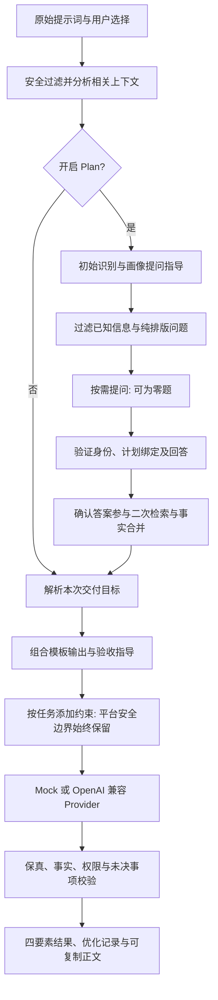

# 任务模板适配实现教学

本轮以“用户最终要交付什么”为分类依据，复用既有模板、四要素和安全边界。适配的是交给下游 AI 的任务说明；平台仍不直接翻译、写文章、执行代码或计算数据。

## 1. 识别与模板的职责

`TaskIntentResolver` 是直接增强、Plan、Mock 和歧义兜底共同使用的轻量识别器。它从肯定的原始目标和服务端已验证的整体交付答案识别任务；背景、待译原文、代码块、否定要求、当前状态、未选选项不能替代目标。文件用于补充事实与冲突，不因文件含“研究”或代码就改写任务。

`TemplateCode` 的公开值仍为 `AUTO`、`GENERAL`、`RESEARCH_ANALYSIS`、`FEATURE_DEVELOPMENT`、`BUG_FIX`、`REFACTORING`、`TESTING`。`AUTO` 是请求选择，结果保存解析后的代码。未能识别目标时返回 `GENERAL`，不假装已经知道业务要求。

内部 `TaskIntent` 字段如下，不新增前端必填项或可伪造的确认字段：

| 字段 | 含义及边界 |
| --- | --- |
| `templateCode` | 解析后的既有模板；显式非 AUTO 选择优先 |
| `deliveryProfile` | 本次主交付画像；不是职业、文件类型或专业认证 |
| `status` | `EXPLICIT`：显式模板；`RAW_GOAL`：原始目标；`USER_CONFIRMED`：绑定交付答案；`DEFAULT`：未识别目标 |
| `auxiliaryProfiles` | 明确附带交付；原始要求全文仍保留，不把多目标删成一个目标 |
| `engineeringConstraints` | 主任务或明确辅助交付是否含代码；不能据上传 Java 文件断定本次需要开发 |

`TaskDeliveryProfile` 内部区分翻译、新闻稿、指南、教学、机关报告、学术方法、学术写作、数据分析、材料整理、会议纪要、法务材料、医疗材料、软件与通用。它提供输出、验收、提问和可选示例指导，不是 14 套独立框架或公开模板。

## 2. 直接与 Plan 的共同链路

工作台默认自动，最终增强请求继续发送 `enhancement.templateCode = AUTO`。Plan 返回的代码是服务端推断结果，用于展示、记录及核对；不是用户显式选择，不能把初期误判锁死。直接 API 调用者显式选择的模板继续有效。

最终编排在 Plan 绑定成功后将 `decisions.knownDecisions()` 传给模板注册中心。整体交付确认可以将“处理材料”细化为“翻译成英文”；附表、字段、下一阶段等局部选择不能覆盖主任务。暂不确定和当前状态不能冒充执行目标。部分回答仅使用可明确分开的已定部分，原始回答和未决部分仍保存。

## 3. 指导如何随任务变化

| 原始目标 | 适用指导 | 不应自动附加 |
| --- | --- | --- |
| 新闻稿 | 受众、篇幅、产品状态、事实和引语依据 | 接口、代码、软件测试或论文方法 |
| 用户指南 | 已知功能、步骤、易懂表达、能力边界 | 因资料含登录代码而追问认证实现 |
| 翻译 | 目标语言、术语、语气、原文段落 | 用户要求只输出译文时追加解释 |
| 论文/研究方案 | 指定章节、研究对象、方法条件、公平比较与未知参数 | 未要求章节、未执行实验的结果 |
| 数据分析 | 字段、分母、缺失、日期、异常和统计口径 | 未要求的 Python/R 代码或模拟结果 |
| 机关报告/纪要 | 已完成、进行中、拟办、决定与待定分开 | 虚构成效、已获批状态、负责人或期限 |
| 医疗/法务材料 | 对象、版本、授权、字段含义和材料出处 | 临床判断、法律行动或跨机构规则推断 |
| 软件实现 | 兼容、参数、异常、事务/缓存及验证 | 由附件主题改变本次软件目标 |

`ConstraintCompleterImpl` 仅向主软件模板加入识别到的 Java、Spring Boot、数据库、Redis 和代码测试约束。非软件任务保留事实依据、凭据保护、受保护路径和人工确认边界。分析或写作任务明确要求复现代码时，通过兼容的 `completeWithAuxiliaryCode` 入口追加输入、异常和必要边界验证，并写明仅作用于代码交付；不会因为研究附件碰巧是 Spring 项目就套用 Web 开发约束，也不会把软件测试要求扩展到整份报告。

`AmbiguityDetector` 同样使用交付识别：写作引用登录、排序或科研案例不触发相应工程/科学兜底；明确的附带开发目标仍参与判断。真实增强 Provider 的同次语义检测继续执行，没有用关掉检测来消除提醒。

## 4. System Prompt 与交互边界

增强输入的 `template` 新增内部 `deliveryProfile`，继续附输出、验收及示例指导；四参数模板构造兼容。Plan 输入增加内部 `taskIntent` 和 `questionScope`，由服务端生成，不接受客户端声称已确认。

系统指令明确：肯定目标优先于附件主题；遵守“只输出”及篇幅限制；内部推理不要求公开；不要为填满模板增加问题、代码、真实数据或额外章节。写作清单的纯排版可以委托执行者，候选带新增权限、指标、方法或参数时仍保留整题。翻译已明确的段落和解释限制继承，正式名称与术语冲突不作为普通排版删除。

`ResolvedPlanState` 只在原来未知的整体交付已绑定并明确选择时，更新“具体交付形式请先向我确认”的旧谓词；同句不执行开发/部署等限制保持。附件、下一阶段、未决或未绑定回答不能获得该确认状态。

优化结果仍至少包含背景、任务、输出、约束，并由原有组装器补验收。比如翻译任务返回的是四要素优化提示词，其中要求下游只输出译文；不是增强接口直接返回译文。本轮不实现按场景省略验收段、14 框架选择器、高级偏好界面或版本化 Skill 库。

## 5. 验证与限制

`TaskTemplateAdaptationTest` 验证正向/否定、原文/背景、主辅交付、整体/局部答案、显式模板、软件保护保留、纯排版与复合业务条件边界。既有过滤、提醒、冲突、Provider 修复预算、权限、Controller 与前端流程一起回归。

真实模型结果、原始/增强下游作品、首轮失败及剩余问题见[本轮验收报告](../testing/任务模板适配与真实模型作品对照-2026-10-05.md)。识别器是有限规则，不能保证任意语言与跨行业表达均识别正确；语义归并、推荐适用性、完整目录、多模型专业双人评审继续作为独立门禁。
