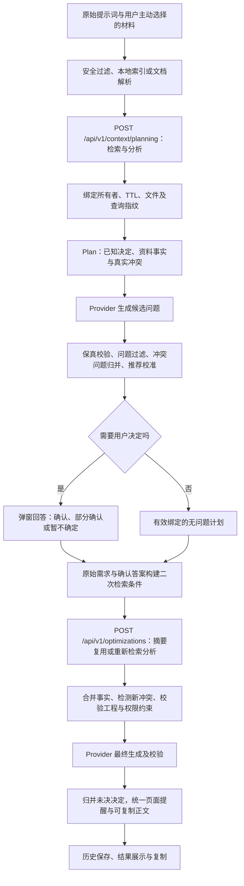

# Plan Mode 深度评估与跨行业测评方案（2026-10-04）

## 1. 结论与证据边界

当前 Plan Mode 已具备上下文感知、用户确认、答案参与二次检索、明确规则校验和未决条件进入复制正文的主链路，但尚不能据此认定跨行业业务质量已经满足正式上线标准。本轮针对当前工作区做代码评估、最小离线反例和安全耗时核对，没有修改产品代码，也没有新增付费模型调用。

三个问题都可以继续改进，不需要推倒主链路。特别需要调整思路：问题不是“去重力度还不够”，而是部分地方没有稳定区分**哪个业务对象、哪个属性、什么条件下的决定**。继续扩大关键词删除范围，会少问真正必要的问题。

| 问题 | 难度评级 | 本轮依据 | 优先方向 |
| --- | --- | --- | --- |
| 同一待确认事项的改写重复 | 高；已有结构化关联链路的局部修复为中 | `PlanAmbiguityMerger` 有 questionId 和保守关联，但没有覆盖全部跨行业语义；历史论文 7 个未决点在复制正文形成 14 条提醒 | 统一决定身份，归并同一未决条件，保护新增条件 |
| 已知事实、低价值问题和错误过滤 | 高；本轮两项确定误删缺陷为中 | `PlanQuestionFilter`、`PlanningDecisionPolicy`、保真规则依赖具体维度与表达；离线反例证明不同业务对象会被误删 | 先修误删，再按任务职责分流，专业决定保留 |
| 响应延迟定位和受控优化 | 中；保证所有外部模型长尾固定为低延迟为高 | 历史 61／50 秒是 Node–CDP 计时，服务器实际约 20 秒；当前阶段标记不能拆开模型 HTTP 与业务校验 | 先修计时口径和阶段观测，再优化首次失败和重复计算 |

“任意行业、任意模型、任意改写都绝不重复、绝不遗漏、速度始终固定”的绝对保证目前无法完成。这不妨碍修复确定缺陷，也不等于无法制定可验收的质量门槛。

### 本轮与历史验证的区别

- **本轮新执行**：当前已编译类的两项离线合成反例；21 次无模型健康请求；通过正常已登录会话读取已发布模型目录；按安全字段关联历史请求日志。没有运行完整后端回归，没有新执行跨行业模型推理。
- **历史证据**：上一候选有 34 类、432 项限定范围后端检查；三轮共 27 次真实生成 API、18 份最终正文、14 次原生复制检查。这些是已保存的历史结果，本轮没有重新跑成 432 项“当前通过”。
- **未完成**：本文新测试集的真实模型执行、两名独立评审、专业正确性评审、完整大型目录流程和正式跨模型比较。合成输入与自动断言不能替代临床、科研或法律专业验收。

本轮安全证据索引：[manifest.json](./evidence/plan-mode-depth-assessment-2026-10-04/manifest.json)。历史原始结果仍保留，失败不会被后续成功重跑覆盖。

## 2. 当前流程与三个问题出现的位置

代码事实以当前工作区为准，主要入口为：

- [OptimizationPlanningServiceImpl](../../services/api/src/main/java/com/promptoptimizer/enhancement/service/impl/OptimizationPlanningServiceImpl.java)：Plan 准备、模型提问、服务端冲突问题、过滤、推荐校准和计划注册。
- [PlanningSessionServiceImpl](../../services/api/src/main/java/com/promptoptimizer/enhancement/service/impl/PlanningSessionServiceImpl.java)：上下文和计划所有权、TTL、指纹、确认及摘要复用。
- [DefaultEnhancementOrchestrator](../../services/api/src/main/java/com/promptoptimizer/enhancement/service/impl/DefaultEnhancementOrchestrator.java)：最终增强、重新分析或摘要复用、事实合并、规则及歧义处理。
- [OptimizationResultAssembler](../../services/api/src/main/java/com/promptoptimizer/enhancement/service/impl/OptimizationResultAssembler.java)、[PlanAmbiguityMerger](../../services/api/src/main/java/com/promptoptimizer/enhancement/service/impl/PlanAmbiguityMerger.java)：最终歧义分类、关联和复制正文组装。



“已完成 Plan”不意味着必须清空全部提醒。用户明确选择“暂不确定”、只确认了复合问题的一部分，或者二次检索发现新冲突时，必要条件仍应保留；问题是同一条件重复，或已解决条件被重新当作未知。

## 3. 待确认事项重复：真正发生在哪一层

### 3.1 现有保护与局限

`AmbiguityDetector.detect` 根据原始需求、已分析上下文和用户会话提出候选缺口，当前包含登录、地区、YLL 等具体场景规则。它不是通用的最终语义去重器，因此不能把论文 7→14 的全部责任归到该类。

资料冲突由 `ContextConflictDetector` 先做保守检测：读取当前片段及首次绑定事实，识别冒号／等号形式的同名短字段，比较跨来源取值，使用资料用途和用户确认进行过滤，并区分现状与目标。它目前只覆盖特定字段名模式，每次最多返回 3 条冲突；不是对所有自然语言段落的完整语义冲突检测。已有确认后遇到第三取值仍会比较，这是应保留的保护。建议增加自然语言业务规则、不同对象同名属性及 4 个独立冲突的覆盖测试，不能把字段正则检测说成“全部冲突已识别”。

`OptimizationResultAssembler` 合并 Provider 歧义与平台检测结果，分类、规范化辅助关联，再交给 `PlanAmbiguityMerger`。已有精确文本去重只能删除相同文字；不同表达仍可能作为两项进入后续处理。

`PlanAmbiguityMerger` 优先利用问题 ID、有限主题和已绑定事实关联。同一已确认事项可被移除，同一未决事项可以合并；但无法证明关联时，保守创建 `text:<正文>` 项。这个保守行为保护新问题，却也使科研主题的同义改写形成重复。有些合并还追加长篇“补充说明”，即使条目数量减少，阅读负担仍可能没有下降。

历史论文样本中，用户未决答案应继续保留；7 个决定点却成为 14 条复制正文提醒，属于已有真实输出证据。本轮没有再次调用模型证明某项新修复已经生效。

### 3.2 新复现：粗粒度去重已经误删必要问题

本轮使用 Java 21 编译的最小探针，直接加载当前 `services/api/target/classes` 调用局部方法，不启动 Spring，不读取模型配置，不联网。

| 反例 | 应有行为 | 实际结果 |
| --- | --- | --- |
| 审批标准和退款标准均未确定，单独输入各问题 | 分别保留 | 两题单独均保留 |
| 合并两题 | 保留两个独立决定 | 只保留第一题；反序后改为只保留退款题 |
| 已有“审批标准”资料冲突，再问“退款规则采用什么标准” | 保留另一对象的问题 | `sameConflictDimension` 返回 true；Plan 分支会据此排除该题 |

根因：`PlanQuestionFilter` 第 80 行附近的 `seenDimensions` 使用类别键；第 347 行附近 `questionDimension` 可使两题都变为 `BUSINESS_RULE`。`OptimizationPlanningServiceImpl` 第 279 行附近仅凭字段含“标准”和问题含“标准／验收”认定同一冲突，缺少业务对象匹配。

这两项是**当前编译方法的实际离线反例**，不只是静态猜测；但尚不等同于完整 Controller、真实 Provider 或跨租户接口复现。详细结果与哈希见 [distinct-decision-probe.json](./evidence/plan-mode-depth-assessment-2026-10-04/distinct-decision-probe.json) 和 [runtime proof](./evidence/plan-mode-depth-assessment-2026-10-04/distinct-decision-probe-runtime-proof.json)。

### 3.3 建议的代码级方向（尚未实施）

内部首先建立决定身份，再处理模型措辞。以下为设计示意，不是当前已有接口：

```java
/** 标识一个业务对象在特定条件下的决定，不能只用 BUSINESS_RULE 一类宽泛标签。 */
record DecisionIdentity(
        String subject,
        String attribute,
        List<String> applicabilityConditions) {}

/** 区分事实、用户确认、未决选择及新冲突；证据引用使用服务端可验证标识。 */
record DecisionFinding(
        String decisionId,
        DecisionIdentity identity,
        DecisionState state,
        List<String> evidenceIds,
        String description) {}
```

- 冲突身份需包含业务对象、属性、适用范围及冲突两侧的证据与取值。同字段第三个新取值、新版本或不同对象不能被误并为旧冲突。
- 优先复用现有 `PlanningKnownDecision`、确认决定和事实合并能力，避免另建与原链路竞争的“事实系统”。新增状态与持久化兼容性需单独设计，本文不修改接口或数据库。
- 模型可引用服务端问题 ID，引用只是辅助信息，必须验证内容是否对应。错误引用时保留原始新问题并降级处理，不能拖垮增强，也不能静默删除。
- 同一个未决决定在页面与复制正文各呈现一次；复制正文仍保留必要来源、适用条件和冲突两侧的最小证据，只有非必要的长证据可在可展开区查看。复合提醒拆到决定层归并，新增条件重新保留。
- 身份缺失、仅有泛化主题或作用条件无法唯一核验时，先独立保留，不自动合并。模型自报结构化 ID 不获得删除新问题的权力。
- 不采用“完成 Plan 就清空歧义”或仅凭向量相似度删除；“暂不确定”不能转成默认同意推荐选项。

此方向的局部修复难度为中，跨行业语义稳定性为高。至少补同对象改写、不同对象同属性、同对象不同条件、第三个取值、部分确认和错误辅助引用反例。

## 4. 非必要决策：过滤已知事实与判断问题价值是两件事

### 4.1 当前已有能力

`PlanQuestionFilter` 从原始需求、用户历史、项目描述和摘要事实提取已知信息，然后执行文本去重、任务相关性、已解决事实和已委派实现细节检查。

`PlanningDecisionPolicy` 已区分部分当前状态、用户目标、作用范围与条件，包含软件任务的测试层级、已定模块、地区范围／已有地区实现和论文方法提纲等处理。真实地区字段来源、缺失值和行政层级仍可能未决。它对“执行 Agent 可核查”的工程细节已有分流；上一轮表单三次复验没有重问已知字段，不代表所有行业及改写均已覆盖。

`RequirementFidelityGuard` 主要防止规则反转、候选违约和丢失关键条件。一个问题即使没有违反原始要求，也可能缺乏决策价值；**保真通过不等于问题有必要**。

### 4.2 应如何分流

| 信息类型 | 默认处理 | 例子与边界 |
| --- | --- | --- |
| 原始需求或可信相关材料已经明确 | 继承事实或目标，不再问相同决定 | 已明确输出中文新闻稿、已有字段全量覆盖；现状 React 不可覆盖明确 Vue 目标 |
| 执行者可以通过代码或资料核查 | 委派核查，必要时标明依据范围 | 已授权代码任务中的 Mapper 所在位置、常规测试分层；不能借此增加新模块 |
| 常规表达与排版细节 | 按任务采用合理结构，允许编辑或高级选项 | 论文提纲一般章节组织、是否列方法候选清单；用户明确要求特定格式时必须遵守 |
| 真正改变业务或研究结论的选择 | 提问并提供有依据的选项 | 数据分母、研究样本来源、纳排标准、评分定义、关键业务授权 |
| 资料相互冲突或来源用途不清 | 说明两侧证据，询问或保留冲突 | 不可把测试样例当已上线事实；不可把甲院字段映射直接用于乙院 |
| 用户暂不确定且影响后续执行 | 保留条件，不强推默认答案 | 相应步骤先确认；其他独立步骤可继续 |

不能要求每个需求都出现问题。完全明确的翻译、新闻稿和教育场景应允许零问题；高风险研究或法律关键条件缺失时，不能为了让弹窗更短把它们全部自动决定。

### 4.3 改进顺序

1. 先修第 3.2 节两项误删，避免“低价值过滤”减少必要反馈。
2. 让候选问题携带所需决定、当前证据、尚缺条件及为何影响交付的理由，服务端按任务职责审查。
3. 科研、医学、机关报告、法律等使用任务适配策略，明确哪些决定可以委派、哪些需要用户或专家确认；不能把开发测试模板套给新闻或翻译。
4. 推荐依据必须来自用户偏好、当前目标、相关真实实现或可解释的取舍。资料中提到某工具不等于用户偏好该工具。
5. 默认不增加一轮语义裁判模型；额外模型会增加成本、延迟和新的误判来源。先通过结构化证据及保留反例收敛确定缺陷，再评估受控模型校核的净收益。

已知事实继承和局部委派优化为中；跨行业判断“这个专业问题是否值得问”为高，需要真实使用者和专业评审。

## 5. 响应延迟：纠正原计时口径，不能未经测量归因

### 5.1 已重新关联的历史证据

`scripts/plan-business-acceptance.mjs` 的 `requests[].elapsedMs` 在 Node 中先开始计时，再调用 `page.evaluate`，等待浏览器 `fetch`、`response.json()` 及 CDP 回传后停止。它包括验收工具和浏览器链路，不是纯服务器响应时间，也不是用户页面内部 fetch 的独立计时。

`RequestIdFilter` 的服务器 HTTP 耗时包围过滤器链。`OpenAiCompatiblePromptEnhancementProvider` 的 Provider 耗时包围 `request.apply` **与** `validation.apply`，包含模型 HTTP、解析和业务校验／组装回调，不能直接称为“模型推理耗时”。

| 历史请求 | Node–CDP 客户端计时 | 服务器 HTTP 计时 | Provider 调用与校验 | 服务器计时之外的差额 |
| --- | ---: | ---: | ---: | ---: |
| 论文 Plan，`e36736af-07c9-4a87-8c98-6235ea0499ac` | 61,021 ms | 20,132 ms | 19,917 ms，1 次 | 40,889 ms |
| 表单最终，`fbe2058e-6c2b-4476-b979-72924cbc4b86` | 50,264 ms | 20,438 ms | 7,146 + 13,261 ms，2 次 | 29,826 ms |
| 首轮表单最终，`97b10e50-ce98-435c-b8e6-9ca2aedad194` | 32,438 ms | 6,820 ms | 6,764 ms，1 次 | 25,618 ms |

这修正了此前对 61／50 秒的解释，**没有证明历史差额一定来自 CDP、浏览器、代理或某一个组件**。当时没有浏览器内部计时和足够的阶段标记，无法继续细分这些差额。

论文 Plan 前置 `/context/planning` 的客户端记录为 37 ms，响应 `latencyMs=2`，只涉及一个合成文件；该样本没有上下文分析耗费几十秒的证据。也不能把这个小材料结论推广到整个大型项目目录。

27 次真实生成请求均完成服务器关联：

| 类型 | 请求数 | 服务器中位数 | 服务器最大值 |
| --- | ---: | ---: | ---: |
| 直接增强 | 9 | 5,494 ms | 11,335 ms |
| Plan 提问 | 9 | 3,703 ms | 20,132 ms |
| Plan 最终增强 | 9 | 6,702 ms | 20,438 ms |

31 次上游尝试中有 4 次受控修复。已报告用量为输入 76,796、输出 31,689、合计 108,485 Token；失败尝试用量未知，不能按 0 计算，也不能说这是完整总成本。详细关联见 [historical-generation-latency-correlated.json](./evidence/plan-mode-depth-assessment-2026-10-04/historical-generation-latency-correlated.json)。

### 5.2 本轮无模型隔离检查

同一正常登录浏览器下，对直连后端、经 Vite 和 CDP 浏览器链路各做串行 5 次、双并发 1 轮，共 21 次轻量健康检查，全部 HTTP 200。串行 Node 总计时中位数分别为 8.39、8.85、16.44 ms。

这证明当前轻请求正常，以及工具计时确实比浏览器内部 fetch 多一段开销；不能据此证明历史长请求已恢复，或者排除大响应、CPU 压力、代理连接和服务端请求入队。证据见 [health timing](./evidence/plan-mode-depth-assessment-2026-10-04/health-timing-2026-10-04T03-56-27-506Z-server-correlated.json)。

### 5.3 需要补充的阶段计时

| 层次 | 建议字段／阶段 | 用途 |
| --- | --- | --- |
| 验收 Node | `nodeTotalMs`、起止时间 | 明确工具整体耗时，不能代替页面计时 |
| 浏览器 | `fetchHeadersMs`、`bodyReadMs`、`jsonParseMs`、`browserTotalMs` | 拆出真正页面等待和响应解析；安全 Resource Timing 不记录凭据 |
| 上下文 | `contextResolveMs`、`retrievalMs`、`analysisMs`、`contextCacheHit` | 定位检索、解析、缓存是否重复；仅记录计数与耗时 |
| Plan／最终业务 | `decisionMergeMs`、`conflictCheckMs`、`questionFilterMs`、`recommendationMs`、`assemblyMs` | 分离领域规则和结果组装 |
| Provider | `attempt`、`modelHttpMs`、`providerParseMs`、`businessValidationMs`、失败代码 | 与现有含校验的 `durationMs` 区分，记录每次重试 |
| 持久化 | `historySaveMs`、`auditAcceptMs` | 定位数据库和可靠审计接收；不能未经测量归为锁等待 |

所有阶段使用单调时钟；跨机器用 requestId 关联，不能直接相减不同机器未校准的墙钟。日志不写原始提示词、文件正文、认证会话、密钥或不必要的个人信息。本文建议新增日志字段，不改变优化响应契约。

确认答案改变查询时，应重新检索。摘要复用必须维持所有权、TTL、文件版本与查询指纹；不能仅按原始提示词缓存，也不能跳过二次检索来降低耗时。现有模型并发限制满额会快速失败，并非应用层循环等名额；当前 HTTP 工厂也不是预设 Apache 连接池，均无证据可直接认定为此次瓶颈。

优化优先级：先定位 → 降低无效响应的首次失败率 → 复用不变的解析和事实计算 → 再评估 HTTP 客户端或后台处理。不得削减文件覆盖、删除保真检查、强行降低输出上限或增加无限重试来制造“更快”的结果。

## 6. 中长提示词跨行业测试集

可执行输入见 [plan-mode-cross-domain-2026-10-04.json](./fixtures/plan-mode-cross-domain-2026-10-04.json)。测试集是**合成业务材料，状态为待专业评审**，不含患者资料、真实交易建议、密钥或生产配置。

静态结构与来源检查可在仓库根目录执行：

```powershell
node .\scripts\validate-plan-evaluation-cases.mjs
```

该脚本只读取测试集并检查 JSON、长度、来源、路径和答案卡一致性，不调用 API、不调用模型，不代表产品功能已经通过。实际模型输入使用题目的 `rawPrompt`；将 `contextFiles` 按原相对路径保存为文件后从工作台“添加上下文”选择。按下面的答案卡协议完成 Plan，再保存正文与复制结果。批量适配现有验收脚本时，必须按 DTO 转换资料，并先调用上下文准备接口，不能把含完整正文的题目 JSON 直接提交 Plan 接口。

每个领域一组配对中等／长提示词：中等目标 600–1,600、长目标 3,500–6,500 个 UTF-16 代码单元，均不超过接口 8,000 上限；草案实际长度分别为 700–915 和 3,726–4,082。长度按前端 `rawPrompt.length` 口径另行记录；与中文汉字数和 Token 数不能互换。长题增加真实的多对象、条件、交付边界和来源核对，而非机械重复文字。中长题保持业务目标一致，但信息量不同，只能用于长度与覆盖分层，不能当作相同输入下的质量胜负对照。

| 编号 | 领域／典型任务 | 主要检验点 | 建议专业评审 |
| --- | --- | --- | --- |
| CD-01-M／L | 开发：地区匹配及表单补全 | 全量字段、0／false、取消不写入、已有目标不重问 | 前后端开发、业务负责人 |
| CD-02-M／L | 项目文档：模块与接口说明 | 实现／测试／规划分开，文档不冒充已实现 | 维护者、技术文档使用者 |
| CD-03-M／L | 写作与用户指南 | 受众、操作边界、正文完整，任务不扩张 | 编辑、目标读者 |
| CD-04-M／L | 机关单位报告 | 时间范围、部门口径、事实与建议分开 | 材料撰写者、业务审核人 |
| CD-05-M／L | 研究生论文／研究设计 | 样本、评分、未知方法与常规提纲分流 | 导师／研究人员、统计人员 |
| CD-06-M／L | 数据分析 | 指标分母、缺失数据、来源、时区与筛选条件 | 数据分析师、数据业务负责人 |
| CD-07-M／L | 医院运营分析 | 非诊疗运营指标，院区与排除范围、去重分母 | 医院运营／信息人员、统计人员 |
| CD-08-M／L | 医学研究方案 | 合成材料、研究边界、伦理前提、不伪造临床结论 | 医学研究人员、统计／伦理相关人员 |
| CD-09-M／L | 新闻稿 | 已知事实不重复问，未知日期不编造，无关技术要求不进入交付 | 新闻编辑、事实核对者 |
| CD-10-M／L | 法律／律师文书分析 | 明确法域和材料时间；未知授权、证据不伪造 | 律师／法律专业人员、材料提供人 |
| CD-11-M／L | 金融／股票合成风险分析 | 历史与预测分开，单位和风险口径，不捏造收益 | 金融分析人员、风险人员 |
| CD-12-M／L | 教育与教学设计 | 已知年龄／受众不重问；完整任务允许零问题 | 教师、目标用户 |

另设翻译零问题对照，严格执行“只输出译文”等目标。默认不要求每题问满 8 条。问 0 条既可能正确，也可能漏掉关键决定，必须结合题目的金标准判断。

每题具备：

- `rawPrompt` 与 `contextFiles`：可直接提交的原始需求和 `.txt`／`.md`／源码等材料；文件用途和来源区分实现、业务文档及测试样例。
- `knownFacts`、`criticalRules`：来源可追溯的已知事实与必须保留的要求。
- `unknownDecisions`、答案卡：真正未知的业务点；预定明确回答、部分确认或暂不确定，不由评测者临场选择“看起来最好”的答案。
- `forbiddenQuestions`：已明确、无关或越界的问题类别。
- `expectedUnresolved`、`expectedConflict`：应保留的条件与冲突，不能用“零提醒”作为通用成功标准。
- `expectedDeliverables`、评审角色与评分说明：检查最终提示词及执行结果，而不只看格式。

提交模型时只传送各实验组允许的 rawPrompt、材料和答案；**不得上传金标准、禁问题清单、预期结果或评审说明**，避免答案泄漏。

### 额外负例与边界组

1. 两个不同对象均问“标准”，必须保留两项；同对象同条件的改写只保留一项。
2. 两份资料冲突，用户确认一侧；二次检索发现第三取值或不同适用范围，不能吞掉新冲突。
3. 同一句同时含已知条件和新字段来源／校验要求，不能整句删除。
4. 错误 `ambiguityReference` 不拖垮增强，确实新增的问题进入正文。
5. 原始需求明确 Vue 迁移，React 现状不可被推荐成目标；测试样例中的 Python／Excel 不能当项目默认技术栈。
6. 未知分母、授权、评分标准和研究样本不能用默认推荐静默补齐。
7. 相同材料在不同目录名、分块后缀和顺序下，事实及问题不应因顺序而丢失。
8. 无文件、代码＋方案、办公目录、长文中段／尾部、TTL 过期、非法计划归属及 8,000／8,001 边界分别验收。

最后一组要复用现有文档与文件夹入口，执行上传 → 解析／本地索引 → 检索 → Plan → 二次检索 → 最终正文 → 历史／复制的完整流程。小型合成接口用例不能代替大型混合目录检查。

## 7. 真实测评执行协议

### 7.1 冻结与复现

1. 冻结候选源码哈希、测试集版本、材料哈希、模型版本及接口参数；记录运行环境和是否首次／复用上下文。不能在正式三轮中一边改代码一边宣称同一候选通过。
2. 专业人员审查合成题的金标准和答案卡。已有软件规则可先自动检查；医院、医学、法律及研究结论保持 `PENDING`，直到对应角色确认。
3. 每题做直接增强与 Plan。记录所有 Plan 问题、推荐理由、用户答案、二次召回文件／事实和最终提示词。用户“暂不确定”不自动改为推荐答案。
4. 固定随机种子打乱实验组顺序；每题每组独立执行 3 轮。首次失败、重试次数和失败用量未知状态均保存，重跑另存，不覆盖。
5. 对最终 `optimizedPrompt` 做实际复制和历史回读，确认必要未决条件随正文离开平台；不要只验证 UI 的 `ambiguities`。
6. 两名评审独立评分、记录争议，再复核。名称隐藏为 A／B／C，评审不知道工具品牌。专业正确性不能仅由同一个生成模型自己打分。

### 7.2 两种公平对照必须分开

**实际使用体验对照**：同一原始需求与初始文件，原始提示词、直接增强、Plan 增强三个组；Plan 可通过回答获得额外信息。报告同时展示其收益、问题数量、回答负担、模型调用与等待成本。

**同等信息表达对照**：三组都获得同一份原始需求、文件和已确认答案。原始组使用“原始需求＋答案清单”，直接组以相同信息增强，Plan 组使用正常确认链路。只有这一组更适合判断“优化措辞本身是否让执行模型做得更好”。

不能把获得额外业务答案的 Plan 与没有这些答案的原始组混在一起，全部归功于文字优化。也不能将未经确认的全部选项放入某组，造成信息不公平。

### 7.3 不仅评提示词，还评执行结果

平台继续只生成提示词。后续执行由独立评测适配器或各模型官方交互界面完成，不接入工作台的“执行任务”功能。

- 软件：在隔离的合成项目执行或生成补丁，运行任务规定的验证；不部署、不改生产库。
- 文档／新闻／指南：检查事实、语气、受众、篇幅、必含信息及越界要求。
- 数据／科研：检查定义、分母、条件、未知事项保留和计算可复现性；合成数据的数值校验由确定性脚本完成。
- 医院／医学／法律：专业人员评价方法、适用范围和不确定性；没有专业复核的结果不能写成“正确”。不涉及患者诊疗或个体法律建议。

不得把优化提示词再次调用 `/api/v1/optimizations` 当作执行结果对比，那测的是二次增强。

## 8. 跨模型质量比对

### 8.1 当前可用目录与证据限制

2026-10-04 11:57（上海时间）通过正常身份读取已发布模型目录，实际可见：

| 平台模型版本展示 | 路由 | 当前证据 |
| --- | --- | --- |
| DeepSeek-V4.1-Flash | `deepseek:deepseek-flash`，默认 | 有前述历史真实 API 结果；不是全行业验收通过 |
| DeepSeek-V4-Pro-0813 | `deepseek:deepseek-v4-pro` | 已发布目录；本轮未调用 |
| GLM-5.3-FlashX | `tokenhub:glm-5.3-flashx` | 已发布目录，经 TokenHub；不能写成已验证直连智谱 |
| MiniMax-M3 | `tokenhub:minimax-m3` | 已发布目录；本轮未调用 |
| Kimi | 当前目录未出现 | 需要后续管理员配置或独立官方评测通道，未执行 |

读取目录不代表每条路由调用一定成功，显示名也不替代上游实际返回模型标识。此处只记录当前事实，不改模型配置、不读取密钥。快照见 [model-catalog.json](./evidence/plan-mode-depth-assessment-2026-10-04/model-catalog.json)。

### 8.2 先固定增强模型，再比较执行模型

定义 `O` 为生成优化提示词的模型，`E` 为执行原始／优化提示词的模型。第一阶段固定 O 和版本，将同一批冻结的三组提示词交给不同 E；第二阶段再改变 O，避免同时更换 O、E、材料和答案而无法解释结果。

先做 2 个领域 × 2 个长度 × 3 个实验组 × 2 个执行模型 × 3 轮 = **72 次执行调用**的小规模试运行。再决定是否扩展到 24 题 × 3 组 × 3 模型 × 3 轮 = **648 次执行调用**。上述次数按每一种信息公平实验计算；两种实验都执行时分别为 144／1,296 次，优化、Plan 提问和重试仍另计，不能把这些次数当总费用。两个信息公平实验应分别计费和统计，不重复共用不适用的输入。

同一 E 内尽量固定可用的采样、思考模式、输出预算、工具与上下文。不同厂家并非参数完全相同，unsupported 参数不能强行填充；报告逐模型记录配置、实际返回 model、finish_reason、输入／输出用量和重试。Token 计数器不同，不能只按 Token 数断言哪个模型成本更低；失败用量缺失标为 unknown。

接口适配以 [DeepSeek 对话接口](https://api-docs.deepseek.com/api/create-chat-completion/)、[Kimi 对话接口](https://platform.kimi.ai/docs/api/chat)、[智谱对话接口](https://docs.bigmodel.cn/api-reference/%E6%A8%A1%E5%9E%8B-api/%E5%AF%B9%E8%AF%9D%E8%A1%A5%E5%85%A8) 的当前官方文档为准。模型参数和输出用量是否可得要逐路由验证，不能根据兼容 OpenAI 就假定完全一致。

本轮**没有新增跨模型执行结果，不能给出 DeepSeek、Kimi、GLM 的质量排名**。

## 9. 指标、门槛与报告模板

### 9.1 自动与人工指标

| 指标 | 统计口径 |
| --- | --- |
| 已知事实重复提问率 | 已有明确答案却再次询问的决定数 ÷ 已知决定数；按决定身份判定，不按相似文字 |
| 必要决定召回率 | 被正确问出或保留为明确执行前提的必要未知决定 ÷ 金标准必要未知决定 |
| 无效问题率 | 已知、无关、常规可委派且无特殊风险的问题 ÷ 生成问题数；零问题时单独报告而非除零 |
| 最终重复提醒率 | 同一未决决定多余的提醒次数 ÷ 应呈现的未决决定数；正文和 UI 分开统计 |
| 关键规则保真 | 关键对象、条件、作用、排除范围、数字与否定是否全部保留，逐项通过／失败 |
| 确认答案落实率 | 已确认且适用于当前任务的决定是否进入最终上下文与正文；不适用的分支规则不得迁移 |
| 推荐有效性 | 推荐理由是否有真实相关证据、是否尊重目标、是否误引用测试样例；无推荐不自动扣分 |
| 复制正文完整性 | 必要约束、未决执行前提、新冲突是否在复制正文中；UI 独有说明不算完整 |
| 执行质量 | 原始组与优化组的准确性、完整性、可用性、越界／伪造事实和实际交付结果 |
| 交互与性能 | 问题数、回答时间、取消率；浏览器／服务器／阶段耗时；首次成功率、重试与用量可见性 |

建议评分权重：关键规则与事实保真 30、结果准确性 25、完整性 20、相关性 10、可执行／可用性 10、可读性 5，共 100。建议试运行目标 85 分以上，但这是**待确认的新增评测标准**，不是现有上线门禁，也不能抵消以下硬失败：

- 关键规则反转或丢失、捏造已确认事实、必要未知决定被错误过滤。
- 新冲突被旧问题吞掉、复制正文丢失影响执行的条件、敏感信息泄露。
- 非法所有权引用、错误辅助关联导致可恢复任务整体失败。

性能先按每模型、每长度和重试分组给出中位数、最大值及失败数。每组仅 3 次不适合宣称稳定 p95；要评估长尾，建议每桶至少 30 个独立请求起步，扩大到 100 个后再判断稳定性。时延目标须结合部署与 Provider 实测制定，不承诺所有模型统一 5 秒内返回。

### 9.2 逐例报告字段

```text
runId / candidateHash / corpusVersion / caseId / lengthClass
experiment: usage-experience | equal-information
optimizerModel / executorModel / actualReturnedModel / parameters
contextHash / answerCardVersion / replicate / requestId
questionIds / decisionKeys / recommendationEvidence
confirmedDecisions / unresolvedDecisions / retrievedEvidence / newConflicts
firstStatus / retryCount / finalStatus / usageKnown / promptTokens / completionTokens
nodeTotalMs / browserTotalMs / serverHttpMs / stageTimings
rawOutputArtifact / optimizedPromptArtifact / clipboardArtifact / executionArtifact
criticalRuleResults / unnecessaryQuestions / duplicateFindings / missedDecisions
reviewerA / reviewerB / disagreement / adjudication / finalStatus
```

真实正文只保存在授权的本地评测材料中，服务器日志使用白名单字段。评测 runId 和 API requestId 不是认证 Session ID；报告不保存 Cookie、验证码或访问令牌。

专业与独立评审符合 [NIST AI RMF Core](https://airc.nist.gov/airmf-resources/airmf/5-sec-core/) 对评测场景、记录、独立判断及领域意见的建议。NIST 是方法参考，并不替本项目批准上线；两名同轮评审来自本项目现有门禁要求。

## 10. 实施顺序与上线判断

1. **中难度确定缺陷**：修复跨对象问题误删和冲突误关联，增加顺序反转、独立对象、第三取值及复合条件反例。
2. **同步补可观测性**：分开 Node、浏览器、服务器和 Provider 内部阶段。保留旧耗时字段及失败，不改业务统计口径。
3. **中至高难度归并**：使用统一决定身份整理 UI 与复制正文；已确认条件继承、未决条件一次说明、新条件保留。
4. **高难度跨行业策略**：减少低价值问题、适配输出与验收模板；先覆盖可验证职责边界，再扩领域包，不把默认推荐当专业决定。
5. **真实评测**：冻结候选，专业审查题集，先小规模同等信息试运行，再扩 24 题与不同执行模型；完整混合目录单独验收。

本项目现有 11 个跨行业、非 Mock、按 Provider／模型执行并完成同轮两名评审的上线门禁仍须完成。本文 24 题是新增的中长提示词能力测试，不自行替换原门禁，也不把已完成局部回归当正式上线批准。

最终放行需要：确定误删缺陷关闭；关键规则与复制正文硬失败清零；真实专业结果与必要问题保留通过；性能计时可信且达到约定目标。当前结论是**可以实施修复并开展评测，尚不能认定正式上线验收已经通过**。
