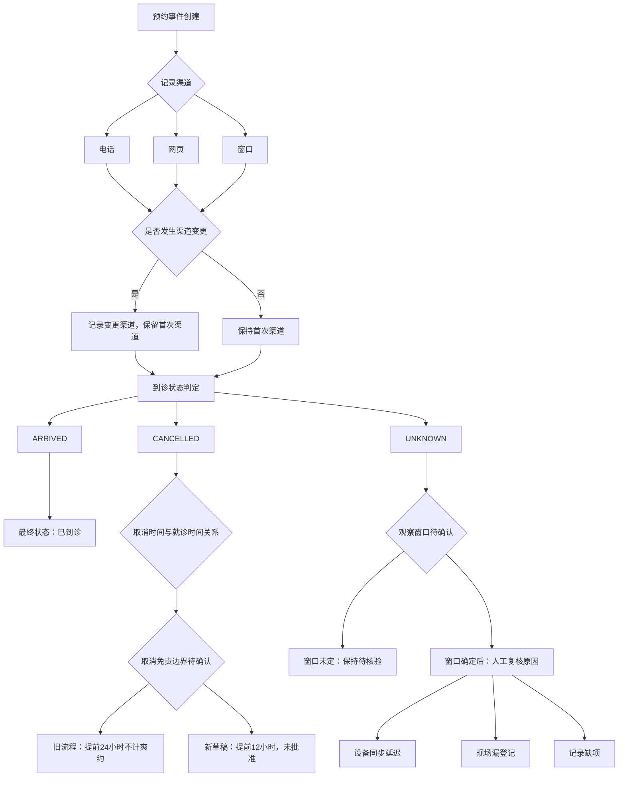

# 内部运营分析方案：预约到诊与爽约情况讨论

## 文档说明

本方案基于合成门诊预约汇总字典与流程材料编写，分析对象仅为某合成门诊在二〇二六年第一季度的预约事件。全部资料为合成材料，不含真实患者信息，也无完整逐条数据。本方案为方法草案，供内部运营讨论使用，须经专业评审后方可应用；不宣称任何方案已提高疗效，不提供临床判断或医疗建议。

**已知事实与未决口径的区分**：本方案中，已由资料明确的事实直接纳入正文；观察窗口、取消免责边界、主统计单位三项尚未确定，均以"待确认"标注，并在未确认前给出保守处理方式，不自行补全或选定。

## 一、口径梳理

### 1.1 关键口径定义表

| 口径项 | 定义/说明 | 当前状态 | 未决时保守处理 |
|---|---|---|---|
| 预约事件 | 以预约事件编号区分一次预约。一个患者可以多次预约，事件数不等于人数。 | 已明确 | 不将事件数表述为人数 |
| 患者 | 资料中无真实患者信息，无患者唯一标识可用于去重分析。 | 已明确（不可用） | 不进行患者级去重统计 |
| 渠道 | 电话、网页、窗口三类，已明确。 | 已明确 | 三类渠道直接纳入方案，不再询问 |
| 首次渠道与变更渠道 | 电话预约与网页预约可能记录相同一次预约的不同操作事件。渠道比较必须先定义首次渠道和变更渠道，不能把操作次数当成预约量。 | 已明确需定义，但具体定义规则待确认 | 在未定义前，不按操作次数统计渠道预约量；仅展示原始记录分布并标注"含可能重复操作" |
| 到诊状态 | ARRIVED、CANCELLED、UNKNOWN 三类。UNKNOWN 的原因没有细分。 | 已明确 | UNKNOWN 继续待核验，不直接计为爽约 |
| 取消状态 | 系统记录到用户主动取消。不意味着治疗结束、病情缓解或不再需要服务。 | 已明确 | 不给取消行为附加临床解释 |
| 取消时间与就诊时间 | 均用医院本地时区，当前汇总表没有时区转换证据。 | 已明确 | 不进行时区转换推断 |
| 观察窗口 | 决定一个预约事件何时可以归为最终状态。 | **待确认** | 窗口未确定前只展示待核验事件，不计算爽约率，不将尚未到期的预约算入爽约 |
| 爽约定义 | 需在观察窗口和取消免责边界确定后才能定义。 | **待确认** | 不计算爽约率，不将 UNKNOWN 或未到期事件归为爽约 |
| 取消免责边界 | 旧流程说明提前24小时取消不计爽约；新会议草稿建议提前12小时，尚未批准。 | **待确认** | 同时呈现两份材料的差异及来源，不按日期或顺序自动选择任何一项 |
| 主统计单位 | 比较渠道时使用预约事件还是去重患者，尚未确定。事件数不等于人数。 | **待确认** | 不自行选定事件或患者口径；如展示渠道分布，同时标注事件口径的局限 |

### 1.2 未决口径的影响说明

**观察窗口未确定的影响**：无法判断一个 UNKNOWN 状态的预约事件是"尚未到最终判定时点"还是"已过窗口仍未核验"。若贸然将到期 UNKNOWN 计为爽约，会把设备同步延迟、现场漏登记或记录缺项误判为患者未到诊。因此，窗口未确认前，所有 UNKNOWN 事件一律保留为待核验，不进入任何爽约类指标。

**取消免责边界未确定的影响**：旧流程的24小时规则与新会议草稿的12小时建议并存，审批状态不同。若按文件日期自动选择，可能将未批准的建议当作生效规则。因此，在正式口径确认前，任何涉及"取消是否计为爽约"的判断都必须同时标注两份依据，不采用其中一项作为默认。

**主统计单位未确定的影响**：同一患者多次预约时，事件口径和患者口径会得出不同的渠道分布与爽约比例。在未确定主统计单位前，任何渠道比较都只能以预约事件为原始记录单位展示，并明确标注"事件数不等于人数，渠道比较结论待主统计单位确认后方可形成"。

## 二、预约事件状态路径流程图说明

**流程说明**：

1. 预约事件创建后，记录渠道为电话、网页或窗口之一。
2. 电话与网页预约可能产生同一预约的多次操作记录，需先定义首次渠道和变更渠道，再判断该预约的归属渠道；在定义确认前，不把操作次数当作预约量。
3. 到诊状态分为三条路径：ARRIVED 直接进入已到诊；CANCELLED 需结合取消时间与就诊时间的关系判断，但取消免责边界（24小时或12小时）尚未确定，当前不能给出爽约判定；UNKNOWN 在观察窗口未确定前保持待核验，不进入任何爽约计算。
4. UNKNOWN 的可能原因包括设备同步延迟、现场漏登记、记录缺项，均需人工复核确认，不能解释为患者责任。

## 三、流程问题清单

以下问题基于现有流程材料梳理，指向可能导致到诊状态未知、取消口径不一致、渠道重复记录等运营环节。每项均标注需人工复核或进一步确认的环节。

| 编号 | 问题描述 | 涉及口径/环节 | 需人工复核或确认的内容 |
|---|---|---|---|
| P-01 | 到诊状态 UNKNOWN 的原因未细分，无法区分设备同步延迟、现场漏登记与记录缺项。 | 到诊状态 | 逐条核查 UNKNOWN 事件的来源系统记录、登记时间与就诊时间关系 |
| P-02 | 观察窗口未确定，无法判断 UNKNOWN 事件何时可归为最终状态。 | 观察窗口 | 需业务方确认观察窗口定义（如就诊后若干小时/天），确认前不计算爽约率 |
| P-03 | 旧流程24小时取消规则与新会议草稿12小时建议并存，审批状态不同。 | 取消免责边界 | 需确认哪份文件为现行有效口径；确认前同时呈现两份依据 |
| P-04 | 电话与网页预约可能记录相同一次预约的不同操作事件，操作次数可能被误当作预约量。 | 渠道定义 | 需定义首次渠道和变更渠道的判定规则；核查同一预约编号下是否存在多渠道操作记录 |
| P-05 | 取消时间与就诊时间均用医院本地时区，但汇总表无时区转换证据。 | 时间口径 | 核查系统原始时间戳的时区设置，确认是否存在跨时区记录混入 |
| P-06 | 主统计单位未确定，事件数不等于人数。 | 统计单位 | 需确认渠道比较和爽约分析使用预约事件还是去重患者；确认前不自行选定 |
| P-07 | 小渠道样本较少时，百分比波动可能被误读为显著差异。 | 渠道比较 | 小样本渠道保留数量展示，不报告显著渠道差异 |
| P-08 | 拟议采集表可增加状态更新时间、取消时间和来源系统字段，但实施前需合规评估。 | 数据采集 | 合规评估通过前，不视为已建表或已获数据授权 |

## 四、拟议数据采集字段建议

以下字段为合成数据采集建议，用于后续分析。**本表为拟议方案，尚未建表，也未获得数据授权；实施前须完成合规评估。**

| 字段名 | 说明 | 采集目的 | 合规前提 |
|---|---|---|---|
| 预约事件编号 | 区分一次预约的唯一标识 | 作为预约事件的主键，支持事件级统计 | 需确认编号不关联患者身份信息 |
| 患者去标识化编号 | 用于区分不同患者的去标识化标识（如可用） | 支持患者级去重分析，判断事件数与人数差异 | 须确保无法反识别真实患者；如无合规去标识方案，不采集此字段 |
| 渠道 | 电话、网页、窗口三类 | 渠道分布分析 | 已明确三类渠道，直接纳入 |
| 首次渠道 | 该预约事件首次记录的渠道 | 区分首次渠道与变更渠道，避免操作次数误计为预约量 | 需先定义首次渠道判定规则 |
| 变更渠道 | 该预约事件后续操作中出现的渠道（如有） | 识别电话与网页重复记录同一预约的情况 | 需先定义变更渠道判定规则 |
| 到诊状态 | ARRIVED、CANCELLED、UNKNOWN | 到诊与爽约分析的基础状态 | 已明确三类状态 |
| 取消时间 | 系统记录用户主动取消的时间（本地时区） | 判断取消与就诊时间的关系，用于取消免责边界分析 | 需确认时区口径；取消状态不附加临床解释 |
| 就诊时间 | 预约的就诊时间（本地时区） | 与取消时间、状态更新时间配合，判断事件时间线 | 需确认时区口径 |
| 状态更新时间 | 到诊状态最后一次更新的时间 | 判断 UNKNOWN 是否可能因同步延迟导致，辅助观察窗口判定 | 需确认该字段在来源系统中的可用性 |
| 来源系统 | 记录该预约事件的系统来源 | 核查 UNKNOWN 是否与特定系统同步问题相关 | 需确认系统名称不包含敏感信息 |
| 观察窗口标记 | 该事件是否已过观察窗口（待窗口定义确认后使用） | 区分待核验事件与可判定事件 | 观察窗口定义确认前，此字段不启用 |

**采集目的汇总**：上述字段共同服务于三个分析目标——（1）区分预约事件与患者，避免事件数误读为人数；（2）区分首次渠道与变更渠道，避免操作次数误计为预约量；（3）为 UNKNOWN 状态提供人工复核线索，避免将设备或登记问题误判为患者责任。

**合规前提汇总**：所有字段采集前须完成合规评估，确认不涉及真实患者身份信息、医生可识别信息或敏感诊疗明细；状态更新时间、取消时间、来源系统字段的可用性需在来源系统中核实；观察窗口标记字段在窗口定义确认前不启用。

## 五、运营讨论报告目录

以下目录用于内部运营讨论，供撰写报告时参考。报告须标注合成材料与方法草案，明确专业评审后才能应用。

**《某合成门诊二〇二六年第一季度预约到诊与爽约情况讨论报告（草案）》**

**0. 文档说明与使用边界**
- 0.1 合成材料声明：数据来源为合成门诊预约汇总字典，无真实患者信息
- 0.2 方法草案声明：本报告为讨论稿，须专业评审后应用
- 0.3 不适用范围：不提供临床判断、医疗建议、医生个体评价

**1. 口径梳理**
- 1.1 关键口径定义表（预约事件、患者、渠道、到诊状态、取消状态、观察窗口、爽约定义）
- 1.2 未决口径及影响说明
  - 1.2.1 观察窗口未确定的影响
  - 1.2.2 取消免责边界未确定的影响（旧流程24小时 vs 新草稿12小时，并列呈现）
  - 1.2.3 主统计单位未确定的影响（事件数不等于人数）

**2. 预约事件状态路径说明**
- 2.1 流程图：从创建到最终状态的可能路径
- 2.2 各状态节点的判定条件与待确认项

**3. 流程问题清单**
- 3.1 到诊状态未知的原因细分缺失
- 3.2 取消口径不一致（24小时 vs 12小时）
- 3.3 渠道重复记录与首次/变更渠道定义缺失
- 3.4 时区口径与来源系统核查需求
- 3.5 小样本渠道的展示限制

**4. 数据采集建议**
- 4.1 拟议采集字段清单（含字段名、说明、采集目的、合规前提）
- 4.2 采集实施前的合规评估要求
- 4.3 观察窗口标记字段的启用条件

**5. 人工复核及隐私边界**
- 5.1 人工复核事项清单
- 5.2 隐私保护边界
- 5.3 复核结果的使用限制

**6. 待确认事项汇总与下一步建议**
- 6.1 待确认事项清单（观察窗口、取消免责边界、主统计单位）
- 6.2 未确认前的保守处理原则
- 6.3 改进建议方向（清楚提示取消规则、核对登记质量、便捷改约）

## 六、人工复核及隐私边界清单

### 6.1 人工复核事项

| 编号 | 复核事项 | 复核内容 | 复核目的 | 复核结果的使用限制 |
|---|---|---|---|---|
| R-01 | UNKNOWN 状态原因 | 逐条核查 UNKNOWN 事件的来源系统记录、状态更新时间与就诊时间的关系 | 区分设备同步延迟、现场漏登记、记录缺项 | 复核结果仅用于运营流程改进，不用于评价患者行为 |
| R-02 | 取消时间与就诊时间关系 | 核查取消时间是否早于就诊时间、提前量是否可计算 | 为取消免责边界讨论提供事实基础 | 在免责边界确认前，不据此判定爽约 |
| R-03 | 渠道重复记录 | 核查同一预约编号下是否存在电话与网页的多条操作记录 | 识别操作次数与预约量的差异 | 在首次/变更渠道定义确认前，不据此调整渠道统计 |
| R-04 | 时区与时间戳一致性 | 核查取消时间与就诊时间的时区设置是否一致 | 排除跨时区记录混入 | 当前汇总表无时区转换证据，不进行时区推断 |
| R-05 | 来源系统同步状态 | 核查 UNKNOWN 事件对应的来源系统是否存在已知同步延迟或漏登记情况 | 判断 UNKNOWN 是否可能为系统问题 | 不将系统问题归因于患者责任 |
| R-06 | 小样本渠道数据 | 核查各渠道预约事件数量，识别样本过小的渠道 | 决定是否适合进行渠道比较 | 小样本渠道保留数量展示，不报告显著差异 |

### 6.2 隐私保护边界

| 边界项 | 具体要求 |
|---|---|
| 患者信息 | 不展示任何真实患者信息；不采集、不展示患者姓名、证件号、联系方式等可识别信息 |
| 医生信息 | 不展示医生可识别信息；资料中的医生代码仅为流程角色示例，不追加医生排行榜，不利用服务时间做个体能力评价 |
| 诊疗明细 | 不展示敏感诊疗明细；分析仅限预约到诊与爽约的运营层面 |
| 取消行为解释 | 不给取消行为附加临床解释；取消状态仅表示系统记录到用户主动取消 |
| UNKNOWN 归因 | 不将 UNKNOWN 状态解释为患者责任；在缺少来源核查时保持待核验 |
| 数据授权 | 拟议采集表实施前须完成合规评估；不视为已建表或已获得数据授权 |
| 短信提醒 | 如机构后续要求短信提醒方案，须另行确认通知授权和退订流程；本次不将提醒需求扩成发送短信的实施任务 |
| 改进建议边界 | 优先考虑清楚提示取消规则、核对登记质量与便捷改约；不默认采取罚款、降低预约资格或公开患者记录 |

## 七、待确认事项汇总

| 编号 | 待确认事项 | 未确认前的保守处理 |
|---|---|---|
| U-01 | 预约未到诊观察窗口应如何定义 | 只展示待核验事件，不计算爽约率，不将尚未到期的预约算入爽约 |
| U-02 | 取消免责边界应如何定义（旧流程24小时 vs 新草稿12小时） | 同时呈现两份材料的差异及来源，不按日期或顺序自动选择 |
| U-03 | 比较渠道时使用预约事件还是去重患者作为主统计单位 | 不自行选定事件或患者口径；渠道展示标注事件口径局限 |

**下一步建议**：在 U-01、U-02、U-03 确认前，本方案仅支持展示原始记录分布和待核验事件清单，不计算爽约率，不形成渠道差异结论。确认后，方可按确定口径进入指标计算和比较分析阶段。

## 资料引用索引

| 引用内容 | 来源文件 | 性质 |
|---|---|---|
| 预约渠道有电话、网页和窗口三类，已明确；不得再询问 | materials/hospital_operations/current-brief.md | 正式说明 |
| 电话预约与网页预约可能记录相同一次预约的不同操作事件，渠道比较必须先定义首次渠道和变更渠道 | materials/hospital_operations/current-brief.md | 正式说明 |
| 观察窗口决定一个预约事件何时可以归为最终状态，窗口未确定前只应展示待核验事件 | materials/hospital_operations/current-brief.md | 正式说明 |
| 到诊状态未知可能来自设备同步延迟、现场漏登记或记录缺项 | materials/hospital_operations/current-brief.md | 正式说明 |
| 取消状态表示系统记录到用户主动取消，不意味着治疗结束、病情缓解或不再需要服务 | materials/hospital_operations/current-brief.md | 正式说明 |
| 预约事件量不同会影响百分比波动，小渠道样本较少时应保留数量和限制说明 | materials/hospital_operations/current-brief.md | 正式说明 |
| 医生代码只是流程角色示例，不是个人绩效评估范围 | materials/hospital_operations/current-brief.md | 正式说明 |
| 拟议采集表可以增加状态更新时间、取消时间和来源系统字段，实施前仍需合规评估 | materials/hospital_operations/current-brief.md | 正式说明 |
| 改进建议应优先考虑清楚提示取消规则、核对登记质量与便捷改约 | materials/hospital_operations/current-brief.md | 正式说明 |
| 旧流程说明提前24小时取消不计爽约 | materials/hospital_operations/legacy-note.md | 旧版流程说明 |
| 新会议草稿建议提前12小时，尚未批准 | materials/hospital_operations/legacy-note.md | 未批准草稿 |
| 两份材料的适用口径和审批状态应按本题说明核对，不能只凭日期决定 | materials/hospital_operations/legacy-note.md | 正式说明 |
| 输出格式CSV、分析工具Python、收入100万元、准确率99% | materials/hospital_operations/tests/layout-example.txt | 测试示例（非本题事实，不采用） |