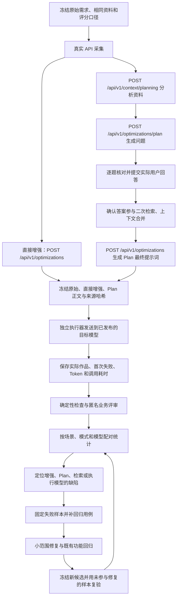

# 提示词实际交付质量闭环评测

## 1. 目标与判断边界

这套机制回答的是：**相同任务与资料下，增强后的提示词，是否更稳定地让执行模型完成正确、完整、可用的实际工作。** 不以字数、四段结构或提示词是否像专业文档代替交付质量，也不要求最终作品逐字等于答案卡。

它能帮助定位和验证缺陷，不能靠评分本身修复缺陷。重复提醒、业务对象误合并需要代码回归；模型输出的专业准确性需要领域复核；延迟归因需要阶段计时。

生产产品仍只生成提示词。这套工具是本地验收工具，不在工作台新增“执行开发、诊疗或投资任务”的能力，不改变现有增强、Plan、文件索引、历史、租户隔离和安全边界。

2026-10-05 用户明确分工：上线前专业场景的自动化、真实模型及实际作品对照由 Codex 全面执行；上线后再由用户组织相应领域人员核验，安排见[专业场景评测与核验](../待办事项.md#professional-review-after-launch)。本协议和既定真实 Plan 流程继续用于上线前验证；AI 辅助判断与领域人员核验分别记录，尚未验证的专业结论不写为通过。各批样例、优化器／执行器模型、资料与实际答案冻结，保留失败并控制调用预算。

## 2. 闭环与现有架构的连接



- 采集复用 `scripts/prompt-comparison-eval.mjs` 的固定输入与 `scripts/prompt-comparison-reviewed.mjs` 的两阶段问答，不自动接受推荐项，不把隐藏答案卡拼进请求。
- `PlanningSessionServiceImpl` 负责资料快照和计划所有权；`OptimizationPlanningServiceImpl` 负责提问、过滤和冲突；用户实际提交的答案经服务端校验后进入最终增强。
- 最终上下文的关键路径是 `buildRefinedContextQuery`、`ConfirmedDecisionSet`、`PlanningFactMerger` 和 `OptimizationResultAssembler`。须检查答案是否改变召回与正文，不能只检查请求携带了答案。
- `OpenAiCompatiblePromptEnhancementProvider` 是优化器，不是业务执行器。执行器发送普通任务消息，不使用平台增强用的 JSON schema，不要求再次改写提示词。
- 浏览器的“复制到 DeepSeek/Kimi/智谱”是复制与跳转，不是模型执行 API；本工具另外调用服务器已配置的 OpenAI 兼容路由。

## 3. 公平对照：信息增益与表达增益分开

| 信息轨道 | 对照组 | 共同条件 | 可以回答的问题 |
| --- | --- | --- | --- |
| 初始信息 | `raw`、`direct`；零回答的 `plan` | 原始需求、资料、补充描述、执行 system 相同 | 直接增强或零问题 Plan 的表达是否有收益 |
| 回答后同信息 | `raw_matched`、`direct_matched`、`plan` | 同样的资料与用户**实际提交**的问答附录 | 控制新增信息后，Plan 的组织与合并是否有收益 |
| 完整产品体验 | 原始初始输入与 Plan 最终输出 | 允许 Plan 获取额外信息，但记录问答负担与额外成本 | 澄清机制整体是否有用；不能把增益全部归因于改写 |

没有 Plan 回答时，只生成三组，不重复付费生成等价的 matched 组。有回答时，保留初始组并增加匹配信息基线。同一轮问答附录在三个 matched 组中完全相同；“暂不确定”和部分确定保留原文，不自动升级为事实。未选择选项不进入附录。

优化器 O 与执行器 E 分开记录：先固定 O 比较不同 E，再固定 E 比较不同 O。工具一次运行固定已采集的优化正文，重复次数仅表示 **重复执行固定提示词**。需要验证优化器随机性时，另采集独立的直接增强、Plan 和回答，再建立新运行；不能把一次优化、三次执行写成全流程三次通过。

采用相同材料原文是在控制输入，**不等于完成了真实文件夹索引、办公文件解析或二次召回性能验收**。这些路径要单独从工作台真实选目录/文件开始测试。

## 4. 场景与运行规模

复用 [24 题跨行业中长需求集](./fixtures/plan-mode-cross-domain-2026-10-04.json)，覆盖开发、项目文档、机关报告、科研、论文、医院资料、医学研究、法律、新闻稿、商业/金融、翻译与教学等任务；资料为合成或明确授权的项目节选。医院、医学、法律、金融结果不能用模型自评认证临床、司法或投资正确性。

原始草案中 `CD-09-L` 和 `CD-12-L` 存在交付要求冲突，先标记 `INPUT_AMBIGUITY`，以新版本修正后再进入正式干净对照，保留原件。静态长度检查通过不代表题目没有语义矛盾。

建议先做 6–12 题、两个已校准执行模型，每组 3 次执行，再扩到 24 题。24 题 × 三组 × 三轮 × 三个模型，仅下游执行就有 648 次；匹配信息组、优化调用与重试还会增加调用。每批最多 60 个执行请求，先列出数量和 Token 上限，再分批运行，不采用不限次数的重跑。

代码修复使用失败样本；验收保留独立样本。代码版本、题目版本、模型路由、参数或字数口径变化后建立新运行，不修改旧证据获得通过。

## 5. 量化指标与评审

| 维度 | 本工具的初始权重 | 检查方法 |
| --- | ---: | --- |
| 准确性 `accuracy` | 35% | 事实、数值、计算、代码/流程正确性，结合材料与专业复核 |
| 完整性 `completeness` | 25% | 必须交付项、适用范围、关键边界和必要未决条件覆盖 |
| 规则保真 `ruleFidelity` | 25% | 不反转禁止、条件、例外、对象和用户决定，不引用测试占位词作为事实 |
| 可用性 `usability` | 15% | 实际成果可用、目标集中、结构易读、无需无谓补写 |

每项 0–4 分，加权换算为 0–100。权重是本评测的初始约定，不是行业标准或已验证的最优权重；要更改应先版本化并重新冻结。

严重业务错误优先于分数。错误算式、事实造假、业务规则反转或越权，即使其他项满分也为 `CRITICAL_FAIL`；两组都有严重错误时记 `BOTH_FAIL`，不宣布增强胜出。输入口径不明确记 `INPUT_AMBIGUITY`；未评审记 `PENDING`，不按零分或通过填充。

匿名评审只见原始需求、同轨道资料与实际作品，映射文件单独存放。评审填写 `reviewer.kind=HUMAN` 或 `AI_ASSISTED`、评审时间、领域及每个判断的作品/材料依据。自动评审可辅助定位，正式领域验收继续由独立评审完成。

报告按场景、模式、执行模型、重复轮次和信息轨道输出技术状态、严重错误、质量分、胜/负/平/双方失败。胜率分母包含本次已判定的双方失败；另列已计划、未执行、未评审和优化生成失败，防止只统计成功作品。专业验收和现有 11 题、实际优化 Provider/模型、同轮双人门槛独立保留，本报告不会自动放行。

还应在正式批量报告中核查：关键规则覆盖率、已知信息重复提问率、真正未知问题召回率、低价值提问率、推荐证据有效率、确认后规则冲突/遗失率、每题耗时、实际 Token 和失败类别。当前工具保存下游调用耗时及 Token；优化器重试 Token、完整用户等待时间和服务器阶段计时尚需关联补齐，不能把它们当作已量化。

## 6. 可执行工具与步骤

新增工具：

- `scripts/prompt-output-evaluation.mjs`：目录快照、同信息任务准备、匿名作品导出、评审绑定和配对报告。
- `scripts/java/PromptOutputEvaluationRunner.java` 与 `scripts/run-prompt-output-evaluation.ps1`：隔离的真实执行 API，复用普通 `application.yml` 与进程环境中的服务端路由，不启动应用/数据库/Flyway。
- `scripts/prompt-output-evaluation.test.mjs`：同信息对照、答案隔离、调用边界、结果绑定、严重错误与未评审等回归。

先采集真实增强结果，沿用已有命令：

```powershell
node scripts/prompt-comparison-eval.mjs --prepare --industry --only <场景ID列表>
node scripts/prompt-comparison-reviewed.mjs --collect <prepared-directory>
# 核对实际问题；逐题填写 reviewed-answers.json，不自动采用推荐答案。
node scripts/prompt-comparison-reviewed.mjs --finish <prepared-directory>
```

这组历史采集脚本当前默认使用 5175 登录页、9325 本机 CDP 和平台默认优化模型。Plan 有期限；过期失败须保留，重新采集另建新运行。当前工具不会伪造登录或替换账号。需要切换 O 时先在管理员控制下切换并核查实际版本，再新采集，不能无声复用另一模型结果。

获取当前真实公开目录，命令返回 `<catalog-file>`；新运行实际执行时目录快照最多使用 24 小时，变更发布列表后立即重新采集：

```powershell
node scripts/prompt-output-evaluation.mjs catalog
node scripts/prompt-output-evaluation.mjs prepare --comparison-dir <prepared-directory> --catalog <catalog-file> --models <已发布模型ID列表> --repetitions 3 --max-jobs 60 --max-tokens 4096
```

也可用已发布的试测输入验证工具，**不会重新生成优化提示词**：

```powershell
node scripts/prompt-output-evaluation.mjs prepare --pilot --catalog <catalog-file> --models deepseek:deepseek-flash --repetitions 1 --max-jobs 6 --max-tokens 4096
```

准备命令返回 `<run-directory>`。以下两条 PowerShell 命令分别为零 API 校验与真正付费执行，默认行为为校验：

```powershell
.\scripts\run-prompt-output-evaluation.ps1 -Action ValidateJobs -JobsPath <run-directory>\jobs.json
.\scripts\run-prompt-output-evaluation.ps1 -Action RunJobs -JobsPath <run-directory>\jobs.json
node scripts/prompt-output-evaluation.mjs blind --run <run-directory>
# 将 review-template.json 另存为 reviewed-results.json，填写匿名评审，不覆盖原模板。
node scripts/prompt-output-evaluation.mjs report --run <run-directory> --reviews <run-directory>\reviewed-results.json
```

没有评审时，直接调用 report 会输出 PENDING 报告；不会宣布业务通过。报告每次另存，执行结果不覆盖，不自动重试，已用过的批次拒绝再调用。

参数：

| 参数 | 默认值 | 值域/含义 |
| --- | --- | --- |
| `--catalog` | 必填 | 从真实 `/api/v1/models` 得到的公开目录快照，无密钥 |
| `--models` | 必填 | 1–4 个已发布且服务端路由可解析的模型 ID，逗号分隔 |
| `--repetitions` | 3 | 1–3；固定提示词的执行重复次数 |
| `--max-jobs` | 30 | 1–60；整批付费执行调用数量上限，超出则零调用拒绝准备 |
| `--max-tokens` | 4096 | 256–16384；单请求输出预算，须先验证该路由支持；不代表可交付正文一定有同等预算 |
| `--cases` | 当前输入的全部案例 | 可选 ID 列表；未找到的 ID 报错 |
| `--input` | 与 `--pilot`、`--comparison-dir` 三选一 | 明确的合成快照 JSON；不能提交密钥、个人资料或隐藏答案卡作为输入事实 |
| `-Action` | `ValidateJobs` | `ValidateJobs` 零 API；`RunJobs` 真正调用外部模型 |
| `-ClasspathFile` | 最新的本地后端依赖清单 | 仓库内 runtime-classpath.txt 或 evaluation-classpath.txt；不下载或升级依赖 |

模型参数按服务端已有兼容逻辑发送：当前直连 DeepSeek 关闭思考；其他路由采用默认协议，Kimi K3 不传 temperature 并用 `max_completion_tokens`。未实际校准的路由不得计为已支持该模型的质量验收。空正文 HTTP 200 仍失败，输出截断记部分交付，缺少 usage 记空值，不估算成真实 Token。

`--input` 的规范化快照字段如下。通常由 `--comparison-dir` 导入，避免人工复制错组；快照声明只供评测，不替代生产接口的所有权校验。

| 字段 | 默认/必填 | 含义与边界 |
| --- | --- | --- |
| `schemaVersion` | 必填，1 | 规范化输入格式版本，与执行 jobs 的 schemaVersion=2 分开 |
| `dataAuthorization` | 必填，SYNTHETIC | 仅受控合成任务；既有项目节选的具体来源另记 materialScope，不接收真实个人/患者数据 |
| `cases` | 必填，1–24条 | 每例有唯一安全 ID、domain、rawPrompt（1–8000字符）与 files（最多100条） |
| `contextDescription` | 空字符串 | 共同补充描述，最多4000字符，各组保持相同 |
| `files[].path/content` | 必填 | 主动提供的资料相对路径与原文；不按路径读本机，排除受保护名称、路径逃逸和重复路径 |
| `optimizerModelId` | 可空，正式采集须记录 | 实际优化模型公开 ID；同运行不能混合不同优化器 |
| `direct.prompt` | 可空 | 真实直接增强正文，不手工补成理想输出；缺失作为生成未完成保留 |
| `plan.prompt/serverAccepted` | 可空/必须为true才能执行Plan组 | 来自实际成功提交计划后的最终正文；不能用未提交草稿替代 |
| `submittedAnswers` | 空数组，最多8条 | 实际提交的 questionId、question、answer（每条答案最多1500字符）及 actuallySubmitted=true；未知和部分确定不改写 |
| `generationFailures` | 空数组 | 保留优化生成失败或未采集的组；不因无法执行而从报告范围中消失 |

输入中的隐藏答案卡、knownFacts、criticalRules 或评分 rubrics 不进入模型请求。材料超过预算时拒绝准备，不悄悄截断；单文件文本最多150000字符、合计资料最多180000字符、冻结执行 jobs 最多8MB，这些是本地评测工具的边界，不改变产品原有上传上限。

## 7. 用评测推动当前缺陷修复

| 缺陷 | 最小回归与真实反例 | 建议修改边界 |
| --- | --- | --- |
| 不同业务对象误合并 | 审批标准与退款标准分开、合并、交换顺序；已有审批冲突仍必须保留退款问题 | `PlanQuestionFilter`、冲突关联按对象＋属性＋条件＋来源/取值判断；不继续扩大通用关键词删除 |
| 同事项多措辞提醒 | 同一未决点的两种措辞只出现一次；新对象、新条件、新值、部分确认仍保留 | `AmbiguityDetector`、提醒归并与结果组装共享决定身份；不按整类 BUSINESS_RULE 清除 |
| 非必要提问 | 完整新闻稿/教学/翻译零新增业务问题；研究提纲组织交给执行者，样本与分母缺失仍提问 | `PlanQuestionFilter` 区分业务决策与执行细节；`RequirementFidelityGuard` 继续守住禁止、条件和例外 |
| 答案未改变上下文 | 选择站内信后不把邮件重试当成站内信规则；跨文件冲突与新条件可见 | 确认答案参与检索，`PlanningFactMerger` 合并不能跨对象/条件；输出区分已知、冲突、未决 |
| 任务模板污染和冗长 | “不写测试”的报告不能转为测试交付；新闻/翻译不附无关代码验收 | 模板分类以任务目标为主；正文保留必要规则，详细证据转为按需展开；压缩后仍检查复制完整性 |
| 长尾等待 | 固定相同输入，记录失败/重试及 p50/p95，分辨首次和最终成功 | 计时分开：上下文分析/检索、Plan过滤、每次模型 HTTP、修复重试、结果组装；客户端总耗时不冒充推理耗时 |

评测失败先区分输入有矛盾、优化器漏规则、执行器违反规则、路由无正文、评审口径不明确。比如增强提示词保留了正确算式要求，但执行模型算错，不应直接把原因定为 Plan 合并；需要逐阶段对照或消融后再改代码。

## 8. 已有证据与本轮状态

[先前真实试测报告](./原始与优化提示词实际执行对照-2026-10-04.md)已有两个中题、两条执行路由、12 次初始调用与一次 GLM 校准。DeepSeek 六份正文中有增强组篇幅不足、原始/Plan 教案错误答案；GLM 七次均未交付正文，不适合内容质量排名；Kimi未发布，未测试。

本轮在此基础上构建可复用工具；工具验证和少量实际执行检查的证据另存 `tmp/prompt-output-evaluation/`，不替代先前失败。该机制尚未完成 24 题多模型全量、专业双人验收、真实目录和办公文件全流程检查，也没有将生产缺陷标记为已修复。工具可运行与增强功能正式上线通过是不同结论。

本轮新增的真实接口检查已完成：复用两道题的已冻结提示词，固定一个 DeepSeek 执行模型，每组一次，共 6 次普通任务执行，6 次均返回完整正文；未重新调用优化接口。总执行 Token 为 20,723，单次模型 HTTP 为 2,479–12,858 ms，含网络与响应处理，不是纯推理耗时。

单次 AI 辅助静态复核结果：

| 场景 | 原始组 | 直接增强组 | Plan组 |
| --- | --- | --- | --- |
| 新闻稿 | 正文 Han 543 / 非空白611，字数口径待明确，不记通过 | Han490 / 非空白547，确定不足600 | Han440 / 非空白492，确定不足600 |
| 教案 | 31项明确数字分数关系未发现错误 | 22项明确数字分数关系未发现错误 | 32项明确数字分数关系未发现错误 |

三份教案均保留固定课时、分组、设备和练习数量，当前静态评分配对为平局，不证明真实课堂教学效果。新闻稿原始基线口径未决，比较保持 PENDING，但增强组篇幅违约作为明确失败保留。先前教案错误答案没有因为本轮未复现而被删除或认定已修复。

可携带证据：[实际调用记录](./evidence/prompt-output-evaluation-2026-10-04/execution-call-results.json)、[确定性检查](./evidence/prompt-output-evaluation-2026-10-04/deterministic-checks.json)、[AI辅助静态评审报告](./evidence/prompt-output-evaluation-2026-10-04/quality-report.md)、[证据哈希](./evidence/prompt-output-evaluation-2026-10-04/manifest.json)。这次验证只证明评测工具能连接真实 API、产出作品并据规则保留失败；专业验收仍为 PENDING。

## 9. 确定缺陷修复后的中长需求闭环（2026-10-04）

本节为后续修复与执行证据，不覆盖第8节校准样本或早先失败。详见[决策范围修复与下游执行复验](./Plan决策范围修复与下游执行复验-2026-10-04.md)，[本轮完整证据与哈希](./evidence/plan-decision-remediation-2026-10-04/README.md)。

- 修复跨对象误去重、错误冲突关联、部分重复提醒、已知测试范围重复提问、取消并列禁令误拦、选项元信息新条件误删、明确未决项隐藏和旧待定状态回填；增加任务交付指导、兼容可选证据面板与安全阶段计时。相关后端41类478项、桌面/移动端8项、评测工具21项通过，不等同于全仓库或专业上线验收。
- 四例为开发915字符、研究3978字符、新闻776字符、教学3800字符；原文与各增强组使用相同合成资料，实际确认答案也进入等信息原文。隐藏答案卡与评分规则不进入模型请求，不要求结果逐字一致。
- 优化器为平台当前默认Flash；执行器为已发布Flash和Pro，温度0.2、输出8192、每臂一次。匿名AI辅助静态评审另记结构清晰与可执行性；不替代行业双人盲评，也不建立统计显著性。
- 初始两批54调用取得30份作品、24次技术失败；18个可比较配对为9提升、5持平、4退步，两项缺基线保持PENDING。修复后的开发五臂单独补验5次、5份作品，两个评分提升、一次双方严重失败；不当作新独立任务。总计59次调用、35份实际作品，保留全部技术失败。
- 新闻6份中5份未满足冻结的600–800汉字下限；原文教学出现确定算式错误；开发方案存在异步详情后的失效遗漏、状态混同或字段值/字段名白名单误用。科研有重复未决参数、部分候选定义仍需专业审阅，不能只根据增强接口成功判质量通过。
- 最后裸待定状态修复只沿用有效计划与答案补验最终优化生成，11.186秒成功、0提醒、已确认决定和禁止猜测保留；此前五臂执行用的是修复前冻结提示词，版本不可混记。

本轮把**已修复的平台确定缺陷、未达标的真实作品及仍未关闭的正式门禁**分别记录。全行业“增强后一定显著优于原文”没有通过；下一轮应按独立保留题、固定次数、同信息对照验证，不能通过重复调用择优、改字数口径、修掉失败文件或跳过失败基线得出获胜结论。
