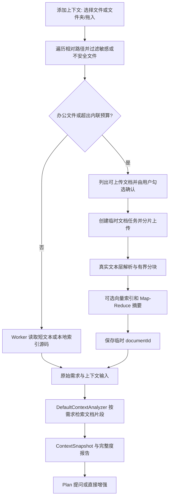

# 文档读取与内容匹配验证

验证日期：2026-09-23。本文记录合成测试样例与当前代码的结果，不承诺任意 Office/PDF 文件、扫描件或模型输出都能百分之百正确。

## 1. 实际支持范围

| 场景 | 验证内容与结论 |
| --- | --- |
| 单个 TXT | UTF-8 中文正文、无换行长文本、跨读取缓冲区词组、中等大小文档尾部均有回归测试 |
| 单个 DOCX | 使用真实 ZIP/XML 解析器，覆盖中文跨格式 run、表格、页脚与英文原有空格；不验证嵌入图片 OCR、批注或修订语义 |
| PDF | 用 PDFBox 生成并解析文字层 PDF；无文字层 PDF 返回明确 OCR 错误。本次 PDF 字体样例为英文，中文字体映射复杂的 PDF 尚未专项验证 |
| 多文件目录 | 浏览器实际选择嵌套目录，TXT/DOCX/PDF 保留相对路径并发送文档引用；后端另用真实解析器将三种文档合并为 ContextSnapshot |
| 大文件 | 实际上传 50 个 1 MiB 分片，总计 50 MiB，验证索引完成和中文尾部召回；100 MiB 创建请求被明确拒绝 |
| 关键词匹配 | 验证中文业务规则在片段前 40 个词之后仍能命中，不依赖恰好选中首尾代表片段 |
| 语义与摘要 | 确定性测试模型验证向量召回、混合排序、Map-Reduce 摘要和失败降级；未调用外部真实模型，不代表业务语义准确率评测 |
| 安全 | 合成路径验证 `../`、绝对路径、Windows 盘符相对路径、反斜杠穿越与受保护文件过滤；没有读取真实密钥或生产配置 |

原文件上限是 **50 MiB**，并非 100 MB。`100,000,000` 指后端提取字符数保护上限；DOCX 等压缩正文另有 256 MiB 展开保护。不能把这些限制等同于上传容量。

## 2. 先复现后修复的缺陷

1. **文本文档分流过晚**：以前超过 1 MB 才走临时索引，但 Worker 单文件最多保留 64,000 字符，多文件还会均摊总预算。已改为在读取前根据实际预算分流，避免尾部提前丢失。
2. **DOCX 人为插入词间空格**：以前每个 XML 文本事件都 `strip` 并追加空格，中文跨字体样式时变成“心脑 血管”。现在保留相邻 run 的原始文本，仅用真实结构边界分段。
3. **超长单行无法有界读取**：以前 `readLine()` 会创建整行字符串；现在按固定缓冲读取，连续块不会被索引标签打断。
4. **全文已读取但词表不完整**：临时索引以前只记录每块前 40 个词，后部规则可能漏召回。现在逐块匹配完整正文，继续使用现有代表片段与语义混合排序。
5. **安全入口不一致**：前端候选筛选缺少路径校验，部分入口未过滤明确的生产配置；后端还接受 `C:report.txt`。现在读取、增量复用及临时索引创建前均拦截对应情况。后端实际落盘使用服务端生成的 UUID，原缺陷不等于已证实可越目录写磁盘。
6. **办公资料文件夹入口不明确**：工作台现合并为“添加上下文”。同一文件夹中的源码在浏览器本地索引，办公文档只生成待上传清单；用户勾选并确认后才送后端解析。原有的单文件选择和拖入仍可用，新增上下文不会清除已有项目索引。

## 3. 链路与覆盖边界



- 全文索引完成不表示全文都发送给模型。快照仍有最多 40 个片段文件、单文件 60,000 字符、总计 120,000 字符等预算。用 `fileCoverage.extractionStatus` 与 `contextLimited` 分别判断解析完整度和本次选取范围。
- 关键词检索准确命中不等于同义改写语义召回。向量与模型摘要默认关闭；是否开启应核对实际部署配置。本次没有启用外部模型或更改配置。
- 扫描 PDF/文档内图片不支持 OCR；TXT 验证范围为 UTF-8，不承诺 GBK、UTF-16 等编码自动识别。
- 一批临时文档仍受 100 个/200 MiB 预算约束，候选扫描也有限额；超限返回警告，不能声称任意文件夹的所有内容都无条件被纳入。
- 逐块完整匹配减少常驻词表内存，但增加每次检索的磁盘读取量。生产高并发可后续评估磁盘倒排索引，不以扩大内存词表替代本次正确性修复。

## 4. 可重复执行的测试

在 `apps/web` 执行：

```powershell
npm.cmd test
npm.cmd run typecheck
npm.cmd run test:e2e -- document-folder-upload.spec.ts mixed-project-document.spec.ts
```

在 `services/api` 执行：

```powershell
mvn -q '-Dtest=*Context*Test,*Document*Test,*Planning*Test,*Enhancement*Test,*Optimization*Test,ContentChunkSelectorTest,Semantic*Test,MapReduce*Test' test
```

重点测试位置：

- `apps/web/src/composables/useProjectFilesRouting.test.ts`：真实 composable 的混合目录分流、多文件均摊预算；网络上传函数使用替身。
- `apps/web/src/composables/useProjectFiles.test.ts`、`fileDrop.test.ts`、`features/project-index/projectIndexer.test.ts`：支持格式、目录遍历、本地索引与安全过滤。
- `apps/web/e2e/document-folder-upload.spec.ts`：浏览器选择真实合成目录、确认前零上传、完整字节上传和文档引用传递；另有同一目录源码本地索引加办公文档确认上传的用例。HTTP 服务模拟，不能单独证明后端解析正确。
- `apps/web/e2e/mixed-project-document.spec.ts`：项目索引与独立方案文件共同进入 Plan 和最终增强请求；模型响应模拟。
- `StreamingDocumentExtractorTest`：真实提取器的中文 run、表格、页脚和无换行文本。
- `TemporaryDocumentIndexServiceTest`：真实上传服务、解析器、临时磁盘索引与 `DefaultContextAnalyzer` 集成，包括 50 MiB 样例；向量与摘要专项使用确定性模型。
- `DocumentUploadControllerTest`：HTTP 上传协议转换，服务使用替身。

这组测试分别覆盖浏览器、HTTP 契约和真实后端内部链路；本次没有把浏览器、运行中的后端和真实外部模型联成一次完整线上调用。

## 5. 历史验证结果与本轮回归

- 此前的文档解析专项验证：前端全部 19 个测试文件、90 项单元测试通过；`vue-tsc -b` 通过。
- 后端上述命令选中的 24 个测试类、127 项测试通过，失败、错误、跳过均为 0；包括 Plan 会话、编排、最终结果与历史相关回归。
- 两个浏览器测试文件分别在桌面 Chrome 和移动视口 Chrome 运行，共 4 项通过。

本轮统一入口实现后，前端 19 个单元测试文件、90 项测试以及类型检查、生产构建通过；`document-folder-upload.spec.ts`、`mixed-project-document.spec.ts`、`prompt-workbench.spec.ts` 在桌面 Chrome 共 19 项通过，前两个文件在移动 Chrome 共 3 项通过。其中新增的混合目录用例验证源码索引、办公文档勾选确认、取消时零上传，以及两类文件共同进入上下文分析。浏览器测试中的后端文档解析由 HTTP 替身模拟，真实解析能力仍以本文件前述 Java 测试为依据。
- `git diff --check` 通过。未执行提交、数据库迁移或核心依赖升级。
- 故障注入用例会产生预期的向量检索降级与 Provider 重试日志。测试环境还出现 Byte Buddy/JVM 动态代理提示，以及 PDFBox 字体缓存目录不可写警告；这些未造成测试失败，字体缓存问题会增加字体扫描开销。没有将这些环境提示当作文档业务解析失败。
