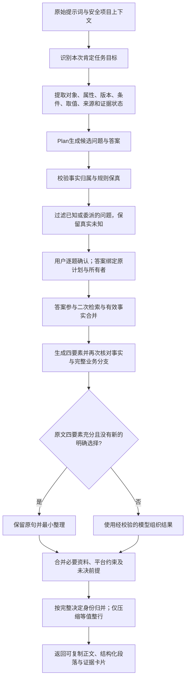

# 资料对象保真与最小整理真实作品验收（2026-10-06）

## 1. 目标与证据边界

本轮对应两个P0和三个P1：相关任务才触发工程歧义；对象、属性、版本、条件与证据状态一起核对；必要事实关联交付；完整规则去重与溯源分离；充分需求少改。系统仍只增强提示词，不在用户业务流程中执行任务。下述Java编译执行仅发生在独立的合成验收脚本中。

只测试拟开放的DeepSeek Flash与DeepSeek V4 Pro；TokenHub超时与截断修复按用户要求暂缓。所有模型调用和评审都是非Mock；AI辅助评分不代表独立人工或医学、法律等专业认证。没有把专业正确性或每次增强胜过原文写成已保证能力。

## 2. 修复与共享边界

| 优先级 | 改动 | 必须保留的边界 |
| --- | --- | --- |
| P0 | `TaskQuestionScope`识别肯定的软件排序目标；任务识别支持租赁资料、律师复核 | 真实的软件排序仍提问；风险优先级不是编程需求 |
| P0 | `SourceObjectContract`表示对象、属性、版本、条件、取值、来源、证据状态；计划选项与最终段落共用校验 | 未绑定版本保持未知；明确回答只能绑定自己的版本；测试例子不证明业务事实；已有其他属性不变 |
| P1 | `NewsBodyFactContract`保留同主体功能说明后的MVP阶段，并绑定新闻正文要求 | 私有内部事实不默认公开；其他产品和示例不借用 |
| P1 | 完整问题身份辅助归并；只读材料差异按用户指令并列，不重新让用户择一 | 新对象、条件、取值、观察窗口与部分未知保留 |
| P1 | `PromptRewriteStrategy`与`MinimalPromptOrganizer`对充分且四要素明确的原文采用最小整理 | 不跳过模型、安全、所有权和规则校验；有新的明确Plan选择或未知标题时沿用模型组织 |
| P1 | `ExecutionRuleCompactor`只处理可证明等值的完整行；已覆盖证据不重新复制 | 不改变运算符、否定、条件、代码块或表格；详细事实卡片仍返回 |

外部请求、响应字段、历史、权限红线和数据库结构保持兼容。新增策略属于Provider内部输入，不新增用户必填字段；模型错误使用既有受控修复预算，不增加无界重试。

## 3. 首次候选05：保留的失败

冻结6题：医院与新闻为中等输入，研究与法律为长输入，另有表单合并和独立审批／退款Java工具题。实际原始长度为827、710、3941、3944、877、1916字符；题号中的L不代替实际长度统计。

两个优化模型各跑直接增强、Plan提问及确认后增强，共36次增强／计划成功采集。原始、直接、Plan提示词分别交给两个执行模型，共96份实际作品完整返回；同信息组使用相同资料及真正提交的回答，未提供的评分答案不进入模型输入。该历史批使用旧评测工具，Plan正文后又被追加一次实际答案；记录保留，但不能与修正协议后的候选10合并计算稳定胜率。

匿名AI辅助评审96份引文均通过导入验证。评分仍有退步，不能以接口成功或比前一版本减少错误作为正式放行依据。

- **代码明确缺陷**：Flash增强的退款任务遗漏`amount>1000 → MANUAL`分支。两个执行模型均生成错误代码。24份作品全部编译，22份功能通过，2份失败；独立验收共检查21,384组输入。根因是保真提取只收集“必须／不得”等语句，未收集完整的正向判别分支。
- **新闻明确失败**：12份正文按汉字计数，标题不计；5/8份增强正文不在600–800范围。8份增强均保留MVP阶段，1/4份原始作品遗漏MVP。必要事实有改善，但篇幅仍未通过。
- **提醒与低价值问题**：仍有主文本、研究限额及医院统计单位的改写重复，以及用户已要求并列差异仍被追问择一。最终候选将使用同一输入验证归并及保留真实未知。
- **验收工具修正**：首版Java入口白名单大小写判断误把`class`当反射入口，作品全部未执行；该工具失败记录保留。修正白名单后才执行编译和功能断言，未修改任何模型作品。

候选05与最终候选分别留档，不用后来成功覆盖首次结果。

## 4. 最终候选验证协议

1. 固定源码、原始需求、资料、Plan实际答案、模型ID和参数，分别保存每轮运行。
2. 两个拟开放优化模型各多轮采集；只回答原文确实未知的业务问题，不自动选择推荐项。
3. 原始／直接／Plan分别交给两个相同执行模型，同信息配对；Plan只发送平台生成的可复制正文，原始及直接的matched组追加一次实际答案。答案另存为评审依据，不由工具修补Plan遗漏。执行调用只有一次，失败与截断保留。
4. Java作品先核验来源哈希，再按Java21编译；纯内存合成工具通过独立组合断言验证，不接入生产代码、文件或网络。子进程不继承密钥。
5. 新闻正文保留原600–800汉字口径；实际计数和必要事实共同作为门槛，不采纳模型自报数字。
6. 作品匿名评分，实际断言失败优先于AI打分；记录完整性、准确性、规则遵守与可用性，不因更长或表格更多加分。

最终候选为10。两轮冻结的31个共享源码哈希一致，清单汇总哈希为`8b5fcc0a12586d50330205c8ee9d55c5914b160f05ed2efd49eb53d4d6faff74`。该哈希标识本轮清单，不是Git提交哈希。候选09作为中间记录保留，不改名为最终通过结果。

候选10增加两个定向保护：只有未绑定条款的表格版本格使用“版本对应待核实”，不能用表尾注释抵消单元格的归属暗示；“讨论时区分”不当作时区条件，但真正的“时区分组”仍是独立条件。评测工具同步修复Plan重复追加答案，并按真实断言校正匿名评分。

## 5. 处理顺序、内部契约与兼容范围

- `PromptRewriteStrategy.mode`只在Provider内部使用：`MINIMAL_ORGANIZATION`或`CLARIFY_AND_STRUCTURE`，由原文交付、背景与限制信号推导，不是用户传入的必填参数。策略不免除模型调用或保真校验。
- `SourceObjectContract.Claim`包含对象、属性、版本、适用条件、取值、证据状态和来源。`KNOWN_VALUE_UNBOUND_VERSION`表示内容已知但版本对应未知；`EXPLICIT_VERSION`只接受同一属性、取值及完整条件的明确版本依据。目前识别的是有限的“一版／另一版”等语法，不是通用知识图谱。
- 新诊断原因`SOURCE_SCOPE_CONFLICT`继续通过已有无效模型响应处理，沿用共享受控重试预算；不新增无界重试，不伪造成功。请求与响应的公共必填字段、租户和工作区隔离均不改变。
- 最小整理只保留已明确的四个必需段落；未知标题、未闭合代码块、缺少段落或出现新的明确确认选择时回到模型组织路径。代码块、表格、引用、分支标题及不同作用域不能按相同行文删除。
- 裸“暂不确定”状态可由统一提醒表达，原始Plan答案不改。复制正文仍包含完整业务边界；旧模型逐字复写原题和原回答时，只统一绑定前缀的展示，新尾部、对象和条件继续校验并保留。
- 证据卡片仍通过原结果字段返回；已经完整存在的资料不再重复附写。未覆盖的语义复述仍可能留在正文，当前没有新增前端折叠交互。

## 6. 自动化与真实接口结果

最终候选10后端使用`reuseForks=false`隔离已有测试日志状态：134类、1382项中1374通过、8条件跳过，零失败、零错误。评测工具最终32项通过；本轮前端请求与状态20项及类型检查通过。跳过范围为统计性能／真实浏览器、真实模型并发及Redis集成的条件验收，不能写成生产规模全部验证。没有改动数据库迁移、依赖版本或前端公共样式。

候选08的完整回归保留2项失败：旧的逐字复制断言要求再次显示裸状态，且原题／完整原回答的旧提醒因新展示前缀不一致未能归并。候选09同步调整状态展示断言和绑定前缀兼容，原未知前提、YLL确认边界及新的退款条件断言继续通过；不是删除失败测试或降低实际业务要求。

候选09两个DeepSeek优化模型各跑两轮、每轮6题、直接／Plan提问／确认后增强三轨，共72次增强／计划阶段全部采集成功。携带资料的样例还实际调用`POST /api/v1/context/planning`，没有用Mock替代后端分析。这个范围不是完整文件夹选择、浏览器索引或生产并发验收。候选10另建运行，结果单独登记；模型阶段包含平台短路的零问题计划，不能把72项全部写成72次上游推理。

中间候选08曾同时启动4个同账号评测工作流，Pro的6次请求返回429。失败记录保留；随后限制为2个后端工作流，未修改平台的账号并发保护。旧候选源码发生变化后的采集由冻结校验提前拒绝，没有向上游发起调用。这些中间记录不能删除，也不计为最终候选成功。

最终候选10也完成两轮72个增强／计划阶段，全部HTTP200且成功采集。两个零问题开发题及新闻题保留零问题路径，真正未知的医院统计单位、观察窗口、研究轮次与评审方式仍保留。法律场景未出现无关的软件排序提醒。开放表达的复合重复及低价值科研呈现问题仍有漏网，不将问答数量减少理解为业务缺口全部关闭。

HTTP成功、编译通过、AI评分和正式上线放行分别判断。

## 7. 最终候选10：真实作品与同信息对照

两个优化模型各采集两轮，每轮的优化正文交给两个执行模型，原始／直接／Plan三组及有实际答案的matched基线共192份作品，全部完整返回。另有72次匿名AI辅助评审调用；192份作品均形成有效评审。两组初次评审曾因JSON缺少数组闭合符及一处Markdown标题引文错误而被拒绝导入，原失败保留；根代理仅修正结构与字面引文并核对作品哈希，未调整分数或重写作品。

### 7.1 实际断言

| 检查范围 | 原始／匹配信息基线 | 增强作品 | 结论 |
| --- | --- | --- | --- |
| 两种合成Java工具 | 所有原始作品通过 | 所有增强作品通过 | 共48份编译及功能通过、42,768组输入检查；此前退款`amount>1000`遗漏未再出现，但不是任意项目代码验收 |
| 新闻正文600–800汉字且含必要MVP阶段 | 3/8通过；6/8含MVP | 7/16通过；16/16含MVP | 必要事实保留有改善，9份增强正文偏短；篇幅仍未通过 |
| 未绑定维修条款填入具体A/B版本格 | 16/16检出误绑 | 9/24检出误绑，15/24未检出该表格问题 | 有改善，但仍有严重归属错误；“未检出”不是完整法律语义通过 |

资料表格检查在首轮实际作品暴露格内归属暗示后新增，对所有组使用相同规则，属于补充诊断，不冒充预先注册的通用语义检测。首版工具还误把“对应哪版”的问题当版本标签；原诊断保留，加入关系问题、匿名版本与不同属性反例后复核，最终统计采用修正版本。原AI评分未发现全部字数和归属错误，报告追加确定失败后才计算质量结果；不以满分代替实际验收。

### 7.2 同信息质量配对

| 优化器与轮次 | 增强胜出 | 原始胜出 | 平局 | 双方均失败 |
| --- | ---: | ---: | ---: | ---: |
| Flash第一轮 | 8 | 3 | 13 | 6 |
| Pro第一轮 | 7 | 4 | 17 | 2 |
| Flash第二轮 | 8 | 9 | 11 | 2 |
| Pro第二轮 | 5 | 6 | 14 | 5 |
| 合计 | 28 | 22 | 55 | 15 |

共120组同信息比较。直接增强为12胜6负24平6组双方失败；Plan为11胜10负22平5组双方失败；追加相同实际答案的直接增强为5胜6负9平4组双方失败。科研场景6胜11负7平，法律场景15胜9组双方失败；两种代码题大多持平，表单合并题仍有可读性评分下降。不能因总体胜出略多就宣布Plan全面优于原始。

这些配对来自6道冻结题的重复采集，样本相关且评审为AI辅助。与此前44组结果的题目、评分校正及Plan输入协议不同，不能据此计算“提升了多少个百分点”，也没有证明统计显著的普遍增益。完整性、准确性、可读性和可执行性仍分别检查，不把表格更多、提醒更多或代码能编译作为全面优质的证据。

## 8. 长尾定位、未完成项与下一步

最终72阶段中最长为59,056ms，对应医院直接增强。该请求首轮上游耗时约50.6秒并返回`RESPONSE_TRUNCATED`，第二次受控调用约8.4秒后成功；结果校验／组装约41–42ms。这里的主要等待来自模型响应与既有修复，不是文件索引或摘要CPU耗时。该证据只解释这一请求；DeepSeek预算与长尾仍需独立校准，不将成功重试写成首次快速稳定。TokenHub仍按用户决定暂缓。

| 未完成项 | 本轮确认的情况 | 下一步方案 |
| --- | --- | --- |
| 下游资料对象误绑 | 优化正文明确保留未知，但部分执行模型仍把匿名内容放入A/B格 | 优先按对象／属性生成明确的交付表头与格级边界，保留匿名内容独立列；用实际作品检查，不继续只堆叠提醒 |
| 开放表达与复合重复 | 医院窗口＋取消口径复合提醒、资料边界在背景／约束间复写仍存在 | 完善决定身份和展示职责，只有证明同对象、条件与状态等值时归并；新条件与真实未知继续保留 |
| 低价值追问与推荐依据 | 研究对照呈现、法律押金差异呈现仍会被要求选择；本轮未覆盖全部推荐行业 | 区分用户决定与执行者常规组织，针对每个问题维度核对；补未参与修复的反例与明确推荐证据范围 |
| 充分需求的可读性 | 科研与表单仍有评分退步，详细来源和安全说明仍占较多正文 | 扩展少改策略的适用证据，把事实与要求集中表达，详细溯源走已有卡片；明确格式不加无关交付 |
| 新闻篇幅 | 必要MVP事实已保留，9/16增强正文不足600汉字 | 继续独立比较少改、篇幅组织及计数修订建议，不改用户字数口径，不把多写提示当效果已验证 |
| 正式范围验收 | 本轮是目标失败集、两轮与两个已开放模型，未覆盖所有真实目录或行业 | 扩展独立中长样例及完整上传流程；基础业务门槛保留，专业人员按用户安排上线后核验 |

**本轮关闭有限工程反例并完成冻结复验执行任务，尚未关闭所有P0/P1的业务质量门槛，也未达到“增强作品显著且稳定优于原始”的目标。** 可证明的改善是此前代码分支遗漏消失、必要新闻阶段事实更稳定保留、资料误绑有所减少；9份法律增强仍误绑、9份新闻增强仍偏短、22组质量退步与15组双方失败必须保留，不能宣布全面上线通过。

证据与源码快照见[本轮证据导航](./evidence/object-scope-2026-10-06/README.md)。报告不包含登录凭据、模型密钥、真实个人材料或受保护文件正文。
