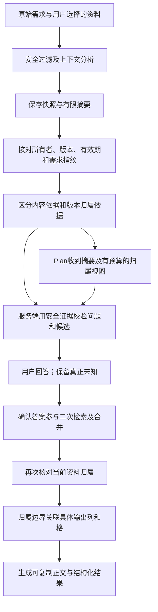

# 资料归属边界修复与真实作品复验（2026-10-06）

## 1. 本轮结论与范围

本轮已修复一组可复现的资料归属缺陷，并在两个 DeepSeek 模型上验证了实际作品的改善。**资料内容已知，不等于它与某个版本的对应关系已知**；这一边界现在同时进入 Plan 提问依据、服务端校验和最终可复制正文的交付要求。

最终候选04完成24个真实增强／Plan阶段及6次上下文准备，均成功返回。下游72份作品中62份完整、10份因输出预算截断；截断全部保留，不算通过。匿名维修案例的18份完整增强作品未检出A/B表格错误归属，而同批16份原始／同信息基线有15份检出。部分归属已知的8份完整增强作品保留了A的明确证据，也保留另一项的未知状态。12份合成Java作品通过编译及15,120组业务断言。

这是**有限归属边界的专项改善**，不是所有专业场景或整个平台的上线放行，也不是增强总能优于原文的结论。完整作品的归属正确，不能替代截断作品的交付完整性、全篇质量、独立人工或专业核验。

历史报告和失败不回改：[上一轮资料对象保真与最小整理验收](./资料对象保真与最小整理真实作品验收-2026-10-06.md)。新证据单独归档至[本轮证据导航](./evidence/source-attribution-2026-10-06/README.md)。

## 2. 原问题及修复方式

合成材料写道：维修条款一版由承租方承担日常维护，另一版新增全部设施故障费用。材料另有明确的押金差异：草稿A为两个月、B为三个月。

押金的版本关系不能替维修条款建立关系；“一版／另一版”的先后也不能自动等同A/B。此前最终正文虽写了“版本未知”，下游仍可能把两个维修内容直接填入A/B列；表尾的通用待核提醒没有抵消具体单元格的归属暗示。

现在分别处理三种情况：

| 资料证据 | 交付行为 | 不允许的推断 |
| --- | --- | --- |
| 内容明确、版本未绑定 | 保留两项内容，独立列出；具体版本格只写“版本对应待核实” | 按文件顺序或表格列次序分配A/B |
| 补充材料仅证明日常维护属于A | A按证据填写；另一项仍保留未知及其内容 | 用排除法把另一项分配给B |
| 两项均有同属性、取值和完整条件的明确对应证据 | 按各自证据整理，不新增未知归属要求 | 借用其他属性的A/B关系 |

内容出处与归属依据分列。例如日常维护最初出现在`current-brief.md`，而它属于A是`maintenance-confirmation.md`证明的；不能把初始内容来源写成已经证明版本的来源。相同内容的多个来源合并保留，条件、否定、运算符和取值不因压缩被改写。

## 3. 修改模块与处理顺序

| 模块 | 本轮改动 | 保护的共享行为 |
| --- | --- | --- |
| `SourceObjectContract` | 生成内容／对应状态／内容出处／归属依据的具体视图；核对横向版本格、纵向版本行、短标签和有限别名 | 其他属性不借用；测试、假设和生成资料不证明真实归属；转义表格分隔符时保留原值 |
| `PlanningSessionService`及实现 | `resolveForPlan`在原所有者、有效期、版本及需求指纹校验后，向应用层返回已过滤快照 | 完整快照不进入模型载荷，缓存结构与30分钟TTL不变 |
| `OptimizationPlanningServiceImpl` | 基于安全快照和事实卡片建立一次归属契约，生成有限Plan依据并复用校验 | 不靠摘要遗漏把已知降为未知；格式与业务校验继续共用既有受控预算 |
| `PlanningProviderRequest`、`PlanningDecisionPolicy`、OpenAI兼容适配器 | 内部载荷携带服务端生成的归属依据，策略补充时保留该字段 | 不增加客户端可伪造的“确认事实”或完整源码上传 |
| `DefaultEnhancementOrchestrator`、`OptimizationResultAssembler` | 归属边界同时加入输出要求及可复制正文 | 保留用户交付格式、四要素、安全红线、确认答案与历史；不只在页面提醒中显示 |
| 验收脚本及测试 | 修正固定合成题的A版别名检测；扩大源码冻结清单，保存稳定错误字段 | 检测范围仍明确标为固定题表格检查，不套用到允许A绑定的部分确认题 |

接口路径、客户端请求／响应字段、数据库结构和前端页面没有调整。内部新增字段如下：

| 内部字段／策略 | 含义、默认值与边界 |
| --- | --- |
| `ResolvedPlanningContext.snapshot` | 已通过会话绑定检查的安全快照；无文件时为空；仅用于应用层校验，不对客户端或Provider返回完整内容 |
| `PlanningProviderRequest.sourceObjectGuidance` | 默认空字符串；服务端按有限证据生成；当前生成器最多6000字符，按完整行截取并明确提示省略行，完整校验仍使用服务端证据 |
| `deliveryGuidance` | 仅在有未绑定版本的明确资料时补充具体交付边界；全部对应已明确或没有版本比较时为空；翻译任务不追加分析交付要求 |

没有增加独立模型调用、无界重试、新缓存或依赖；归属视图会增加部分输入Token。真实调用的收益及成本需分开看，不以校验加强保证外部模型总能遵守。

## 4. 修复期间发现的问题与闭合依据

### 4.1 Plan摘要与校验证据不一致

部分确认材料中，安全文件摘要包含“草稿A维修条款写承租方承担日常维护”，但预算内事实卡片未选中这句话。旧校验只使用需求和卡片，导致模型引用真实已知A关系时被误拒绝。

补充了经过真实`prepareContext → resolveForPlan → plan`应用链路的回归：明确A应允许，猜测B应拒绝，测试文件的A说明不能作证。修复前正例失败、两个负例通过；修复后全部通过。现在应用校验复用经授权的安全快照，模型仍只收到摘要及有限视图。

### 4.2 比较角色被当成具体条款归属

“草稿A维修条款写承租方承担日常维护，草稿B作为对照版本”并未断言维修内容属于B。旧实现把同句的B角色误作归属。独立编译探针的两条合法表述均被拒绝；修复后两条均允许。同句夹带B具体取值、条件或其他谓语的反例仍须校验，不能靠“对照版本”绕过。

### 4.3 翻译交付被追加分析任务

组装回归发现待译材料中的匿名版本关系可能触发新增分析表格。现在翻译保留忠实表达和现有校验，不追加归属分析交付。翻译、无比较、全部映射明确、部分已知及纯代码场景都有保护用例。

上述确定缺陷有独立复现依据；中间真实502仅保存安全原因、字段和尝试次数，没有保存被拒绝的模型原文，**不能据此认定每次502都是同一个具体句子导致**。

## 5. 自动化验证及环境故障

| 验证 | 结果 | 解释 |
| --- | --- | --- |
| 9个相关后端测试类 | 208项通过 | 归属、组装、Plan会话、Provider载荷、共享校验预算、任务适配及编排 |
| 评测工具 | 34项通过 | 归属诊断、实际作品输入和评审引文验证 |
| 最终源码完整运行及环境专项复验的合并覆盖 | 134类、1403项；1395通过、8条件跳过 | 零最终断言失败、零最终错误；这是合并覆盖，不是单次完整运行零故障 |

最终完整运行首次退出1：1399项、零断言失败、1项错误、8跳过；`PromptOptimizerApplicationTests`遇到Mockito／ByteBuddy外部自附加失败，`ModelConcurrencyHttpIntegrationTest`子JVM以`-1073741571`退出，4项尚未执行。随后在同一源码下使用已有ByteBuddy代理预加载、`-Xmx512m`、fork隔离和仓库临时回环目录，两个受影响类的5项全部通过；没有修改依赖或生产配置。首次故障保留在安全摘要中，未复制可能含环境信息的完整Surefire XML或后端日志。

8项跳过属于统计性能、真实浏览器统计验收、真实模型并发及其归档回放、Redis并发存储的条件验收；本批不能代替目标生产并发、Redis集成或大型目录压力验收。没有本轮前端功能回归或完整上传GUI验收的新增证据。

## 6. 最终候选与真实调用协议

候选04的两轮35个生产源码哈希一致，当前源码核对一致；聚合SHA-256为`0b265abd3e6b13c2144dabe61b8fba19a328f8582d4f4b77b12a21fde4a2400f`，算法是排序后`相对路径:文件SHA-256`以LF连接再计算。它是源码清单哈希，不是Git提交号。

| 题目 | 输入长度 | 资料和目的 | 轮数 |
| --- | --- | --- | --- |
| CD-10-L | 3944字符 | 原匿名维修版本题，保留押金明确对应、测试例子、多个业务边界 | 2 |
| ATTR-PARTIAL-L | 3944字符 | 同原始需求，新增明确A的补充文件；另一项不由排除法归B | 1 |
| DEV-DECISION-L | 1916字符 | 中长审批／退款纯内存Java工具，检验工程功能独立性 | 1 |

使用普通合成账号的正常登录与验证码会话，真实调用上下文准备、Plan及优化接口；不是Mock身份。API返回的模型目录快照含历史TokenHub项，原manifest的`plannedPublishedModels`只是当时可见目录；**本轮实际优化和执行都只选两个DeepSeek模型，未调用TokenHub**。这也不为目录中其他模型提供上线证据。

每个优化模型的原始／直接／Plan分别交给相同的两个执行模型。实际答案非自动选择推荐项：本批主文本和侧重保留未知、仅并列处理；部分确认题继续保留已知A。Plan只发送平台可复制正文，raw_matched／direct_matched追加一次相同实际回答，不额外给Plan补答案，也不发送隐藏答案卡。

下游每份只有一次调用，`temperature=0.2`、输出预算4096 Token，推理关闭，截断／失败不自动重跑。中间启动因评测子进程默认路由未映射至DeepSeek而在付费调用前停止；修正仅限评测子进程的默认路由环境，再执行尚未运行的任务，没有改服务端目录或覆盖作品。

### 6.1 最终接口结果

| 轮次 | 直接增强 | Plan提问 | 确认后增强 | 上下文准备 |
| --- | --- | --- | --- | --- |
| r1，3题×2优化模型 | 6/6 | 6/6 | 6/6 | 4/4 |
| r2，匿名版本题×2优化模型 | 2/2 | 2/2 | 2/2 | 2/2 |

代码题两个Plan均为零问题，不强行为充分需求出题。部分确认题Flash保留两个真实未决问题；Pro另问全部设施费用的未知版本，未标推荐，没有重问已明确的A日常维护。

中间候选01／02／03的502保留，候选02重叠调度产生的两次429也保留为验收调度失误；最终两个API批次顺序执行，不放宽账户并发限制。HTTP成功不证明每次都只用一次上游尝试。

### 6.2 72份下游实际作品

| 题目 | 作品数 | 完整 | 截断 |
| --- | --- | --- | --- |
| 匿名版本CD-10-L | 40 | 34 | 6 |
| 部分已知ATTR-PARTIAL-L | 20 | 16 | 4 |
| Java代码对照 | 12 | 12 | 0 |
| 合计 | 72 | 62 | 10 |

截断全部出现在直接增强或direct_matched，统一4096预算下较长交付受影响。截断作品不进入归属通过分母，不能用其中已正确的前半表格当作完整成功，也不能因放大预算后成功而改写原失败。

匿名版本题按固定合成题表格规则检查，并由根代理核对完整增强作品中的维修相关叙述、表格和必要内容：

| 提示词轨道 | 计划作品 | 完整作品 | 完整作品中表格错误归属 | 截断 |
| --- | --- | --- | --- | --- |
| raw | 8 | 8 | 8 | 0 |
| raw_matched，同信息原始 | 8 | 8 | 7 | 0 |
| direct | 8 | 4 | 0 | 4 |
| direct_matched，同信息直接 | 8 | 6 | 0 | 2 |
| plan | 8 | 8 | 0 | 0 |

18份完整增强作品均保留两项维修内容和未知对应关系；未用遗漏内容来获得“无错误归属”。这是固定题和两个模型的结果，不能推断所有行业的归属错误率为零，也不把完整样本的结果扩展到6份截断。

部分确认题不套用“任何A绑定都错误”的诊断。12份增强作品中8份完整、4份截断；8份完整均保留A的日常维护证据和另一项未知，不拼接或排除归B。它们由根代理做限定内容核对，**不是独立人工、盲评或法律正确性评分**。

Java对照的12份作品均编译成功、业务断言成功，每份1260组组合，共15,120组。原始和增强都通过，因此这里只证明所测代码能力保持可用，不声称代码质量胜出。执行发生在独立合成验收工具中，不增加平台执行用户代码的产品能力。

## 7. 剩余问题与下一步

已完成：格级归属约束、内容出处与归属证明分离、部分已知保护、Plan安全快照校验一致性、比较角色误拦修复及代码对照。

尚未关闭：

- **实际交付截断与冗长**：本批10份不完整，尤其直接增强。下一步先比较必要规则、重复组织和交付范围，再独立校准输出预算；不删除真实未知，也不把增大Token等同于质量修复。
- **开放表达与跨任务覆盖**：有限“一版／另一版”等语法、表格标签和条件校验不能覆盖任意行业表达；新增未参与修复的对象／属性、部分确认、跨文件冲突及科研报告版本题，按首轮证据验证。
- **原有低价值问题、提醒重复和新闻篇幅**：本轮不修改这些共享策略，上一轮未通过项继续保留；实际作品出现的重复章节也不能以归属正确为由关闭。
- **正式上线门槛**：完整真实目录／办公文档流程、编辑复制历史、目标规模压力、独立基础业务评审及跨行业真实作品复验继续执行；专业人员核验按用户安排上线后开展。

本次没有数据库迁移、依赖升级、生产部署或对其他供应商的修复。保真校验、安全红线和共享重试预算不放宽；局部测试和实际代码对照支持有限的兼容性结论，不支持“其他功能绝无负面影响”的保证。
